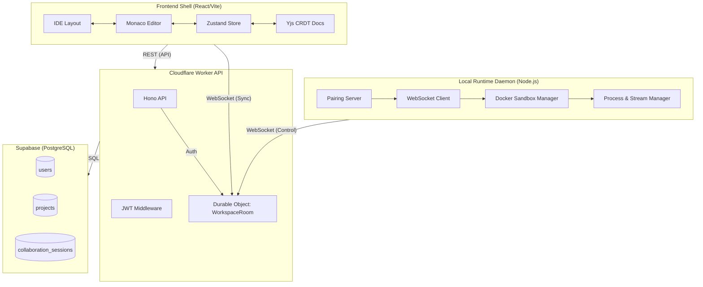

# Co-Vibe — Collaborative AI Vibe-Coding Workspace

Co-Vibe is a realtime collaborative IDE designed for AI agent integration, featuring a local runtime daemon and a durable cloud architecture.

## System Architecture



## Prerequisites

- **Node.js**: v22+
- **pnpm**: 11.24+
- **Docker**: Engine running locally (for the runtime sandbox)
- **Supabase**: Account for database and auth
- **Cloudflare (Optional)**: Wrangler for deployment

## Installation

1. **Clone the repository:**

   ```bash
   git clone <repository_url>
   cd co-vibe-monorepo
   ```

2. **Install dependencies:**

   ```bash
   pnpm install
   ```

3. **Install Playwright Browsers (for E2E tests):**
   ```bash
   npx playwright install
   ```

## Environment Setup

Create the appropriate `.env` files for the web and runtime apps based on their configurations.

### Frontend (`apps/web/.env.local`)

Create an `.env.local` file in `apps/web/`:

```env
VITE_SUPABASE_URL=https://your-project.supabase.co
VITE_SUPABASE_ANON_KEY=your-supabase-anon-key
```

### API Worker Secrets

For local development with Wrangler, or to deploy, you need to set these secrets via `wrangler secret put <NAME>` or in a `.dev.vars` file in `apps/api/`:

```env
SUPABASE_URL=https://your-project.supabase.co
SUPABASE_JWT_SECRET=your-jwt-secret
RUNTIME_AUTH_SECRET=your-runtime-auth-secret
```

### Database

Run the provided migrations against your Supabase Postgres instance to set up the schema:

```bash
npx tsx scripts/migrate.ts
```

_(Ensure you have configured `DATABASE_URL` in your environment or `scripts/migrate.ts` first, if necessary)_.

## Execution Commands

### Development

To run all applications concurrently (Web UI, API Worker, Local Runtime):

```bash
pnpm dev:all
```

_Note: You can run `pnpm dev` to run everything except the API, and run the API separately using `pnpm dev:api`._

### Testing & Validation

**Unit & Integration Tests:**

```bash
pnpm test
pnpm test:coverage
```

**End-to-End Tests:**

```bash
pnpm test:e2e
```

**Code Quality:**

```bash
pnpm lint
pnpm typecheck
pnpm format:check
```

### Deployment

Deploy the Cloudflare Worker API:

```bash
pnpm --filter @co-vibe/api run deploy
```
