# Complete App Flow Document

## Collaborative AI Vibe-Coding Workspace

**Purpose:** Implementation-ready product/app flow for the browser-based collaborative AI development workspace.

**Core journey:**

```text
Login
 ↓
Create / Import Project
 ↓
Connect Runtime
 ↓
Open Workspace
 ↓
Invite Collaborator
 ↓
Collaborative Editing
 ↓
Ask AI
 ↓
AI Plans
 ↓
Approve
 ↓
AI Executes
 ↓
Tests
 ↓
AI Debugs
 ↓
Diff
 ↓
Human Review
 ↓
Apply
 ↓
Preview
 ↓
Git Commit
 ↓
Push
```

**Flow boundary:** This document translates the supplied product/technical requirements into user-facing flows. It does not introduce enterprise-scale functionality. The central experience remains a shared code workspace in which humans and an AI coding agent work on the same codebase.

---

# 1. Flow Principles

## 1.1 Core UX principles

### 1. The workspace is the product

The user should reach the workspace quickly. Dashboard and setup screens exist to get the user into a usable development environment, not to become destinations themselves.

### 2. Make system ownership visible

The UI should make it obvious whether an action is being handled by:

- the browser;
- collaboration service;
- local runtime;
- Docker;
- AI agent;
- Git.

### 3. Never hide consequential AI actions

The user must be able to distinguish:

```text
AI is thinking
AI is inspecting
AI is changing code
AI is running commands
AI is testing
AI is waiting for me
AI is ready for review
```

### 4. Never imply success before validation

For example:

```text
"AI generated a change"
```

is not equivalent to:

```text
"Tests passed"
```

and neither is equivalent to:

```text
"Changes applied"
```

### 5. Preserve user agency

AI changes are isolated and reviewed before reaching the shared workspace.

### 6. Fail with a next action

Every important failure should answer:

```text
What happened?
Was my work saved?
What can I do now?
```

---

# 2. Information Architecture

```text
Landing
├── Login
│
├── Dashboard
│   ├── Projects
│   ├── Create Project
│   ├── Import Repository
│   └── Settings
│
└── Workspace
    ├── Files
    ├── Editor
    ├── AI Agent
    ├── Terminal
    ├── Preview
    ├── Git
    ├── Collaboration
    └── Change Review
```

## 2.1 Global navigation

### Landing

**Purpose:** Explain the product and provide the primary entry into the application.

**Entry:** Product URL.

**Primary action:** `Login`.

**Secondary actions:** None required for MVP.

**Required data:** None.

**Loading:** Minimal shell.

**Empty:** Not applicable.

**Error:** Authentication service unavailable -> "Login is temporarily unavailable. Try again."

**Success:** User proceeds to authentication.

---

## 2.2 Login

**Purpose:** Authenticate the user.

**Entry:** Landing or protected-route redirect.

**Primary action:** OAuth login.

**Secondary actions:** Retry.

**Required data:** Authentication provider state.

**Loading:** `Signing you in...`

**Error:** `Authentication failed. Try again.`

**Success:** Redirect to Dashboard.

---

## 2.3 Dashboard / Projects

**Purpose:** Project selection and creation.

**Entry:** Successful authentication.

**Primary action:**

- `Create Project` if no project exists;
- `Open` if projects exist.

**Secondary actions:**

- `Import Repository`;
- project menu;
- Settings.

**Required data:**

- project list;
- membership role;
- last opened workspace;
- runtime status where useful.

**Loading:** `Loading your projects...`

**Empty:** `No projects yet` + `Create Project` + `Import Repository`.

**Error:** `We couldn't load your projects.` + Retry.

**Success:** Project opens or creation/import begins.

---

## 2.4 Create Project

**Purpose:** Create a blank project.

**Entry:** Dashboard.

**Primary action:** `Create Project`.

**Secondary:** Cancel.

**Required data:**

- name;
- optional description.

**Loading:** `Creating project...`

**Error:** Validation error or server error.

**Success:** Project and initial workspace are created; user proceeds to runtime setup.

---

## 2.5 Import Repository

**Purpose:** Import an existing GitHub repository.

**Entry:** Dashboard or Create Project.

**Primary action:** `Import Repository`.

**Required data:**

- GitHub authorization;
- repository;
- branch;
- project name.

**Loading states:**

- `Loading repositories...`
- `Importing repository...`
- `Cloning repository...`
- `Creating workspace...`

**Error states:**

- GitHub permission denied;
- repository inaccessible;
- invalid repository;
- clone failure;
- empty repository.

**Success:** Workspace created and runtime setup shown.

---

# 3. Complete User Journey

| Step | User action         | UI response          | Backend/system action               | State change         | Next actions      |
| ---- | ------------------- | -------------------- | ----------------------------------- | -------------------- | ----------------- |
| 1    | Open product        | Landing              | None                                | Unauthenticated      | Login             |
| 2    | Login               | Auth progress        | Auth provider validates identity    | Authenticated        | Dashboard         |
| 3    | Create/import       | Form                 | Project/repository metadata created | ProjectSelected      | Runtime           |
| 4    | Connect runtime     | Pairing UI           | Runtime registration                | RuntimeConnecting    | Wait/retry        |
| 5    | Runtime ready       | Ready indicator      | Docker health check                 | RuntimeReady         | Open workspace    |
| 6    | Open workspace      | Workspace shell      | Load metadata/Yjs/files/Git         | WorkspaceLoading     | WorkspaceReady    |
| 7    | Invite collaborator | Invite control       | Membership created                  | CollaboratorAdded    | Collaborate       |
| 8    | Edit file           | Monaco updates       | Yjs update broadcast                | CollaborativeEdit    | Continue editing  |
| 9    | Ask AI              | Task panel           | Agent task created                  | AgentPlanning        | Review plan       |
| 10   | Approve             | Plan marked approved | Agent starts worktree               | AgentExecuting       | Monitor           |
| 11   | Agent changes       | Tool timeline        | Runtime executes tools              | AgentExecuting       | Validate          |
| 12   | Tests               | Test status          | Docker executes tests               | AgentValidating      | Pass/fix          |
| 13   | Failure             | Failure shown        | Context + repair loop               | AgentNeedsFix        | Agent repair      |
| 14   | Diff ready          | Review UI            | Change set persisted                | AgentReview          | Review            |
| 15   | Accept/reject       | Confirmation         | Conflict check/apply                | Accepted/Rejected    | Preview or revise |
| 16   | Preview             | Preview panel        | Runtime serves project              | PreviewRunning       | Test manually     |
| 17   | Commit              | Git dialog           | Git commit                          | GitDirty -> GitClean | Push              |
| 18   | Push                | Approval dialog      | GitHub push                         | Remote updated       | Done              |

---

# 4. Authentication Flow

## 4.1 First-time login

```text
Landing
   ↓
Click Login
   ↓
OAuth
   ↓
Authentication provider
   ↓
Session created
   ↓
Application loads profile
   ↓
No projects?
   ├── Yes → Dashboard onboarding
   └── No → Project dashboard
```

### Mermaid sequence

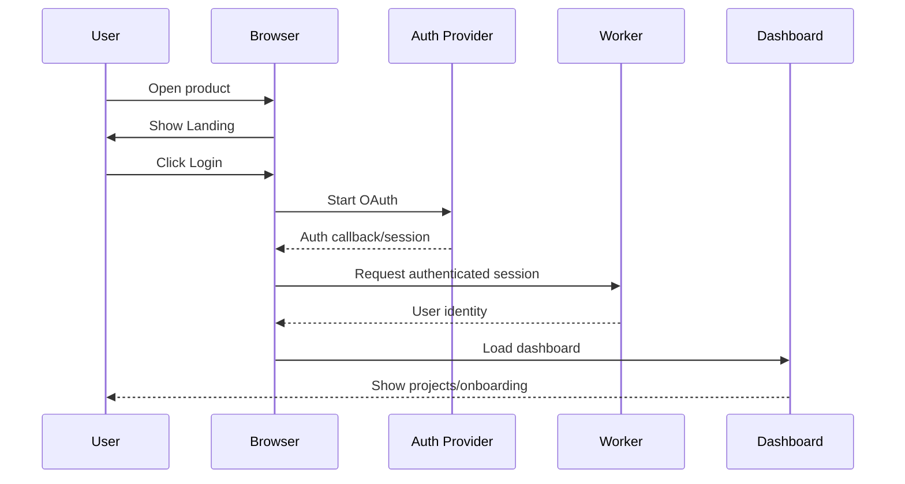

## 4.2 Returning user

```text
Open product
 ↓
Existing valid session
 ↓
Load identity
 ↓
Load projects
 ↓
Dashboard
```

If a last workspace is stored locally and the project still exists, the UI may offer:

`Continue in last workspace`

rather than automatically opening it.

## 4.3 Expired session

```text
User action
 ↓
API returns authentication error
 ↓
UI pauses operation
 ↓
"Your session expired."
 ↓
Sign in again
```

Do not discard unsaved local collaboration state before reconnect/resync has been attempted.

## 4.4 Logout

```text
Settings / account menu
 ↓
Logout
 ↓
Session invalidated
 ↓
WSS closed
 ↓
Local UI cleared
 ↓
Landing
```

## 4.5 Authentication failure

Show:

- concise error;
- retry;
- alternative login if supported.

Do not expose provider implementation details.

---

# 5. Project Creation Flow

# Option A — Blank Project

```text
Dashboard
 ↓
Create Project
 ↓
Enter name
 ↓
Create
 ↓
Project created
 ↓
Workspace created
 ↓
Runtime setup
```

### UI

Form:

```text
Project name
[________________]

Description (optional)
[________________________]

[Create Project] [Cancel]
```

### Success

Show:

`Project created. Connect your local runtime to begin coding.`

---

# Option B — GitHub Import

```text
Dashboard
 ↓
Import Repository
 ↓
GitHub authorization
 ↓
Choose repository
 ↓
Choose branch
 ↓
Import
 ↓
Clone
 ↓
Workspace created
 ↓
Runtime setup
```

## 5.1 Repository picker

Display:

- repository name;
- owner;
- visibility;
- default branch.

Primary action:

`Continue`

## 5.2 Branch selection

Display:

- default branch selected;
- available branches.

Primary action:

`Import Repository`

## 5.3 Import progress

Use meaningful progress:

```text
✓ Repository selected
✓ Access verified
● Cloning repository
○ Creating workspace
○ Preparing runtime
```

Do not show only `Loading...`.

## 5.4 Clone failure

Example:

```text
Repository import failed

We couldn't clone this repository.
Your project has not been modified.

[Retry] [Back to Dashboard]
```

If the project record was already created, preserve it rather than creating duplicates.

## 5.5 Invalid/inaccessible repository

```text
This repository is unavailable to your GitHub account.

Check:
• repository permissions
• repository name
• GitHub authorization

[Reconnect GitHub] [Choose another repository]
```

## 5.6 Empty repository

Show:

```text
This repository is empty.

You can initialize the workspace and create the first files.

[Open Empty Workspace]
```

---

# 6. Runtime Connection Flow

The runtime is a local application/service on the developer machine.

```text
Workspace
 ↓
Connect Runtime
 ↓
Pairing code
 ↓
Local Runtime
 ↓
Authentication
 ↓
Docker availability check
 ↓
Runtime ready
```

## 6.1 Connection UI

Before connection:

```text
Runtime
Offline

Your local runtime is required to run code,
tests, terminals, previews, and Git operations.

[Connect Runtime]
```

After clicking:

```text
Connect your local runtime

1. Start the runtime application
2. Enter this pairing code:

   X7K-29P

3. Waiting for connection...

[Cancel]
```

## 6.2 Runtime connects

```text
Pairing accepted
 ↓
Authentication verified
 ↓
Docker check
 ↓
Workspace capability check
 ↓
Ready
```

UI:

```text
Runtime
● Connected

Docker
● Available

Workspace
● Ready
```

## 6.3 Runtime offline

Persistent workspace banner:

```text
Runtime offline

Editing and collaboration can continue,
but terminal, tests, preview, and Git operations
are unavailable.

[Reconnect]
```

Do not make the entire editor unusable.

## 6.4 Docker unavailable

```text
Runtime connected
Docker unavailable

Start Docker Desktop/Engine and retry.

[Retry Docker Check]
```

## 6.5 Authentication expires

```text
Runtime authentication expired.

Your project files remain intact.
Reconnect the runtime to resume execution.

[Reconnect]
```

## 6.6 Connection drops

UI changes from:

`● Runtime Ready`

to:

`◌ Runtime Reconnecting...`

After recovery:

`● Runtime Ready`

After failure:

`Runtime offline — Retry`

---

# 7. Workspace Entry Flow

When a project opens:

```text
Load project metadata
        │
        ├───────────────┐
        ↓               ↓
Connect WebSocket    Load Git state
        │               │
        ↓               │
Load Yjs document      │
        │               │
        ↓               │
Load file tree         │
        │               │
        └──────┬────────┘
               ↓
        Check runtime
               ↓
        Restore open tabs
               ↓
        Workspace ready
```

## 7.1 Parallel operations

After authentication and workspace authorization, these can happen in parallel:

- project/workspace metadata;
- collaboration WebSocket;
- file tree/runtime workspace metadata;
- Git status.

Do not block the entire shell on Git status if the editor can render first.

## 7.2 Workspace loading UI

```text
Opening workspace...

✓ Project loaded
✓ Collaboration connected
● Loading files
● Checking runtime
● Reading Git status
```

## 7.3 Ready state

The top bar shows:

```text
Project / Workspace
● 2 collaborators
● Runtime ready
Git: main
```

---

# 8. Collaboration Flow

## 8.1 User A joins

```text
User A opens workspace
 ↓
Browser authenticates
 ↓
WSS connection
 ↓
Durable Object validates membership
 ↓
Yjs state synchronized
 ↓
Presence published
 ↓
User A sees workspace
```

UI:

- avatar appears in presence bar;
- selected file opens;
- editor becomes editable according to role.

## 8.2 User B joins

```text
User B opens workspace
 ↓
WSS connection
 ↓
Membership validated
 ↓
Yjs state synchronized
 ↓
B appears in A's presence bar
 ↓
A appears in B's presence bar
```

Example:

```text
Collaborators: [A] [B]
```

## 8.3 User A edits

```text
A types
 ↓
Monaco
 ↓
Y.Text
 ↓
Y.Doc
 ↓
WebSocket
 ↓
Durable Object
 ↓
Broadcast update
 ↓
B's Y.Doc
 ↓
B's Monaco
```

A should see immediate local feedback.

B sees the edit without refreshing.

## 8.4 Simultaneous edits

```text
A edit ───────┐
              ├→ Yjs merge → converged state
B edit ───────┘
```

UI:

- no conflict dialog for normal concurrent text editing;
- remote cursor/selection appears;
- both clients eventually display the same content.

## 8.5 User disconnects

```text
Socket closes
 ↓
Presence changes to offline
 ↓
User's editor remains usable locally
 ↓
Reconnect attempts begin
```

If runtime remains online, runtime state is independent of the collaboration socket.

## 8.6 Reconnect

```text
Socket reconnect
 ↓
Re-authenticate
 ↓
Rejoin room
 ↓
Exchange Yjs state
 ↓
Merge unsynced changes
 ↓
Restore awareness
 ↓
Connected
```

UI:

`Reconnecting...` -> `Connected`

## 8.7 Offline edits

If browser-side Yjs state permits temporary local editing:

```text
Network unavailable
 ↓
Banner: "Offline — changes will sync when reconnected"
 ↓
User edits
 ↓
Local Yjs state changes
 ↓
Connection restored
 ↓
Yjs synchronization
 ↓
Converged workspace
```

The UI must clearly distinguish:

- offline collaboration state;
- runtime availability.

---

# 9. AI Agent Flow

This is the primary advanced interaction.

```text
User enters request
 ↓
Task created
 ↓
Agent starts
 ↓
Repository inspection
 ↓
Context retrieval
 ↓
Plan generated
 ↓
Plan displayed
 ↓
User approves
 ↓
Agent creates isolated worktree
 ↓
Agent reads files
 ↓
Agent edits files
 ↓
Agent runs tests
 ↓
Tests pass / fail
 ↓
If fail → diagnose → fix → retest
 ↓
Generate diff
 ↓
Human review
```

## 9.1 AI panel states

### Idle

```text
AI Agent

What would you like to change?

[Describe a task...             ]

[Ask AI]
```

### Planning

```text
AI Agent
● Planning

Inspecting repository...
Finding relevant files...
Preparing implementation plan...
```

### Waiting for approval

```text
AI Agent
Waiting for approval

Plan

1. Update Dashboard component
2. Add dark-mode toggle state
3. Update styles
4. Run tests

[Approve Plan] [Reject]
```

### Executing

```text
AI Agent
● Working

✓ Read src/Dashboard.tsx
✓ Read src/styles.css
● Editing src/Dashboard.tsx
○ Running tests
```

### Validating

```text
AI Agent
● Testing

Running:
npm test

Result: running...
```

### Needs fix

```text
AI Agent
⚠ Test failed

Dashboard.test.tsx
Expected: light
Received: dark

AI is diagnosing the failure...
```

### Review

```text
AI Agent
✓ Changes ready for review

3 files changed
+82 / -21

[Review Changes]
```

---

# 10. AI Task Lifecycle

## 10.1 Task creation

User enters:

```text
Add a dark mode toggle to the dashboard.
Keep the existing layout and make sure tests pass.
```

System:

1. validates task;
2. creates `AgentTask`;
3. emits `agent.started`;
4. shows task in AI panel.

## 10.2 Repository inspection

Agent first uses read-only tools:

```text
search_repository
search_code
inspect_dependencies
read_file
git_status
```

The UI shows tool activity but should avoid overwhelming users with raw technical output.

Example:

```text
Inspecting repository
✓ Found Dashboard component
✓ Found theme styles
✓ Found dashboard tests
```

## 10.3 Context retrieval

The agent retrieves:

- relevant source files;
- symbols;
- dependencies;
- recent changes;
- current errors;
- test results.

UI:

```text
Context
7 files
3 relevant symbols
2 recent changes
```

This is a compact explanation, not a dump of the entire prompt.

## 10.4 Plan generation

The plan should be understandable to a developer.

Example:

```text
Implementation plan

1. Add theme state to Dashboard.
2. Add a toggle control to the top bar.
3. Apply dark theme class to the workspace root.
4. Preserve existing layout.
5. Run Dashboard tests and build.

[Approve] [Reject]
```

## 10.5 Plan approval

Approval is a hard transition:

```text
WaitingForApproval → Executing
```

Reject:

```text
WaitingForApproval → Cancelled
```

Optionally allow:

`Ask AI to revise plan`

which transitions to `Revision`.

## 10.6 Worktree creation

After approval:

```text
Creating isolated workspace...
✓ Base revision captured
✓ Agent worktree created
```

The user should understand:

> AI changes are being made separately and are not yet modifying the shared workspace.

## 10.7 Agent editing

Show high-level progress:

```text
Working in isolated changeset

✓ Read Dashboard.tsx
✓ Read theme.css
● Editing Dashboard.tsx
○ Editing theme.css
○ Running tests
```

Do not stream every model token into the primary workspace UI.

## 10.8 Tool execution

Each tool result should have:

- name;
- status;
- duration;
- concise result;
- expandable details where useful.

Example:

```text
run_tests
✓ Passed
1.8s
12 tests passed
```

---

# 11. AI Approval Model

## 11.1 Automatic

These can normally happen without separate human approval after the plan is approved:

- reading repository files;
- searching repository;
- inspecting dependencies;
- reading Git status/diff;
- editing files inside the agent worktree;
- creating files inside the worktree;
- deleting files inside the worktree;
- running ordinary tests;
- inspecting preview/runtime errors.

## 11.2 Approval required

| Action                               | Approval                         |
| ------------------------------------ | -------------------------------- |
| Agent plan                           | required                         |
| Applying changes to shared workspace | required                         |
| Package installation                 | required or project policy       |
| Dangerous command                    | required if policy permits       |
| Git commit                           | user confirmation                |
| Git push                             | always explicit                  |
| Destructive Git operation            | blocked or explicit owner action |

## 11.3 Always blocked

Examples:

- access outside workspace root;
- Docker socket access from project container;
- reading application secrets not granted to the task;
- arbitrary host filesystem access;
- privilege escalation;
- disabling security controls;
- bypassing runtime policy;
- exposing raw credentials to the model.

The LLM cannot override these decisions.

---

# 12. AI Failure Flows

## 12.1 Test failure

```text
Tests run
 ↓
Failure
 ↓
Show failing test
 ↓
Capture stdout/stderr
 ↓
Classify failure
 ↓
Retrieve relevant context
 ↓
AI proposes repair
 ↓
Apply repair in worktree
 ↓
Rerun
```

If passed:

`Validating -> Awaiting Review`

If failed repeatedly:

`NeedsFix -> Failed`

UI:

```text
AI couldn't resolve the failure after 3 attempts.

Your shared workspace was not modified.

[Review Failure] [Create Revision Task]
```

## 12.2 Agent timeout

```text
Task running
 ↓
Timeout reached
 ↓
Stop agent/runtime processes
 ↓
Preserve task/run logs
 ↓
Mark Failed
 ↓
Offer Retry
```

## 12.3 Agent crash

```text
Agent connection/process lost
 ↓
Detect missing heartbeat
 ↓
Recover persisted task state
 ↓
If safe checkpoint exists → resume/retry
Else → mark failed
```

Never automatically apply a partial patch after an uncertain crash.

## 12.4 Tool failure

Example:

```text
read_file failed

File could not be read.

[Retry]
```

The agent can receive the error as a tool result if retryable.

## 12.5 Unauthorized tool request

```text
AI requested an action that is not permitted.

Action blocked:
Access outside workspace root

No changes were applied.
```

Do not ask the user to approve a fundamentally blocked action.

## 12.6 Invalid command

```text
Command blocked by runtime policy.

The command was not executed.
```

If a safe equivalent exists, the agent may be asked to revise it.

## 12.7 Context too large

```text
Repository context is too large for the current model.

The agent will narrow context to the most relevant files.
```

If narrowing fails:

```text
AI task paused: context limit exceeded.

[Revise Task]
```

## 12.8 AI provider unavailable

```text
AI provider unavailable

Your project and existing changes are safe.

[Retry] [Continue Manually]
```

Local Ollama mode should not require a paid provider.

## 12.9 Conflicting patch

```text
Changes conflict with newer human edits.

Nothing was overwritten.

[Review Conflict] [Ask AI to Rebase]
```

---

# 13. User Edits While AI Works

The AI works in an isolated worktree.

Therefore:

```text
Human edits shared workspace
             +
AI edits agent worktree
             ↓
No immediate overwrite
```

At review time:

```text
Agent base revision
        ↓
Current shared revision
        ↓
Conflict check
```

### No conflict

Apply.

### Different region of same file

Three-way merge/patch application.

### Same lines

Require explicit conflict resolution.

UI:

```text
Conflict detected

Human changes and AI changes overlap.

[Review Conflict]
```

---

# 14. Change-Set Review Flow

```text
AI completes
 ↓
Change set generated
 ↓
Diff displayed
 ↓
User reviews file
 ↓
User reviews hunks
 ↓
Accept / Reject / Revise
 ↓
Conflict check
 ↓
Apply
```

## 14.1 Review screen

Layout:

```text
+--------------------------------------------------+
| Change Set: Add Dark Mode               [Reject] |
| 3 files changed                       [Accept]  |
+------------------+-------------------------------+
| Changed Files    | Diff                          |
|                  |                               |
| Dashboard.tsx    | - old line                   |
| theme.css        | + new line                   |
| tests/...        | + new test                   |
+------------------+-------------------------------+
```

## 14.2 File-level review

Clicking a file focuses its diff.

Display:

- file path;
- additions/deletions;
- test status;
- hunk controls.

## 14.3 Hunk-level review

Each hunk can be:

- accepted;
- rejected.

Before application:

- validate patch;
- run conflict check;
- optionally run affected tests.

## 14.4 Full rejection

```text
Reject changes?
[Reject Change Set] [Cancel]
```

After rejection:

```text
Change set rejected.
The shared workspace was not modified.
```

## 14.5 Revision request

User can provide:

```text
Keep the toggle but don't change the existing button spacing.
```

This creates a revision task using the current state.

## 14.6 Apply

After acceptance:

```text
Checking for conflicts...
✓ Workspace unchanged since review base

Applying changes...
✓ Changes applied
```

If current workspace changed:

```text
Workspace changed since this review began.

Rechecking compatibility...
```

---

# 15. Terminal Flow

```text
Open terminal
 ↓
Enter command
 ↓
Runtime validates request
 ↓
Docker process starts
 ↓
stdout/stderr stream
 ↓
Process exits
```

## 15.1 Terminal UI

```text
Terminal

$ npm test
 PASS  Dashboard.test.tsx
 PASS  App.test.tsx

Tests: 12 passed
Process exited with code 0
```

## 15.2 Success

Show:

- command;
- exit code 0;
- duration;
- concise output.

## 15.3 Failure

```text
Process exited with code 1

2 tests failed

[View Full Output]
[Ask AI to Diagnose]
```

## 15.4 Timeout

```text
Command timed out after 60s.

The process was stopped.

[Run Again] [Ask AI]
```

## 15.5 Cancellation

```text
Stopping process...
✓ Process stopped
```

## 15.6 Excessive output

```text
Output truncated

The process produced more output than allowed.
The process is still running.
```

Provide:

`Stop Process`

## 15.7 Runtime offline

```text
Terminal unavailable

Connect the local runtime to execute commands.

[Connect Runtime]
```

---

# 16. Preview Flow

```text
Run
 ↓
Runtime starts server
 ↓
Port detected
 ↓
Preview capability created
 ↓
Preview available
 ↓
User interacts
 ↓
Runtime error?
 ├── No → Continue
 └── Yes → Error shown → Restart / Ask AI
```

## 16.1 Preview UI

```text
Preview

[ Refresh ] [ Open ] [ Restart ]

+----------------------------------+
|                                  |
|        Running React App         |
|                                  |
+----------------------------------+

Runtime: Ready
Port: 3000
```

## 16.2 Preview startup

Show meaningful status:

```text
Starting preview...
✓ Container ready
✓ Dev server started
✓ Port 3000 detected
● Checking preview health
```

## 16.3 Runtime error

Show:

```text
Preview crashed

TypeError: Cannot read properties of undefined

[Restart Preview]
[Send Error to AI]
```

The AI can receive structured runtime error information through its tool/context layer.

## 16.4 Preview unavailable

```text
Preview unavailable because the runtime is offline.

[Reconnect Runtime]
```

---

# 17. Git Flow

## 17.1 Branch

```text
Git panel
 ↓
Create branch
 ↓
Enter branch name
 ↓
Validate name
 ↓
Create branch
 ↓
Checkout
 ↓
Workspace updates
```

UI:

```text
Current branch: main

[+ New Branch]
```

Dialog:

```text
New branch
[feature/dark-mode]

[Create Branch]
```

After success:

`Switched to feature/dark-mode`

## 17.2 Commit

```text
Review changes
 ↓
Open Git
 ↓
Enter commit message
 ↓
Commit
 ↓
Success
```

UI:

```text
Changes
M Dashboard.tsx
M theme.css
A Dashboard.test.tsx

Commit message:
[Add dashboard dark mode]

[Commit]
```

After success:

```text
Committed
a81f2c4 Add dashboard dark mode
```

## 17.3 Push

```text
Push
 ↓
Approval
 ↓
Check branch/auth
 ↓
GitHub
```

Approval:

```text
Push to GitHub?

Branch:
feature/dark-mode

Remote:
origin

[Push] [Cancel]
```

Push is never silently triggered by the AI.

## 17.4 Push conflict

```text
Push rejected

Remote branch contains commits not present locally.

[Pull/Rebase]
[View Remote Changes]
[Cancel]
```

Do not automatically overwrite remote history.

The recovery path should preserve local work and let the user explicitly choose how to reconcile.

---

# 18. Notification Flow

Notifications should be grouped by importance.

## Success

Use lightweight toast:

- Project created.
- Runtime connected.
- Changes applied.
- Commit created.
- Push successful.

## Warning

Use persistent or contextual warning:

- Runtime offline.
- Workspace reconnecting.
- AI change set is stale.
- Preview crashed.
- Terminal output truncated.

## Error

Use inline/contextual error for actionable failures:

- GitHub import failed;
- tests failed;
- Git conflict;
- authorization denied.

## Collaboration

Do not toast every keystroke.

Use:

- presence avatars;
- subtle collaborator indicators;
- cursor labels when appropriate.

Potential toast:
`Bob joined the workspace`

Only for meaningful join/leave events.

## AI

Use the agent panel as the primary notification surface.

Examples:

- `AI is planning`
- `AI is waiting for approval`
- `AI found a test failure`
- `AI changes are ready for review`

Do not create a separate toast for every tool call.

## Git

Meaningful events:

- commit succeeded;
- push succeeded;
- push rejected.

---

# 19. Global Error Flow

Reusable pattern:

```text
User action
 ↓
Failure
 ↓
Explain what happened
 ↓
State whether data was saved
 ↓
Provide next action
```

## Error component

```text
[Icon] Something went wrong

What happened:
The runtime stopped responding.

Your code:
Saved

Next:
Reconnect the runtime to resume execution.

[Reconnect]
```

## Error classes

### Network

```text
Connection lost.

Your local changes remain available.
Trying to reconnect...
```

### Authentication

```text
Your session expired.

[Sign in again]
```

### Authorization

```text
You don't have permission to perform this action.

No changes were made.
```

### Runtime

```text
Runtime unavailable.

Editing/collaboration can continue.
Execution is paused.

[Reconnect]
```

### Docker

```text
Docker is unavailable.

Start Docker and retry.

[Retry]
```

### Git

```text
Git operation failed.

No commit was created.

[View Details]
```

### AI

```text
AI task failed.

Your shared workspace was not overwritten.

[Retry] [Review Details]
```

### Collaboration

```text
Collaboration connection lost.

Reconnecting...
```

If reconnect fails:

```text
Still offline.

Your local editor remains open.
[Retry]
```

---

# 20. Empty States

## No projects

```text
No projects yet

Create a blank project or import a GitHub repository.

[Create Project]
[Import Repository]
```

## No repository

```text
No repository connected

Connect a GitHub repository when you're ready.

[Import Repository]
```

## Empty repository

```text
This repository has no files.

Create your first file to get started.

[Create File]
```

## No collaborators

```text
You're the only collaborator

Invite someone to edit this workspace with you.

[Invite Collaborator]
```

## No AI task

```text
No AI tasks yet

Describe what you want to build or fix.

[Ask AI]
```

## No terminal session

```text
No terminal session

Run commands inside your local Docker runtime.

[Open Terminal]
```

If runtime is offline, replace action with:

`Connect Runtime`

## No preview

```text
Preview isn't running

Start the development server to see your app here.

[Run Preview]
```

## No Git changes

```text
Working tree clean

There are no uncommitted changes.
```

## No diff

```text
No changes to review

The selected change set contains no applicable changes.
```

---

# 21. Loading States

Meaningful progress should always be used.

| Operation         | UI                            |
| ----------------- | ----------------------------- |
| Initial app       | `Loading your workspace...`   |
| Repository import | `Cloning repository...`       |
| Workspace         | `Synchronizing workspace...`  |
| Collaboration     | `Connecting collaborators...` |
| Runtime           | `Checking Docker...`          |
| AI planning       | `Inspecting repository...`    |
| Tool              | `Reading Dashboard.tsx...`    |
| Tests             | `Running 12 tests...`         |
| Diff              | `Generating change set...`    |
| Commit            | `Creating commit...`          |
| Push              | `Pushing to GitHub...`        |

Where multiple operations are happening, use a checklist rather than multiple competing spinners.

---

# 22. Complete State Map

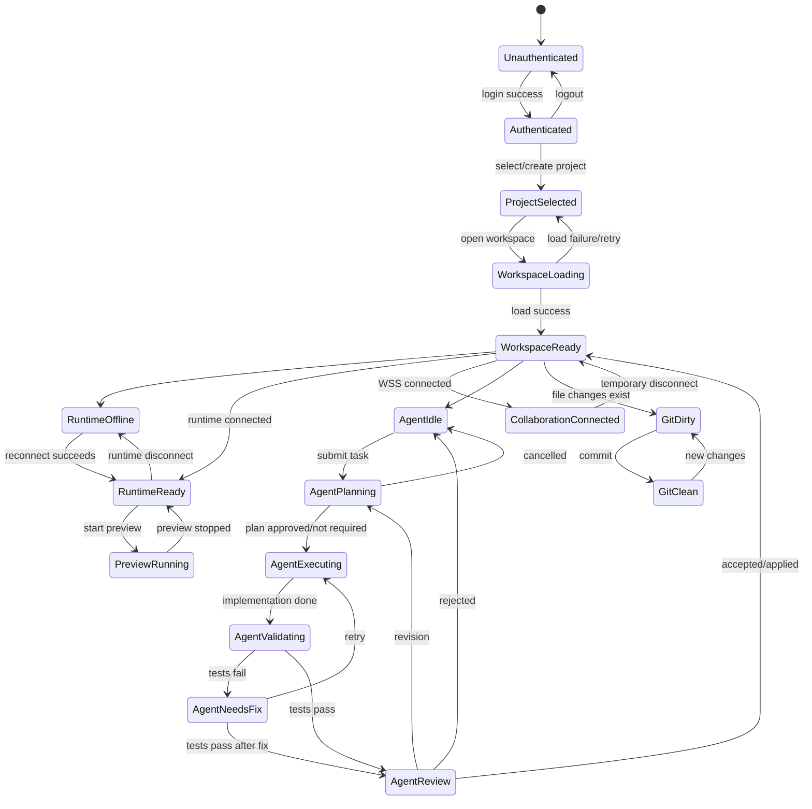

---

# 23. First-Time User Flow

The first session should minimize setup friction while still making the architecture visible.

```text
Login
 ↓
Create/import demo project
 ↓
Connect runtime
 ↓
Open workspace
 ↓
Run project
 ↓
Invite collaborator
 ↓
Ask AI
 ↓
See successful change
```

## 23.1 Onboarding location

Show lightweight contextual onboarding in:

- empty dashboard;
- runtime setup;
- first workspace entry;
- first AI task.

## 23.2 Do not show onboarding

Avoid:

- full-screen tutorials on every visit;
- tooltips for basic editor controls;
- explaining common IDE behavior;
- blocking the user before they can edit.

## 23.3 First workspace checklist

A small checklist:

```text
Get started

✓ Project created
✓ Runtime connected
○ Run your project
○ Invite a collaborator
○ Ask AI to make a change
```

Once completed, collapse it.

---

# 24. Five-Minute Portfolio Demo

## Demo scenario

Participants:

- **Alice** — primary developer.
- **Bob** — collaborator.
- **AI Agent** — coding agent.
- Project — **React Dashboard**.
- Task — **Add dark mode**.

## 24.1 0:00–0:30 — Login/project

Alice logs in.

Create/import:

`React Dashboard`

Open workspace.

Show:

- Monaco;
- file tree;
- terminal;
- runtime status;
- Git branch.

## 24.2 0:30–1:00 — Runtime

Alice connects runtime.

Show:

```text
Runtime ● Ready
Docker ● Available
```

Run the dashboard.

Preview appears.

## 24.3 1:00–1:40 — Collaboration

Alice shares/invites Bob.

Bob opens the same workspace.

Alice edits a small label.

Bob sees it live.

Bob edits another part.

Alice sees Bob's cursor and change.

This demonstrates:

- WebSockets;
- Yjs;
- presence;
- concurrent editing.

## 24.4 1:40–2:10 — AI request

Alice enters:

```text
Add a dark mode toggle to the dashboard.
Keep the existing layout and make sure tests pass.
```

AI shows:

```text
Inspecting repository
✓ Dashboard
✓ Theme styles
✓ Tests
```

## 24.5 2:10–2:40 — Plan approval

AI presents:

```text
1. Add theme state.
2. Add toggle control.
3. Add dark theme styles.
4. Update tests.
5. Run tests.
```

Alice clicks:

`Approve`

## 24.6 2:40–3:40 — AI implementation

Show isolated worktree indicator:

```text
AI changes: isolated
Base: a81f2c4
```

Agent edits.

Run tests.

For the demo fixture, the first test run intentionally fails.

```text
2 tests failed
```

## 24.7 3:40–4:10 — AI debugging

Agent receives:

- exit code;
- stderr/stdout;
- failing test;
- relevant files.

It repairs.

Second run:

```text
✓ 14 tests passed
```

## 24.8 4:10–4:40 — Review

Change set:

```text
3 files
+54
-8
```

Alice reviews the diff.

She accepts the relevant hunks.

System:

```text
✓ Conflict check passed
✓ Changes applied
```

## 24.9 4:40–5:00 — Preview + Git

Preview refreshes.

Dark mode works.

Alice commits:

`Add dashboard dark mode`

Then:

`Push to GitHub`

Explicit approval.

Final:

```text
✓ Commit created
✓ Pushed to GitHub
```

## 24.10 Demo fallback

If AI provider fails:

- use a mocked/deterministic AI fixture for the demo;
- show the same plan/tool/review UI;
- do not pretend a live provider succeeded.

If runtime fails:

- show the architecture honestly;
- reconnect;
- use the prebuilt demo state if necessary.

The demo should never depend on hidden manual edits.

---

# 25. Edge Case Flows

## 25.1 Two users edit same file

Normal Yjs flow:

```text
A edit + B edit
 ↓
Yjs merge
 ↓
Both converge
```

No manual conflict screen.

## 25.2 User closes browser

```text
Browser closes
 ↓
Socket disconnect
 ↓
Presence removed
 ↓
Other users continue
```

On reopen:

- authenticate;
- reconnect;
- resync.

## 25.3 Runtime disconnect

Editor remains available.

Terminal/preview/test controls show unavailable state.

## 25.4 Docker crashes

Runtime reports container failure.

UI:

```text
Container stopped unexpectedly.

[Restart Runtime Container]
```

Existing Git/files remain intact.

## 25.5 GitHub token expires

```text
GitHub authorization expired.

Local repository is safe.

[Reconnect GitHub]
```

## 25.6 AI fails

Agent changes remain isolated.

Shared workspace is unchanged.

## 25.7 Tests fail repeatedly

After maximum attempts:

```text
AI stopped after 3 repair attempts.

No changes were applied to the shared workspace.

[Review Failure] [Revise Task]
```

## 25.8 User rejects AI changes

Change set becomes rejected.

The agent worktree is cleaned up after preserving required audit metadata.

## 25.9 Partial hunk acceptance

```text
Hunk 1 ✓
Hunk 2 ✕
Hunk 3 ✓

[Apply Selected]
```

Run conflict validation before applying.

## 25.10 Branch changes while agent is running

The agent's base remains explicit.

If shared branch changes:

```text
Workspace branch changed while AI was working.

The current AI change set is based on an older revision.

[Rebase AI Changes] [Discard]
```

Never silently rebase and apply.

---

# 26. Overall App Flow Diagram

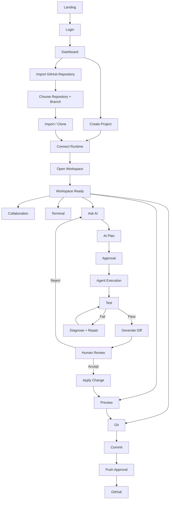

---

# 27. Authentication Diagram

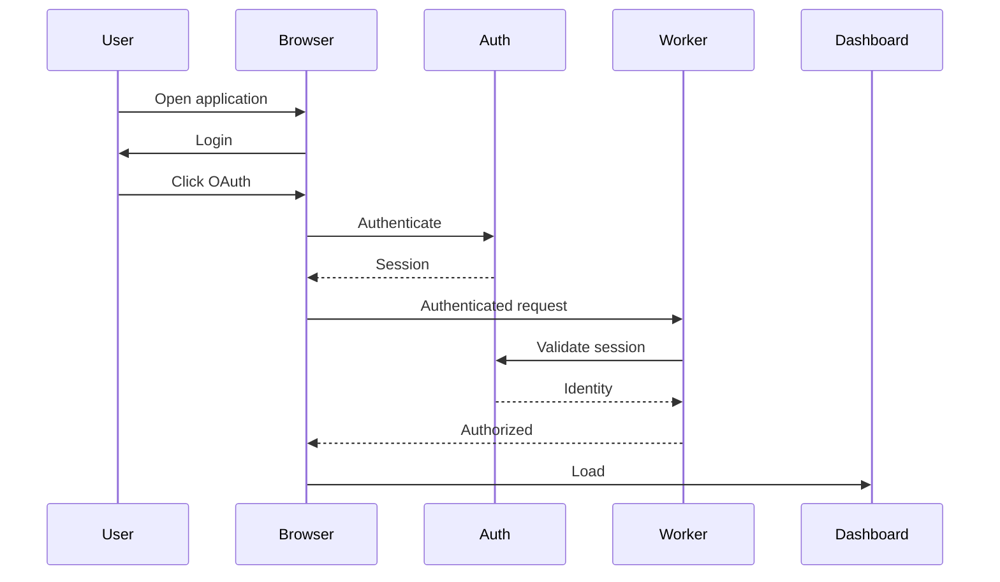

---

# 28. Project Creation Diagram

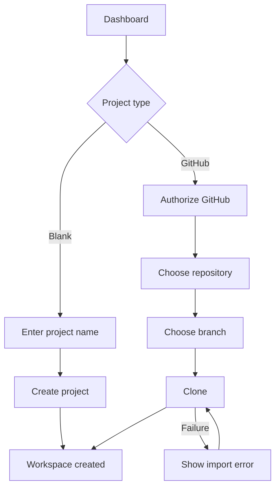

---

# 29. GitHub Import Diagram

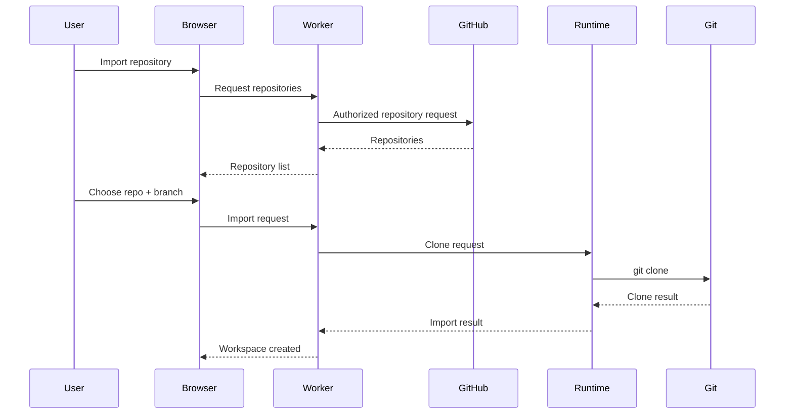

---

# 30. Workspace Loading Diagram

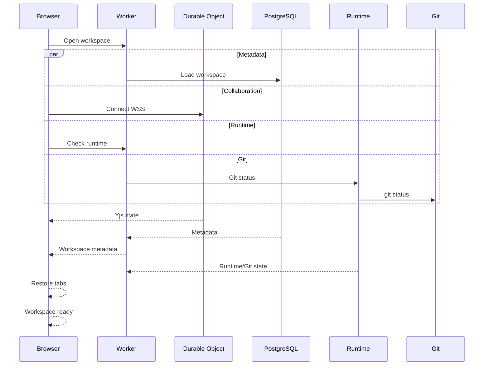

---

# 31. Collaboration Diagram

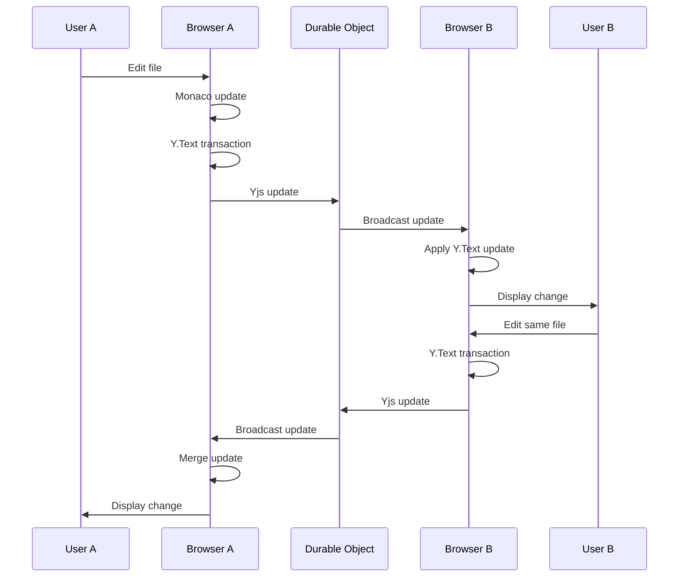

---

# 32. AI Agent Diagram

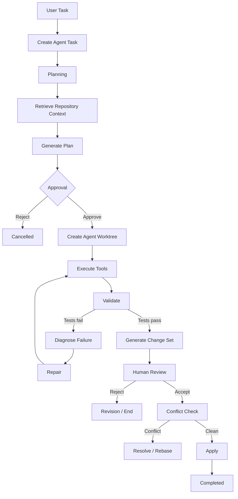

---

# 33. Agent Debugging Diagram

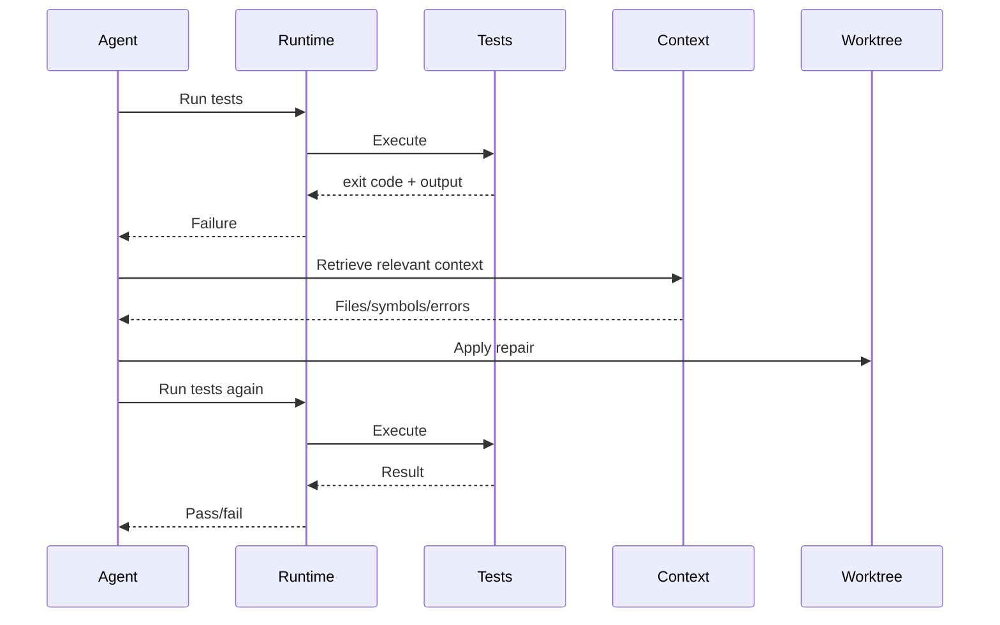

---

# 34. Change Review Diagram

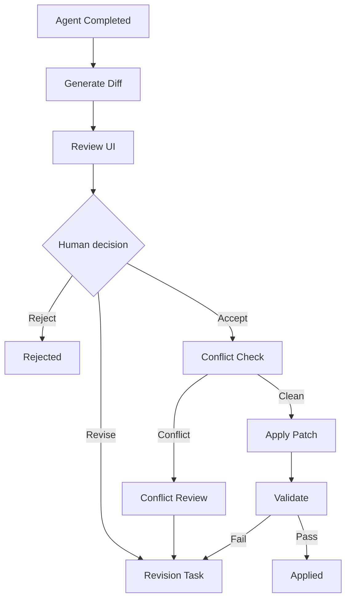

---

# 35. Runtime Diagram

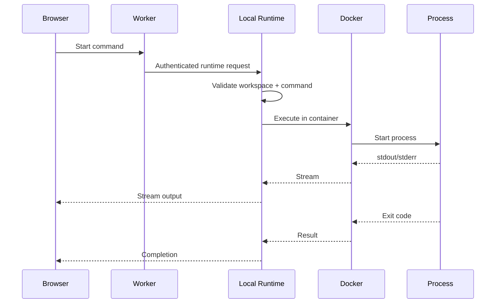

---

# 36. Preview Diagram

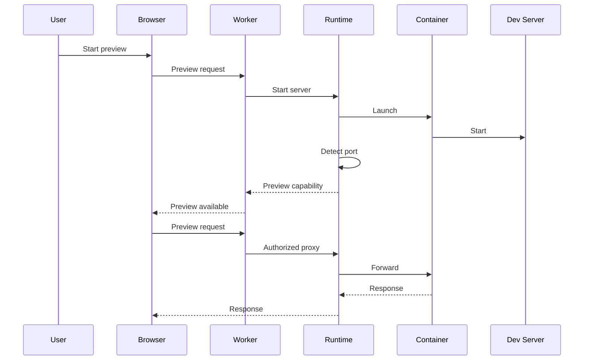

---

# 37. Git Diagram

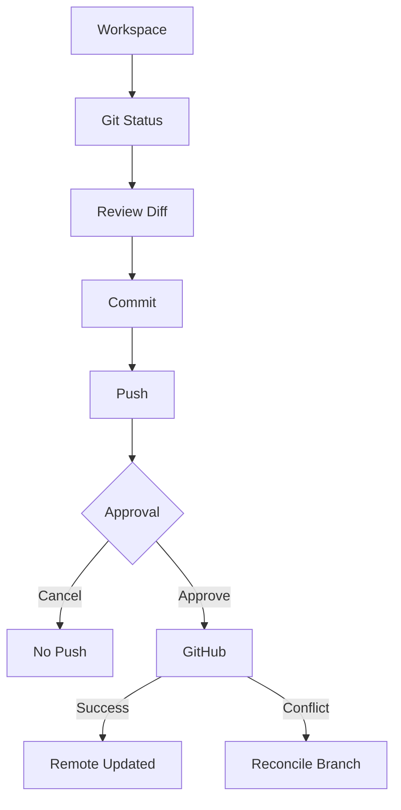

---

# 38. Error Recovery Diagram

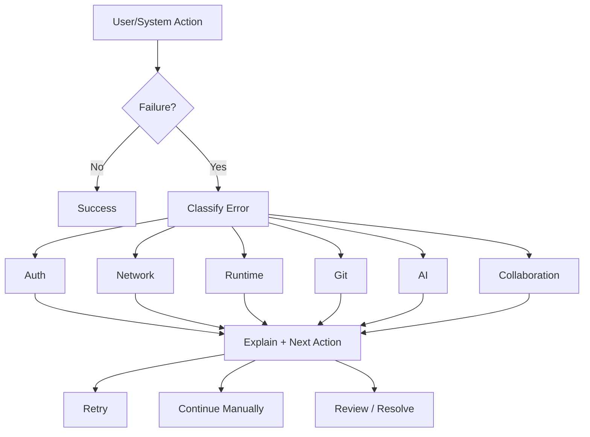

---

# 39. Critical Handoffs

The most important technical/product handoffs are:

## Browser -> Worker

Used for:

- authenticated API requests;
- project operations;
- task creation;
- runtime coordination;
- Git control operations.

## Browser -> Durable Object

Used for:

- collaboration;
- presence;
- cursors;
- Yjs synchronization;
- realtime agent events.

## Worker -> PostgreSQL

Used for:

- durable project state;
- memberships;
- agent state;
- change sets;
- audit events.

## Worker -> Local Runtime

Used for:

- execution requests;
- runtime state;
- preview;
- Git;
- Docker operations.

## Agent -> Runtime

Used for:

- validated tools;
- file operations;
- commands;
- tests;
- Git operations;
- preview inspection.

## Agent -> Human

Used for:

- plan approval;
- change review;
- dangerous actions;
- Git approval.

---

# 40. Critical UX States

The following states must be visually unambiguous:

1. `Runtime Offline`
2. `Runtime Ready`
3. `Collaboration Reconnecting`
4. `Agent Planning`
5. `Waiting for Approval`
6. `Agent Executing`
7. `Tests Running`
8. `Tests Failed`
9. `Agent Needs Fix`
10. `Changes Ready for Review`
11. `Change Set Stale`
12. `Conflict Detected`
13. `Changes Applied`
14. `Preview Running`
15. `Git Dirty`
16. `Push Awaiting Approval`

---

# 41. Most Important User Interactions

Priority order:

1. Open workspace.
2. Edit code.
3. See collaborator edits.
4. Ask AI.
5. Understand AI plan.
6. Approve AI plan.
7. See AI progress.
8. Understand test result.
9. Review diff.
10. Accept/reject changes.
11. Run preview.
12. Commit.
13. Approve push.

The UI should optimize for these interactions before secondary settings.

---

# 42. UX Risks

## Risk 1 — Too many technical statuses

**Problem:** Users may see Docker, runtime, WebSocket, Yjs, agent, Git, and preview statuses simultaneously.

**Mitigation:** Group low-level states into user-level statuses.

Example:

```text
Runtime
● Ready
```

rather than:

```text
WebSocket: Connected
Docker daemon: Healthy
Container: Running
PTY: Connected
Proxy: Listening
```

Details can be expandable.

## Risk 2 — AI activity becomes noisy

**Mitigation:** Show summarized tool progress and expandable details.

## Risk 3 — Users confuse agent changes with shared changes

Always show:

```text
AI changes: Isolated
```

until applied.

## Risk 4 — Runtime appears mandatory for simple editing

It is not. Editing/collaboration should remain available even when execution is offline.

## Risk 5 — Approval fatigue

Do not ask for approval for every file read/edit. Use:

- plan approval;
- policy-based dangerous action approval;
- final change-set approval.

## Risk 6 — Git and AI controls become confusing

Keep Git operations in the Git panel while surfacing relevant Git state in change review.

## Risk 7 — Failure messages expose implementation internals

Use technical detail in expandable sections, not the primary error message.

---

# 43. Flow Simplifications

For the MVP:

### Simplify project creation

One form for blank project.

### Simplify GitHub import

Repository -> branch -> import.

Do not build advanced repository search/filtering.

### Simplify collaboration

One workspace = one collaboration room.

### Simplify AI

One agent.

### Simplify approvals

Plan approval + final change-set approval.

### Simplify Git

Status, diff, branch, commit, push.

### Simplify runtime

One local runtime installation.

### Simplify preview

One detected dev-server port.

---

# 44. Recommended MVP Flow

The recommended product flow is:

```text
LANDING
  ↓
LOGIN
  ↓
DASHBOARD
  ↓
CREATE / IMPORT
  ↓
RUNTIME SETUP
  ↓
WORKSPACE
  │
  ├── Files
  ├── Editor
  ├── Collaboration
  ├── Terminal
  ├── Preview
  ├── Git
  └── AI Agent
        ↓
     TASK
        ↓
     CONTEXT
        ↓
      PLAN
        ↓
   APPROVAL
        ↓
   ISOLATED WORK
        ↓
      TESTS
      ↙    ↘
   PASS      FAIL
    ↓         ↓
   DIFF ←── REPAIR
    ↓
 HUMAN REVIEW
   ↙       ↘
REJECT     ACCEPT
  ↓          ↓
REVISION   CONFLICT CHECK
             ↓
           APPLY
             ↓
          PREVIEW
             ↓
           COMMIT
             ↓
        PUSH APPROVAL
             ↓
          GITHUB
```

---

# 45. Primary Happy Path

```text
1. User logs in.
2. User creates or imports a project.
3. User connects local runtime.
4. User opens workspace.
5. User sees runtime/collaboration/Git state.
6. User invites collaborator.
7. Both users edit concurrently.
8. User asks AI to make a meaningful change.
9. AI inspects repository.
10. AI retrieves relevant context.
11. AI presents a plan.
12. User approves.
13. AI creates isolated worktree.
14. AI edits files.
15. AI runs tests.
16. If tests fail, AI diagnoses and repairs.
17. AI generates change set.
18. User reviews file/hunk diffs.
19. User accepts/rejects/revises.
20. System checks current workspace for conflicts.
21. Accepted changes are applied.
22. Preview starts/refreshes.
23. User verifies behavior.
24. User commits.
25. User explicitly approves push.
26. Changes reach GitHub.
```

---

# 46. Secondary Flows

## Secondary flow A — Continue manually

```text
AI unavailable
 ↓
Continue editing
 ↓
Terminal/tests if runtime available
 ↓
Commit manually
```

## Secondary flow B — Runtime-first setup

```text
Dashboard
 ↓
Connect Runtime
 ↓
Choose project
 ↓
Open Workspace
```

## Secondary flow C — AI revision

```text
Review
 ↓
Revise
 ↓
New agent run
 ↓
New change set
 ↓
Review again
```

## Secondary flow D — Collaboration without AI

```text
Login
 ↓
Project
 ↓
Runtime optional
 ↓
Workspace
 ↓
Invite collaborator
 ↓
Edit together
 ↓
Git commit
```

---

# 47. Critical Error Flows

The following failures must never silently destroy user work:

### Runtime failure

Shared source remains intact.

### AI failure

Agent worktree is discarded or preserved for diagnostics; shared workspace remains intact.

### Git conflict

No forced overwrite.

### Collaboration reconnect

Resync before declaring local state authoritative.

### Change-set conflict

No patch application until compatibility is established.

### GitHub push conflict

No force push by default.

### Unauthorized action

Block before execution.

### Prompt injection

Treat repository content as data; tool policy remains authoritative.

---

# 48. Critical State-to-Action Rules

| State                | User can                     | User cannot                                         |
| -------------------- | ---------------------------- | --------------------------------------------------- |
| Runtime Offline      | edit, collaborate            | run terminal/preview/tests                          |
| Runtime Ready        | execute                      | bypass policies                                     |
| Agent Planning       | inspect plan                 | apply changes                                       |
| Waiting for Approval | approve/reject/revise        | agent execution without approval                    |
| Agent Executing      | observe/cancel               | directly alter agent worktree through shared editor |
| Agent Validating     | observe                      | accept before change set exists                     |
| Agent Needs Fix      | inspect/cancel               | apply unvalidated patch                             |
| Agent Review         | inspect/accept/reject/revise | ignore stale conflict                               |
| Conflict Detected    | resolve/rebase/revise        | force overwrite                                     |
| Preview Running      | interact/restart             | access arbitrary host destination                   |
| Git Dirty            | inspect/commit               | push without required approval                      |
| Push Approval        | approve/cancel               | bypass confirmation                                 |

---

# 49. UI Implementation Guidance

## Top bar

Recommended information:

```text
<Project> / <Workspace>
Branch: main
Runtime: ● Ready
Collaborators: [A] [B]
Git: Clean/3 changes
```

## Main workspace

```text
+---------------------------------------------------------------+
| Top Bar                                                       |
+------------+----------------------------------+---------------+
| File Tree  | Monaco Editor                   | AI Agent      |
|            |                                  |               |
| src/       |                                  | Plan          |
| tests/     |                                  | Progress      |
| package... |                                  | Review        |
+------------+----------------------------------+---------------+
| Terminal / Output             | Preview                      |
+---------------------------------------------------------------+
```

The exact panel arrangement can change during UI design, but the functional surfaces should remain discoverable.

---

# 50. Final UX Evaluation

## Primary happy path

```text
Login
→ Project
→ Runtime
→ Workspace
→ Collaborate
→ Ask AI
→ Approve
→ Execute
→ Test
→ Repair
→ Review
→ Apply
→ Preview
→ Commit
→ Push
```

## Secondary flows

- Blank project.
- GitHub import.
- Collaboration without AI.
- AI revision.
- Manual development after AI failure.
- Runtime reconnect.

## Critical error flows

- Authentication failure.
- Runtime offline.
- Docker unavailable.
- Collaboration disconnect.
- AI failure.
- Test failure.
- Tool denial.
- Context overflow.
- Patch conflict.
- Git conflict.
- GitHub authorization expiry.

## Critical states

- Workspace ready.
- Runtime ready/offline.
- Collaboration connected/reconnecting.
- Agent waiting for approval.
- Agent executing.
- Agent validating.
- Agent needs fix.
- Change review.
- Conflict.
- Preview running.
- Git dirty/clean.

## Most important user interactions

1. Editing.
2. Collaboration.
3. AI task submission.
4. Plan approval.
5. Change review.
6. Preview.
7. Commit/push.

## Most important technical handoffs

```text
Browser → Worker
Browser → Durable Object
Worker → PostgreSQL
Worker → Runtime
Agent → Runtime
Agent → Human
Git → GitHub
```

## UX risks

- status overload;
- AI activity noise;
- unclear distinction between isolated and shared changes;
- approval fatigue;
- confusing runtime/Git states;
- failure messages that are too technical.

## Flow simplifications

- one workspace room;
- one AI agent;
- one local runtime;
- deterministic P0 repository context;
- minimal Git operations;
- policy-based rather than constant approval;
- no enterprise onboarding.

## Recommended MVP flow

The MVP should optimize for one exceptionally clear loop:

```text
OPEN
 ↓
EDIT TOGETHER
 ↓
ASK AI
 ↓
APPROVE PLAN
 ↓
AI WORKS SAFELY
 ↓
TEST
 ↓
REPAIR
 ↓
REVIEW DIFF
 ↓
APPLY
 ↓
PREVIEW
 ↓
COMMIT
 ↓
PUSH
```

If a feature does not strengthen this loop, it should be deferred unless required by the underlying technical architecture.

---

# 51. Final Product Flow in One View

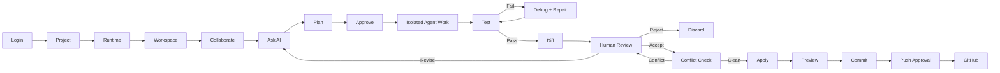

**The defining UX principle is simple:**

> Humans collaborate directly in the shared workspace; AI works through an isolated change path; tests validate the result; humans decide what reaches the shared workspace and Git.

That separation should remain visible throughout the product.
