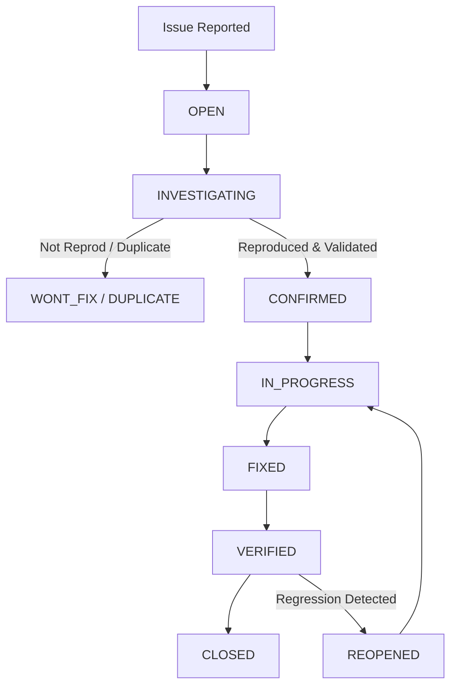
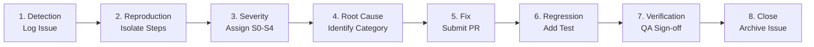

# BUG & REGRESSION TRACKER — Collaborative AI Vibe-Coding Workspace

**Target Document:** `docs/bugs.md`  
**Role:** Senior QA Engineer & Engineering Manager  
**Specification Baseline:** Approved `PRD.md`, `TRD.md`, `Architecture.md`, `implementation.md`, `task.md`, and `testing.md`  
**Core Purpose:** Provide a living bug tracking framework, triage pipeline, severity matrix, standardized issue reporting template, risk watchlists, and regression verification rules.

---

## 1. BUG SEVERITY MATRIX

Bug severity is classified based on functional impact, user data risk, security boundary breaches, and operational disruption.

| Severity | Level        | Impact Criteria                                                                                                                                         | Target SLA (Response / Resolution)                              |
| -------- | ------------ | ------------------------------------------------------------------------------------------------------------------------------------------------------- | --------------------------------------------------------------- |
| **S0**   | **Critical** | System outage, CRDT document corruption, unauthorized workspace access, arbitrary command injection escape, host Docker compromise, secret key leakage. | **Response:** < 1 hour<br/>**Fix Target:** < 24 hours           |
| **S1**   | **High**     | Core functionality broken (e.g. agent repair loop crash, Git worktree corruption, WebSocket sync drop without reconnect, local runtime disconnect).     | **Response:** < 4 hours<br/>**Fix Target:** < 48 hours          |
| **S2**   | **Medium**   | Non-blocking feature failure (e.g. diff viewer syntax highlight error, context engine sub-optimal ranking, terminal log streaming truncation).          | **Response:** < 24 hours<br/>**Fix Target:** < 1 week           |
| **S3**   | **Low**      | Minor edge-case bug with straightforward workaround (e.g. tooltip rendering delay, non-critical toast toast timing issue).                              | **Response:** < 48 hours<br/>**Fix Target:** Next release cycle |
| **S4**   | **Cosmetic** | Visual defects, alignment flaws, minor typos, UI glassmorphic glow padding adjustments.                                                                 | **Response:** Best effort<br/>**Fix Target:** Backlog priority  |

---

## 2. BUG LIFECYCLE & STATUS DEFINITIONS

Every reported issue transitions through a formal state lifecycle:



- **`OPEN`:** Newly submitted issue awaiting triage.
- **`INVESTIGATING`:** QA/Engineer reproducing issue and analyzing root cause.
- **`CONFIRMED`:** Bug reproduced consistently and prioritized for fix.
- **`IN_PROGRESS`:** Active development work in progress to fix issue.
- **`FIXED`:** Pull request merged into `main` branch containing fix.
- **`VERIFIED`:** QA verified fix passes regression test suite in test environment.
- **`REOPENED`:** Verification failed or regression detected post-fix.
- **`WONT_FIX`:** Intended behavior, out-of-scope, or low priority tradeoff.
- **`DUPLICATE`:** Issue duplicates an existing logged bug tracker entry.

---

## 3. STANDARDIZED BUG REPORT TEMPLATE

All issues logged to the tracker MUST use the following markdown template:

````markdown
## BUG-000 — Short descriptive bug title

Status: OPEN
Severity: S2
Component: Collaboration
Found in: v0.1.0
Reported: YYYY-MM-DD
Related Task: TASK-XXX

### Summary

Clear 2-3 sentence description of the bug and its functional impact.

### Environment

- **Browser/OS:** Chrome 125 / Windows 11
- **Deployment:** Cloudflare Worker Staging / Local Docker Runtime
- **Node/pnpm Version:** Node v22.2.0 / pnpm v9.1.0

### Steps to Reproduce

1. Open workspace with two browser sessions (User A and User B).
2. User A opens file `src/App.tsx`.
3. User B disconnects network connection while typing.
4. User A edits lines 10-15.
5. User B reconnects network.

### Expected

User B receives Yjs missing delta vector update and document converges smoothly without text corruption.

### Actual

User B's Monaco editor model experiences line offset mismatch resulting in duplicate line insertions.

### Logs

```text
[ERROR] 14:22:01.405 [WorkspaceRoom] Yjs state vector mismatch for client_cli_88192
[WARN]  14:22:01.410 [YjsMonacoBinding] Text model transaction rejected: IndexOutOfBoundsException
```
````

### Screenshots

_(Attach visual screenshots or terminal recordings if applicable)_

### Root Cause

_(To be populated during INVESTIGATING phase)_

### Fix

_(To be populated during IN_PROGRESS / FIXED phase detailing PR diff)_

### Regression Test

_(Path to automated test file validating fix, e.g. `tests/collaboration/bug-000-reconnect.test.ts`)_

### Verification

_(QA sign-off date, environment, and verification build commit SHA)_

### Notes

Any additional context, edge case observations, or related tickets.

````

---

## 4. BUG CATEGORIES

To enable structured tracking and domain-specific ownership, bugs are categorized into one of 17 subsystem domains:

- **`Frontend`:** React UI components, Monaco editor mount, layout CSS grids, toast notifications.
- **`Backend`:** Cloudflare Worker Hono API routes, HTTP response formatting, RBAC checks.
- **`Database`:** PostgreSQL schema constraints, migrations, Supabase query transactions.
- **`Authentication`:** Supabase Auth SDK, JWT signature validation, cookie management.
- **`Authorization`:** Member role permissions (`owner`, `editor`, `viewer`), policy checks.
- **`Collaboration`:** Yjs CRDT operations, awareness cursors, selection highlights, document state vectors.
- **`WebSocket`:** Envelope protocol, socket handshake, ping/pong heartbeats, reconnection backoff.
- **`Runtime`:** Local Node.js execution daemon, pairing server, reverse WS channel.
- **`Docker`:** Container creation, capability dropping (`--cap-drop=ALL`), resource quotas, volume mounts.
- **`Git`:** Git CLI execution, branch creation, commit history, worktree lifecycle, diff parsing.
- **`AI`:** `AIProvider` abstractions, Ollama streaming, mock providers, token response parsing.
- **`Agent`:** `AgentOrchestrator`, `AgentStateMachine`, tool execution registry, repair loop iterations.
- **`Context`:** Lexical indexer, AST symbol extractor, stack trace parser, token budgeting.
- **`Preview`:** Live preview port discovery, container proxying, dev server lifecycle.
- **`Security`:** Path traversal guards, command policy allowlists, secret redactors, SSRF checks.
- **`Performance`:** High CRDT sync latency, browser memory leaks, slow context retrieval.
- **`Deployment`:** Cloudflare Wrangler configuration, GitHub Actions CI workflows, migration runners.

---

## 5. ROOT-CAUSE CATEGORIES

When a bug fix is submitted, the engineer must assign one primary root-cause category:

- **`Logic`:** Algorithm flaw, incorrect condition check, or invalid business rule logic.
- **`Concurrency`:** Race conditions, thread/event loop lockups, CRDT timing mismatches.
- **`State`:** Unhandled state machine transition, stale React/Zustand state, un-disposed Monaco models.
- **`Network`:** Socket drops, packet latency, unhandled HTTP status codes, CORS issues.
- **`Data`:** Missing database migrations, null constraint violations, Zod parsing mismatch.
- **`Security`:** Un-sanitized inputs, missing permission check, path traversal escape.
- **`Configuration`:** Environment variable missing, invalid Docker runtime flag, incorrect `wrangler.toml` binding.
- **`Dependency`:** Third-party package bug or breaking API change in external library.
- **`Infrastructure`:** Cloudflare Edge worker limits, Supabase connection pool exhaustion, Docker Engine daemon crash.
- **`AI Behavior`:** LLM hallucinated tool arguments, prompt context overflow, non-deterministic output format.
- **`Human Error`:** Typo, invalid manual deployment step, broken test assertion setup.

---

## 6. REGRESSION TEST MANDATE

> **CRITICAL POLICY:** Every resolved **S0 (Critical)** or **S1 (High)** bug MUST produce an automated, repeatable regression test in the test suite prior to QA sign-off and closure.

- **Unit/Integration Regressions:** Added to `tests/regressions/bug-XXX.test.ts`.
- **Collaboration Regressions:** Added to `tests/collaboration/regressions/bug-XXX-sync.test.ts`.
- **Security Regressions:** Added to `tests/security/regressions/bug-XXX-security.test.ts`.

A pull request fixing an S0/S1 bug WITHOUT a corresponding regression test will be blocked from merging during code review.

---

## 7. INITIAL RISK WATCHLIST

The following architectural risk areas are flagged for proactive QA investigation.
*(Note: These are categorized strictly as **Risk / Watch Items** — not confirmed bugs).*

```markdown
### WATCH-001 — High-Frequency Concurrent Keystroke Reconnection Race

Component: Collaboration
Risk Area: Yjs State Vector Synchronization
Description: Under high-latency network jitter, a client reconnecting while rapidly typing may transmit an outdated state vector, potentially triggering temporary Monaco model content flicker before convergence.
Mitigation Plan: Add integration test simulating 50ms packet jitter during Yjs state vector exchange (`tests/collaboration/reconnect-race.test.ts`).
````

```markdown
### WATCH-002 — Orphan Agent Git Worktree Directories

Component: Git / Agent  
Risk Area: Local Runtime Disk Usage  
Description: If local runtime daemon is killed abruptly (`SIGKILL`) while an agent task is executing inside `/tmp/worktree-task-xxx`, temporary git worktree directories may remain on host disk.  
Mitigation Plan: Implement startup directory cleanup scanner in runtime daemon pruning orphaned `/tmp/worktree-*` directories older than 1 hour.
```

```markdown
### WATCH-003 — Container Child Process Tree Leaks

Component: Docker / Runtime  
Risk Area: Host Process Management  
Description: Long-running background processes spawned inside sandbox containers (e.g. `npm run dev`) may fail to catch `SIGTERM` when workspace is stopped, leaving orphan background tasks.  
Mitigation Plan: Ensure Docker container launch uses `--init` or Tini init process wrapper to reap orphan child processes.
```

```markdown
### WATCH-004 — Three-Way Git Patch Conflict after Concurrent Human Edits

Component: Change Sets  
Risk Area: Human + AI Conflict Resolution  
Description: If human edits lines adjacent to an agent's worktree patch while agent execution is in progress, patch application may fail with conflict markers.  
Mitigation Plan: Enforce strict `git apply --check` validation prior to applying patches; surface clear "Conflict Requires Review" warning in UI.
```

```markdown
### WATCH-005 — Context Engine Token Budget Inflation on Minified Code

Component: Context  
Risk Area: AI Prompt Context  
Description: Ingesting minified single-line JavaScript files (e.g., vendor bundles) into context engine may exceed per-file line slicing limits and dominate token budget.  
Mitigation Plan: Add file size and line length filters in `ContextRetriever` excluding minified bundles (`*.min.js`, lines > 1000 chars).
```

```markdown
### WATCH-006 — Terminal PTY Output Buffer Overflow

Component: Runtime / Terminal  
Risk Area: Browser UI Performance  
Description: Fast-printing container commands (e.g. `yes` or verbose build logs) may flood WebSocket channel with thousands of chunks per second, causing UI main thread lag.  
Mitigation Plan: Implement sliding window output throttle in `ProcessManager` capping stdout stream to max 1 MiB/minute per process.
```

```markdown
### WATCH-007 — Live Preview Proxy SSRF Boundary Bypass via Container Loopback

Component: Security / Preview  
Risk Area: Network Isolation  
Description: A malicious container process might attempt to redirect dev server proxy traffic to host loopback interfaces (`127.0.0.1:2375` Docker daemon).  
Mitigation Plan: Validate preview proxy destination IP strictly against container network bridge IP subnet, rejecting host loopback destinations.
```

```markdown
### WATCH-008 — Durable Object Memory Footprint during Long-Lived Rooms

Component: Collaboration / Durable Objects  
Risk Area: Cloudflare Edge Memory Limits  
Description: Long-lived collaboration rooms retaining large binary Yjs update histories in memory may approach Cloudflare Durable Object 128 MB RAM limits.  
Mitigation Plan: Trigger periodic Y.Doc snapshot compaction in `WorkspaceRoom` DO, clearing granular operation vectors into compressed document state snapshots.
```

---

## 8. BUG TRIAGE & RESOLUTION WORKFLOW

The engineering team follows a systematic 8-step bug resolution pipeline:



1. **Detection:** Issue logged by engineer, automated test run, or user report.
2. **Reproduction:** QA/Engineer isolates minimal reproducible example steps.
3. **Severity:** Assign severity level (`S0` through `S4`) based on impact matrix.
4. **Root Cause:** Investigate code and assign root-cause category.
5. **Fix:** Developer creates feature branch `fix/bug-xxx`, implements code fix, and submits PR.
6. **Regression Test:** Developer adds automated test case proving bug fix.
7. **Verification:** QA verifies fix passes automated regression suite in staging environment.
8. **Close:** Bug status updated to `VERIFIED` and issue closed.

---

## 9. BUG METRICS & HEALTH DASHBOARD

The quality engineering manager monitors basic bug health metrics per release cycle:

### Primary Quality Metrics

- **Total Open Bugs:** Count of active issues in `OPEN`, `INVESTIGATING`, `CONFIRMED`, or `IN_PROGRESS` status.
- **Bugs by Severity:** Breakdown of open issues across `S0`, `S1`, `S2`, `S3`, and `S4`.
- **Security Bugs:** Count of open security-related issues (`Security` component).
- **Regression Count:** Number of bugs caught by automated CI test suites prior to production merge.
- **Reopened Rate:** Percentage of bugs where status transitioned `FIXED` → `REOPENED` (Target: < 5%).
- **Average Resolution Time (MTTR):** Time from `OPEN` to `VERIFIED` (Target: S0 < 24h, S1 < 48h, S2 < 7 days).

---

## 10. CURRENT ACTIVE BUG LOG

_(No confirmed production bugs currently logged for initial codebase version v0.1.0-alpha)._

| Bug ID | Title                    | Severity | Component | Status | Reported   | Related Task |
| ------ | ------------------------ | -------- | --------- | ------ | ---------- | ------------ |
| _None_ | _Initial alpha baseline_ | —        | —         | —      | 2026-08-31 | —            |
