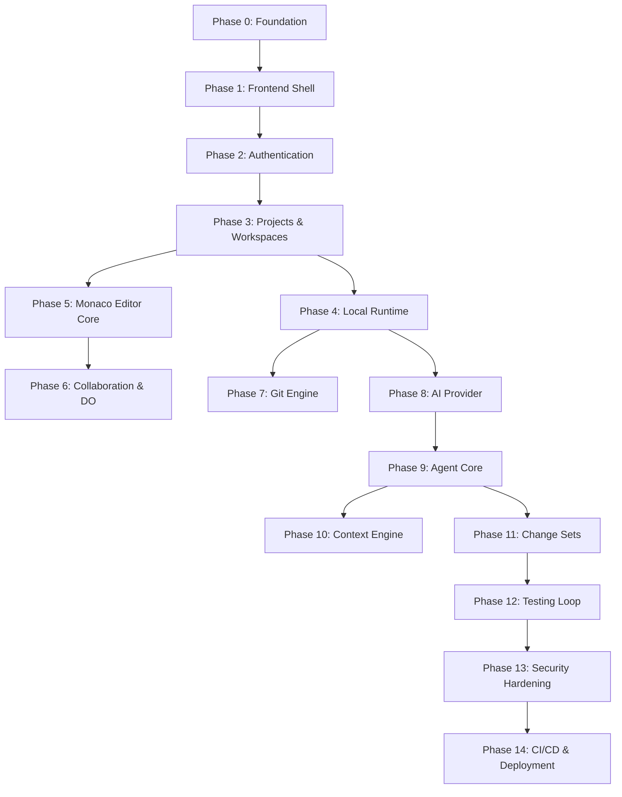
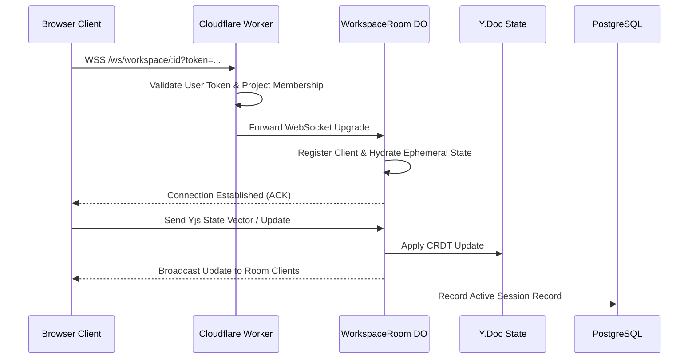

# IMPLEMENTATION PLAN — Collaborative AI Vibe-Coding Workspace

**Target Document:** `docs/implementation.md`  
**Role:** Staff Software Engineer and Technical Lead  
**Specification Baseline:** Approved `PRD.md`, `AppFlow.md`, `Ui-Ux.md`, `Architecture.md`, and `TRD.md`  
**Execution Model:** Single developer, MVP-first, free-first infrastructure, incremental implementation, working software at every phase, zero-trust execution security.

---

## 1. IMPLEMENTATION PRINCIPLES

1. **Single Developer Operational Efficiency:** Avoid unnecessary abstractions, microservices, or complex build pipelines. Maintain a single monorepo using standard TypeScript tooling (`pnpm` workspaces).
2. **MVP First & Incremental Delivery:** Every phase produces a runnable, testable increment. Never write speculative code for unneeded phases.
3. **Free-First Infrastructure Budget:**
   - Control & Realtime: Cloudflare Workers + Durable Objects (Free tier).
   - Persistence & Auth: Supabase PostgreSQL + Supabase Auth (Free tier).
   - Execution & AI: Local Developer machine (Docker Engine + local Ollama model).
4. **Strict Component Boundaries & Ownership:**
   - **PostgreSQL:** User identities, project metadata, workspaces, durable agent tasks/runs, audit logs.
   - **Durable Objects:** Active workspace rooms, ephemeral Yjs document sync, presence, and awareness.
   - **Local Runtime Daemon:** Local Docker engine management, command execution, process management, Git CLI operations.
   - **Git CLI:** Absolute source of truth for committed source code.
5. **Type Safety & Runtime Contracts:** End-to-end TypeScript strict mode. Shared data structures and WebSocket envelopes strictly validated using Zod schemas (`packages/protocol`).
6. **Defense-in-Depth Security:**
   - Model outputs are untrusted.
   - Filesystem operations strictly jailed within the workspace root.
   - Commands executed inside unprivileged Docker containers (`--cap-drop=ALL`).
   - GitHub tokens encrypted server-side and never exposed to the client or model prompts.

---

## 2. IMPLEMENTATION ORDER

The implementation follows a strict 15-phase dependency sequence:



- **Phase 0 — Repository Foundation:** Monorepo config, TypeScript base, shared contracts package.
- **Phase 1 — Frontend Shell:** React + Vite layout, routing structure, component hierarchy, basic styling system.
- **Phase 2 — Authentication:** Supabase Auth setup, HTTP-only cookie validation middleware, user profile persistence.
- **Phase 3 — Projects & Workspaces:** PostgreSQL schema, project creation, GitHub repository metadata, workspace routing.
- **Phase 4 — Local Runtime:** Daemon HTTP/WebSocket server, authentication pairing flow, process stream protocol.
- **Phase 5 — Monaco Editor:** Monaco Editor integration, tab state, file tree navigation, local editor models.
- **Phase 6 — Collaboration:** Cloudflare Durable Object room, Yjs CRDT binding to Monaco, Awareness presence.
- **Phase 7 — Git Integration:** Git CLI wrapper in runtime, repository cloning, branch management, worktree isolation.
- **Phase 8 — AI Provider:** Standardized `AIProvider` interface, Ollama streaming client, mock provider for testing.
- **Phase 9 — Agent Core:** Agent state machine, tool registry, orchestrator loop, execution tracking.
- **Phase 10 — Context Engine:** Lexical search indexer, AST symbol extractor, dependency resolver, error context parser.
- **Phase 11 — Change Sets:** Isolated worktree patches, three-way applicability check, diff UI, hunk acceptance/rejection.
- **Phase 12 — Testing:** Automated test execution engine, failure classifier, agent test-repair iteration loop.
- **Phase 13 — Security Hardening:** Path traversal guards, command policy validator, log token redactor, rate limiters.
- **Phase 14 — Deployment:** Cloudflare Workers deployment script, Supabase migration pipeline, GitHub Actions CI.

---

## 3. REPOSITORY STRUCTURE

Monorepo managed with `pnpm` workspaces:

```text
co-vibe/
├── apps/
│   ├── web/                     # React + Vite IDE Frontend
│   ├── api/                     # Cloudflare Worker + Durable Objects Control Plane
│   └── runtime/                 # Node.js Local Execution Daemon
├── packages/
│   ├── shared/                  # Common TypeScript interfaces & constants
│   ├── protocol/                # Zod schemas & WebSocket message envelopes
│   ├── collaboration/           # Yjs document wrappers & Monaco bindings
│   ├── agent/                   # Agent orchestrator, state machine & tools
│   ├── context/                 # Lexical/symbol indexer & context ranker
│   ├── git/                     # Git CLI abstraction & worktree manager
│   └── security/                # Path validation & command policy checkers
├── tests/
│   ├── integration/             # API & DB integration tests
│   ├── collaboration/           # Multi-client Yjs synchronization tests
│   ├── security/                # Penetration & security policy tests
│   └── e2e/                     # Playwright full end-to-end tests
├── docs/                        # Specifications & architectural documentation
├── infrastructure/
│   ├── cloudflare/              # wrangler.toml & worker configs
│   └── docker/                  # Project sandbox Dockerfile templates
├── scripts/                     # Development & build scripts
├── package.json
├── pnpm-workspace.yaml
├── tsconfig.base.json
└── README.md
```

### Module Specifications

#### 1. `apps/web`

- **Purpose:** Single Page Application providing the browser IDE user interface.
- **Dependencies:** React 18, `@monaco-editor/react`, `yjs`, `y-monaco`, `lucide-react`, `tailwindcss`.
- **Public Interfaces:** UI Component tree, Monaco editor mounting hooks, collaboration state hooks.
- **Responsibilities:** Render UI, manage Monaco editor lifecycle, maintain Yjs client provider connection, capture user input.
- **What Belongs Here:** UI components, client React state, CSS tokens, canvas overlays, Monaco editor models.
- **What Does Not Belong Here:** Server-side secrets, direct Docker manipulation, raw SQL queries.

#### 2. `apps/api`

- **Purpose:** Serverless Control plane API and WebSocket gateway.
- **Dependencies:** Hono, `@cloudflare/workers-types`, `@supabase/supabase-js`, `zod`.
- **Public Interfaces:** `/api/v1/*` HTTP endpoints, `/ws/workspace/:id` WebSocket endpoint.
- **Responsibilities:** Authenticate incoming HTTP/WS requests, enforce RBAC, route WebSocket connections to Durable Objects, manage database transactions.
- **What Belongs Here:** Hono route handlers, Durable Object classes (`WorkspaceRoom`), Supabase client instantiation, JWT validation middleware.
- **What Does Not Belong Here:** Shell command execution, local filesystem reads, UI code.

#### 3. `apps/runtime`

- **Purpose:** Developer-side execution daemon running locally.
- **Dependencies:** Node.js v22 runtime, `ws`, `dockerode`, `chokidar`, `node-pty`.
- **Public Interfaces:** Secure outbound WebSocket client to Worker, local pairing HTTP endpoint (`http://localhost:7890/pair`).
- **Responsibilities:** Container management via Docker Engine, command execution inside containers, PTY terminal streaming, local Git CLI operations.
- **What Belongs Here:** Docker container spawning, filesystem watcher, child process management, Git worktree operations.
- **What Does Not Belong Here:** User authentication validation, React components, Durable Object storage.

#### 4. `packages/protocol`

- **Purpose:** System-wide message envelope schemas, payload definitions, and Zod validators.
- **Dependencies:** `zod`.
- **Public Interfaces:** `WsEnvelopeSchema`, `RuntimeRequestSchema`, `ToolInputSchemas`, `ApiPayloadSchemas`.
- **Responsibilities:** Provide runtime type validation across network boundaries.
- **What Belongs Here:** Zod schemas, inferred TypeScript types, envelope factories.
- **What Does Not Belong Here:** Network I/O, UI logic, database queries.

#### 5. `packages/agent`

- **Purpose:** AI Agent loop, state machine, tool definitions, and repair strategies.
- **Dependencies:** `zod`, `@co-vibe/protocol`, `@co-vibe/shared`.
- **Public Interfaces:** `AgentOrchestrator`, `AgentStateMachine`, `ToolRegistry`, `OllamaProvider`.
- **Responsibilities:** Manage agent task lifecycle, prompt construction, model response parsing, tool dispatch, repair retry counting.
- **What Belongs Here:** Prompt templates, state machine logic, tool definitions, diff patch generators.
- **What Does Not Belong Here:** Direct Docker container API calls, Monaco UI state.

---

## 4. IMPLEMENTATION STEPS

### Phase 0 — Repository Foundation

- **Goal:** Set up root workspace, pnpm build configuration, shared TypeScript contracts, and linting.
- **Prerequisites:** Node.js v22+, pnpm v9+.
- **Files to Create:** `package.json`, `pnpm-workspace.yaml`, `tsconfig.base.json`, `.gitignore`, `packages/shared/package.json`, `packages/shared/src/index.ts`.
- **Files to Modify:** None.
- **Database Changes:** None.
- **API Changes:** None.
- **Frontend Changes:** None.
- **Backend Changes:** None.
- **Tests:** `packages/shared/tests/types.test.ts` (Validates exports and basic contracts).
- **Definition of Done:** `pnpm install` and `pnpm typecheck` execute with zero errors across all workspaces.

### Phase 1 — Frontend Shell

- **Goal:** Create Vite React frontend with layout grid (TopBar, Sidebar, Main Editor, Agent Panel, Bottom Terminal).
- **Prerequisites:** Phase 0 complete.
- **Files to Create:** `apps/web/vite.config.ts`, `apps/web/src/main.tsx`, `apps/web/src/App.tsx`, `apps/web/src/components/layout/AppLayout.tsx`, `apps/web/src/components/layout/Header.tsx`, `apps/web/src/components/layout/Sidebar.tsx`, `apps/web/src/components/layout/TerminalPane.tsx`.
- **Files to Modify:** `package.json`.
- **Database Changes:** None.
- **API Changes:** None.
- **Frontend Changes:** Implement basic dark UI glassmorphism layout structure without live backend data.
- **Backend Changes:** None.
- **Tests:** `apps/web/src/App.test.tsx` (Renders shell components).
- **Definition of Done:** `pnpm --filter web dev` starts dev server on `http://localhost:5173` rendering the complete UI skeleton.

### Phase 2 — Authentication

- **Goal:** Integrate Supabase Auth for user login/signup and worker session validation middleware.
- **Prerequisites:** Supabase project provisioned.
- **Files to Create:** `apps/api/src/middleware/auth.ts`, `apps/api/src/routes/auth.ts`, `apps/web/src/features/auth/LoginPage.tsx`, `apps/web/src/features/auth/useAuth.ts`.
- **Files to Modify:** `apps/web/src/App.tsx`, `apps/api/src/index.ts`.
- **Database Changes:** Run `001_initial_schema.sql` (Creates `users` table synced with `auth.users`).
- **API Changes:** `POST /api/v1/auth/login`, `POST /api/v1/auth/logout`, `GET /api/v1/me`.
- **Frontend Changes:** Add login/signup forms, session state context provider, route guards.
- **Backend Changes:** Add Hono JWT authentication middleware checking Bearer token/Cookie against Supabase JWT secret.
- **Tests:** `apps/api/tests/auth.test.ts` (Validates unauthorized blocking and authorized request passing).
- **Definition of Done:** Unauthenticated users are redirected to `/login`; authenticated users obtain a valid JWT session.

### Phase 3 — Projects & Workspaces

- **Goal:** Enable user project creation, workspace listing, and GitHub repository metadata registration.
- **Prerequisites:** Phase 2 complete.
- **Files to Create:** `apps/api/src/routes/projects.ts`, `apps/api/src/routes/workspaces.ts`, `apps/web/src/features/projects/ProjectList.tsx`, `apps/web/src/features/projects/CreateProjectModal.tsx`.
- **Files to Modify:** `apps/api/src/index.ts`.
- **Database Changes:** Run `002_projects_and_workspaces.sql` (`projects`, `project_members`, `workspaces`, `repositories`).
- **API Changes:** `POST /api/v1/projects`, `GET /api/v1/projects/:id`, `POST /api/v1/projects/:id/workspaces`.
- **Frontend Changes:** Projects overview page, project creation modal, workspace selection.
- **Backend Changes:** CRUD handlers for projects with owner check in `project_members`.
- **Tests:** `apps/api/tests/projects.test.ts` (Tests project creation and membership RBAC).
- **Definition of Done:** Users can create projects and spawn workspaces stored in Supabase PostgreSQL.

### Phase 4 — Local Runtime Infrastructure

- **Goal:** Build the local execution daemon (`apps/runtime`) to pair with Cloudflare Worker and spawn Docker project containers.
- **Prerequisites:** Docker installed on dev host machine.
- **Files to Create:** `apps/runtime/src/index.ts`, `apps/runtime/src/docker/DockerManager.ts`, `apps/runtime/src/process/ProcessManager.ts`, `apps/runtime/src/server/PairingServer.ts`, `packages/protocol/src/runtime.ts`.
- **Files to Modify:** `apps/api/src/routes/runtime.ts`.
- **Database Changes:** Run `005_runtimes.sql` (`runtimes` table).
- **API Changes:** `POST /api/v1/workspaces/:id/runtime/start`, `POST /api/v1/workspaces/:id/runtime/stop`.
- **Frontend Changes:** Runtime status connection indicator in TopBar.
- **Backend Changes:** Authenticated reverse WebSocket channel from Worker to Runtime Daemon.
- **Tests:** `apps/runtime/tests/docker.test.ts` (Spawns a mock container, runs `echo test`, verifies stdout output, tears down container).
- **Definition of Done:** Local daemon pairs via single-use code, connects to Worker, and executes commands inside isolated Docker containers.

### Phase 5 — Monaco Editor Core

- **Goal:** Embed Monaco Editor into the browser UI with multi-tab support, syntax highlighting, and virtual model switching.
- **Prerequisites:** Phase 1 complete.
- **Files to Create:** `apps/web/src/features/editor/MonacoEditor.tsx`, `apps/web/src/features/editor/TabManager.tsx`, `apps/web/src/features/editor/FileTree.tsx`, `apps/web/src/features/editor/useEditorStore.ts`.
- **Files to Modify:** `apps/web/src/components/layout/AppLayout.tsx`.
- **Database Changes:** None.
- **API Changes:** None.
- **Frontend Changes:** Integrate `@monaco-editor/react`, build virtual file tree state, support open file tabs.
- **Backend Changes:** None.
- **Tests:** `apps/web/src/features/editor/MonacoEditor.test.tsx` (Verifies editor initialization and tab switching).
- **Definition of Done:** Users can open multiple files in Monaco tabs with auto-detected language syntax highlighting.

### Phase 6 — Collaboration & Durable Objects

- **Goal:** Implement real-time concurrent editing and remote cursor awareness using Cloudflare Durable Objects and Yjs CRDTs.
- **Prerequisites:** Phase 3 & Phase 5 complete.
- **Files to Create:** `apps/api/src/durable-objects/WorkspaceRoom.ts`, `packages/collaboration/src/YjsBinding.ts`, `packages/collaboration/src/AwarenessManager.ts`, `apps/web/src/features/collaboration/useCollaboration.ts`.
- **Files to Modify:** `apps/api/src/index.ts`, `apps/web/src/features/editor/MonacoEditor.tsx`.
- **Database Changes:** `003_collaboration_sessions.sql` (`collaboration_sessions`).
- **API Changes:** `GET /ws/workspace/:id` (WebSocket upgrade to Durable Object).
- **Frontend Changes:** Bind Yjs `Y.Text` to Monaco editor models, render remote presence cursors and selection highlights.
- **Backend Changes:** `WorkspaceRoom` DO manages WebSocket client connections, broadcasts binary Yjs updates, and holds ephemeral Awareness state.
- **Tests:** `tests/collaboration/yjs-sync.test.ts` (Simulates two clients connecting to a room, making concurrent edits, and verifying convergence).
- **Definition of Done:** Multiple browser windows editing the same workspace file observe real-time keystrokes and cursor positions without collision.

### Phase 7 — Git Integration

- **Goal:** Implement repository clone, status checking, diff calculation, and branch operations via local runtime Git CLI commands.
- **Prerequisites:** Phase 4 complete.
- **Files to Create:** `packages/git/src/GitManager.ts`, `packages/git/src/diff.ts`, `apps/api/src/routes/git.ts`.
- **Files to Modify:** `apps/runtime/src/index.ts`.
- **Database Changes:** `004_git_metadata.sql` (`git_branches`, `commits`).
- **API Changes:** `GET /api/v1/projects/:id/git/status`, `GET /api/v1/projects/:id/git/diff`, `POST /api/v1/projects/:id/git/commit`.
- **Frontend Changes:** Git status panel, changed files tree, commit message input composer.
- **Backend Changes:** Proxy Git commands to local runtime daemon; enforce approval gate on push operations.
- **Tests:** `packages/git/tests/git.test.ts` (Clones test repo fixture, creates branch, generates commit, reads diff).
- **Definition of Done:** Git status and diffs render accurately in the IDE; users can create branches and commit changes locally.

### Phase 8 — AI Provider Abstraction

- **Goal:** Build the pluggable `AIProvider` framework with standard support for local Ollama models.
- **Prerequisites:** Phase 0 complete.
- **Files to Create:** `packages/agent/src/model/interface.ts`, `packages/agent/src/model/ollama.ts`, `packages/agent/src/model/mock.ts`.
- **Files to Modify:** None.
- **Database Changes:** None.
- **API Changes:** None.
- **Frontend Changes:** AI Provider selection dropdown in settings.
- **Backend Changes:** Model proxy service in worker/runtime.
- **Tests:** `packages/agent/tests/ollama.test.ts` (Sends test prompt to Ollama model endpoint and verifies structured response streaming).
- **Definition of Done:** Seamless switching between local Ollama instances and mock providers for unit testing.

### Phase 9 — Agent Core & State Machine

- **Goal:** Create the durable agent state machine, tool registry, and execution loop.
- **Prerequisites:** Phase 8 complete.
- **Files to Create:** `packages/agent/src/orchestrator.ts`, `packages/agent/src/state-machine.ts`, `packages/agent/src/tools/registry.ts`, `packages/agent/src/tools/filesystem.ts`, `packages/agent/src/tools/shell.ts`, `apps/web/src/features/agent/AgentPanel.tsx`.
- **Files to Modify:** `apps/api/src/index.ts`.
- **Database Changes:** Run `006_agent_execution.sql` (`agents`, `agent_tasks`, `agent_runs`, `tool_calls`).
- **API Changes:** `POST /api/v1/agents/:id/tasks`, `GET /api/v1/agents/:id/runs`, `POST /api/v1/agents/:id/cancel`.
- **Frontend Changes:** Agent prompt composer, execution step timeline, tool output drawer.
- **Backend Changes:** Execute agent loop within background task queue; broadcast step updates over DO WebSocket.
- **Tests:** `packages/agent/tests/orchestrator.test.ts` (Executes full mock task from `created` -> `planning` -> `executing` -> `awaiting_review`).
- **Definition of Done:** Agent processes prompt, executes validated tools, updates timeline, and persists state machine transitions to Postgres.

### Phase 10 — Context Engine (P0 Deterministic)

- **Goal:** Implement fast, non-vector repository context engine combining lexical search, AST symbol lookup, import graph, and Git history.
- **Prerequisites:** Phase 7 & Phase 9 complete.
- **Files to Create:** `packages/context/src/retrieval.ts`, `packages/context/src/lexical.ts`, `packages/context/src/symbols.ts`, `packages/context/src/dependencies.ts`.
- **Files to Modify:** `packages/agent/src/orchestrator.ts`.
- **Database Changes:** None (In-memory/local filesystem indexing).
- **API Changes:** `POST /api/v1/projects/:id/context/search`.
- **Frontend Changes:** Context inspection tool showing files included in agent prompt budget.
- **Backend Changes:** Retrieve top relevant files/symbols fitting into model token budget (40% context allocation).
- **Tests:** `packages/context/tests/retrieval.test.ts` (Queries codebase fixture for symbol "AuthMiddleware" and verifies relevant file inclusion).
- **Definition of Done:** Context engine identifies and includes exact target source files into agent prompt within 500ms without vector database overhead.

### Phase 11 — Change Sets & Review System

- **Goal:** Isolate agent code changes into Git worktrees, generate patches, and display diff review UI with hunk acceptance.
- **Prerequisites:** Phase 7 & Phase 9 complete.
- **Files to Create:** `packages/agent/src/changeset.ts`, `packages/git/src/worktree.ts`, `apps/web/src/features/changeset/DiffViewer.tsx`, `apps/web/src/features/changeset/HunkSelector.tsx`.
- **Files to Modify:** `apps/api/src/routes/changesets.ts`.
- **Database Changes:** Run `007_changesets.sql` (`change_sets`).
- **API Changes:** `GET /api/v1/changesets/:id`, `POST /api/v1/changesets/:id/accept`, `POST /api/v1/changesets/:id/reject`.
- **Frontend Changes:** Side-by-side diff viewer, accept/reject buttons per file hunk, stale base warning badge.
- **Backend Changes:** Execute Git three-way patch check on accept; reject stale updates if conflict marker is detected.
- **Tests:** `packages/agent/tests/changeset.test.ts` (Generates patch from worktree edit, tests applicability, applies clean hunk).
- **Definition of Done:** Agent modifications remain isolated in worktrees until human explicitly accepts diff in UI.

### Phase 12 — Testing & Repair Loop

- **Goal:** Implement automated container test execution, test failure parser, and test-driven agent repair iteration.
- **Prerequisites:** Phase 9 & Phase 11 complete.
- **Files to Create:** `packages/agent/src/validation.ts`, `packages/agent/src/repair.ts`, `apps/runtime/src/process/TestRunner.ts`.
- **Files to Modify:** `packages/agent/src/orchestrator.ts`.
- **Database Changes:** Add `error_summary` column to `agent_runs`.
- **API Changes:** `POST /api/v1/workspaces/:id/tests/run`.
- **Frontend Changes:** Test results panel with failing spec line markers in Monaco editor.
- **Backend Changes:** Orchestrator catches test failure, extracts stack trace, feeds trace to context engine, and triggers repair attempt (up to 3 attempts max).
- **Tests:** `packages/agent/tests/repair.test.ts` (Simulates test failure, triggers repair prompt, verifies fix generation).
- **Definition of Done:** Agent automatically runs test suite post-execution; if tests fail, it diagnoses stack traces and attempts auto-repair.

### Phase 13 — Security Hardening & Audit Logging

- **Goal:** Enforce zero-trust security controls: path traversal check, command allowlists, Docker flags, secret redaction, and audit logging.
- **Prerequisites:** All previous phases complete.
- **Files to Create:** `packages/security/src/path-policy.ts`, `packages/security/src/command-policy.ts`, `packages/security/src/redactor.ts`, `apps/api/src/middleware/audit.ts`.
- **Files to Modify:** `apps/runtime/src/docker/DockerManager.ts`, `apps/api/src/index.ts`.
- **Database Changes:** Run `008_audit_logs.sql` (`audit_logs`).
- **API Changes:** Enforce Zod validation and audit middleware on all endpoints.
- **Frontend Changes:** Display policy error toast notifications.
- **Backend Changes:** Wrap all paths with `assertWorkspacePath`; launch Docker with `--cap-drop=ALL --security-opt=no-new-privileges`.
- **Tests:** `tests/security/penetration.test.ts` (Attempts path traversal `../../etc/passwd`, arbitrary shell injection `ls; rm -rf /`, token leakage in logs).
- **Definition of Done:** Zero path traversal vulnerabilities, shell injection blocked, secrets redacted from streams, audit events stored for all mutations.

### Phase 14 — CI/CD & Deployment

- **Goal:** Configure Cloudflare Worker deployment, Supabase database migration runner, and GitHub Actions CI workflow.
- **Prerequisites:** Phase 13 complete.
- **Files to Create:** `.github/workflows/ci.yml`, `infrastructure/cloudflare/wrangler.toml`, `scripts/migrate.ts`, `docs/deployment.md`.
- **Files to Modify:** `README.md`.
- **Database Changes:** Ensure all migration scripts `001` through `008` execute cleanly on blank database.
- **API Changes:** Production binding configurations.
- **Frontend Changes:** Vite production build config.
- **Backend Changes:** Cloudflare Worker production secrets binding.
- **Tests:** `pnpm test` (Runs full test suite: unit, integration, collaboration, security, and e2e).
- **Definition of Done:** GitHub Actions pipeline passes `lint`, `typecheck`, `test`, `build`, and deploys Worker API to Cloudflare Edge.

---

## 5. FILE-BY-FILE IMPLEMENTATION PLAN

### Key System Files Specifications

```text
1. Path: packages/protocol/src/index.ts
   Purpose: Single import point for all system Zod schemas and runtime TypeScript contracts.
   Exports: WsEnvelopeSchema, RuntimeRequestSchema, ToolCallSchema, ChangeSetSchema.
   Dependencies: zod.
   Responsibility: System-wide validation interface.
   Tests: packages/protocol/tests/schemas.test.ts.

2. Path: apps/api/src/durable-objects/WorkspaceRoom.ts
   Purpose: Cloudflare Durable Object class managing single workspace collaboration state.
   Exports: WorkspaceRoom class.
   Dependencies: @cloudflare/workers-types, yjs.
   Responsibility: Hold active WebSocket connections, persist binary Yjs doc updates, broadcast awareness.
   Tests: tests/collaboration/durable-object.test.ts.

3. Path: apps/web/src/collaboration/YjsMonacoBinding.ts
   Purpose: Custom binding adapter connecting Yjs Y.Text structures to Monaco editor models.
   Exports: YjsMonacoBinding class, bindMonacoModel function.
   Dependencies: monaco-editor, yjs, y-protocols.
   Responsibility: Synchronize local editor changes to CRDT transactions without infinite update loops.
   Tests: apps/web/src/collaboration/YjsMonacoBinding.test.ts.

4. Path: apps/runtime/src/docker/DockerManager.ts
   Purpose: Host-side Docker engine manager spawning unprivileged workspace execution containers.
   Exports: DockerManager class.
   Dependencies: dockerode, packages/security.
   Responsibility: Container spin-up/spin-down, resource quota enforcement (--memory=1g --cpus=2), process execution.
   Tests: apps/runtime/tests/docker-manager.test.ts.

5. Path: packages/agent/src/orchestrator.ts
   Purpose: Central orchestrator managing the autonomous AI coding agent loop.
   Exports: AgentOrchestrator class.
   Dependencies: packages/protocol, packages/context, packages/security.
   Responsibility: Task creation, planning prompt dispatch, tool call validation, validation loop, changeset creation.
   Tests: packages/agent/tests/orchestrator.test.ts.

6. Path: packages/agent/src/state-machine.ts
   Purpose: Finite state machine governing valid agent task transitions.
   Exports: AgentStateMachine class, TaskState enum.
   Dependencies: none.
   Responsibility: Enforce legal state transitions (e.g. created -> queued -> planning -> executing -> validating).
   Tests: packages/agent/tests/state-machine.test.ts.

7. Path: packages/agent/src/tools/registry.ts
   Purpose: Tool execution registry and security checker for agent capabilities.
   Exports: ToolRegistry class, registerTool function.
   Dependencies: zod, packages/security.
   Responsibility: Map tool call name to implementation, validate schema input, enforce execution timeout.
   Tests: packages/agent/tests/tools-registry.test.ts.

8. Path: packages/context/src/retrieval.ts
   Purpose: Deterministic context retrieval engine for prompt generation.
   Exports: ContextRetriever class, buildContextPrompt function.
   Dependencies: packages/shared.
   Responsibility: Lexical search, symbol indexing, stack-trace parsing, token budgeting.
   Tests: packages/context/tests/retrieval.test.ts.

9. Path: packages/git/src/worktree.ts
   Purpose: Git CLI worktree lifecycle manager for isolated agent execution.
   Exports: GitWorktreeManager class.
   Dependencies: execa, packages/security.
   Responsibility: Spawn temporary git worktree at exact base revision, compute binary patch diffs, destroy worktree.
   Tests: packages/git/tests/worktree.test.ts.

10. Path: packages/security/src/path-policy.ts
    Purpose: Path traversal defense module verifying all filesystem accesses.
    Exports: assertWorkspacePath function, isPathInsideRoot function.
    Dependencies: node:path.
    Responsibility: Throw PATH_NOT_ALLOWED error on invalid or escaping path traversals.
    Tests: packages/security/tests/path-policy.test.ts.
```

---

## 6. DATABASE IMPLEMENTATION

### Migration Sequence

#### `001_initial_schema.sql`

- **Tables:** `users`, `projects`, `project_members`.
- **Indexes:** `idx_project_members_user` (`user_id`), `idx_projects_owner` (`owner_id`).
- **Constraints:** Foreign key `owner_id -> users(id)`, Check `role IN ('owner','editor','viewer')`.
- **Rollback:** `DROP TABLE project_members; DROP TABLE projects; DROP TABLE users;`.

#### `002_workspaces_repos.sql`

- **Tables:** `workspaces`, `repositories`.
- **Indexes:** `idx_workspaces_project` (`project_id`), `idx_repositories_project` (`project_id`).
- **Constraints:** Foreign key `project_id -> projects(id)`, Unique `(project_id, owner_name, repo_name)`.
- **Rollback:** `DROP TABLE repositories; DROP TABLE workspaces;`.

#### `003_collaboration_sessions.sql`

- **Tables:** `collaboration_sessions`.
- **Indexes:** `idx_collab_workspace` (`workspace_id`), `idx_collab_user` (`user_id`).
- **Constraints:** Unique `(workspace_id, client_id)`.
- **Rollback:** `DROP TABLE collaboration_sessions;`.

#### `004_agent_execution.sql`

- **Tables:** `agents`, `agent_tasks`, `agent_runs`, `tool_calls`.
- **Indexes:** `idx_agent_tasks_workspace` (`workspace_id`, `created_at DESC`), `idx_agent_runs_task` (`task_id`, `attempt DESC`), `idx_tool_calls_run` (`run_id`, `started_at`).
- **Constraints:** Foreign keys, Check `state IN ('created','queued','planning','waiting_for_approval','executing','validating','needs_fix','awaiting_review','accepted','rejected','revision','failed','completed','cancelled')`.
- **Rollback:** `DROP TABLE tool_calls; DROP TABLE agent_runs; DROP TABLE agent_tasks; DROP TABLE agents;`.

#### `005_changesets_conversations.sql`

- **Tables:** `change_sets`, `ai_conversations`.
- **Indexes:** `idx_changesets_task` (`task_id`, `created_at DESC`), `idx_ai_conversations_task` (`task_id`).
- **Constraints:** Check `status IN ('pending','accepted','rejected','stale','conflicted')`.
- **Rollback:** `DROP TABLE ai_conversations; DROP TABLE change_sets;`.

#### `006_runtimes_git_audit.sql`

- **Tables:** `terminal_sessions`, `runtimes`, `git_branches`, `commits`, `audit_logs`.
- **Indexes:** `idx_runtimes_instance` (`runtime_instance_id`), `idx_audit_project_time` (`project_id`, `created_at DESC`).
- **Constraints:** Unique `(workspace_id, name)` on `git_branches`, Unique `(workspace_id, sha)` on `commits`.
- **Rollback:** `DROP TABLE audit_logs; DROP TABLE commits; DROP TABLE git_branches; DROP TABLE runtimes; DROP TABLE terminal_sessions;`.

---

## 7. API IMPLEMENTATION

All endpoints operate under `/api/v1`. Structured Response: `{ "data": T, "requestId": "req_..." }`.

| Route                                | Handler                   | Service            | Database Operation                          | Validation (Zod)        | Authorization  | Error Handling     | Tests                |
| ------------------------------------ | ------------------------- | ------------------ | ------------------------------------------- | ----------------------- | -------------- | ------------------ | -------------------- |
| `POST /auth/login`                   | `AuthHandler.login`       | `AuthService`      | Select/Insert `users`                       | `LoginInputSchema`      | Public         | `AUTH_ERROR`       | `auth.test.ts`       |
| `POST /projects`                     | `ProjectHandler.create`   | `ProjectService`   | Insert `projects`, Insert `project_members` | `CreateProjectSchema`   | User           | `VALIDATION_ERROR` | `projects.test.ts`   |
| `GET /projects/:id`                  | `ProjectHandler.get`      | `ProjectService`   | Select `projects` + `members`               | `UUIDSchema`            | Project Member | `AUTHZ_ERROR`      | `projects.test.ts`   |
| `POST /projects/:id/workspaces`      | `WorkspaceHandler.create` | `WorkspaceService` | Insert `workspaces`                         | `CreateWorkspaceSchema` | Owner / Editor | `AUTHZ_ERROR`      | `workspaces.test.ts` |
| `POST /agents/:id/tasks`             | `AgentHandler.createTask` | `AgentService`     | Insert `agent_tasks`                        | `CreateTaskSchema`      | Owner / Editor | `POLICY_VIOLATION` | `agent.test.ts`      |
| `GET /changesets/:id`                | `ChangeSetHandler.get`    | `ChangeSetService` | Select `change_sets`                        | `UUIDSchema`            | Project Member | `AUTHZ_ERROR`      | `changeset.test.ts`  |
| `POST /changesets/:id/accept`        | `ChangeSetHandler.accept` | `ChangeSetService` | Update `change_sets`, apply patch           | `AcceptChangeSetSchema` | Owner / Editor | `GIT_ERROR`        | `changeset.test.ts`  |
| `POST /projects/:id/git/commit`      | `GitHandler.commit`       | `GitService`       | Insert `commits`                            | `CommitSchema`          | Owner / Editor | `GIT_ERROR`        | `git.test.ts`        |
| `POST /workspaces/:id/runtime/start` | `RuntimeHandler.start`    | `RuntimeService`   | Insert/Update `runtimes`                    | `WorkspaceIdSchema`     | Owner / Editor | `RUNTIME_ERROR`    | `runtime.test.ts`    |

---

## 8. REALTIME IMPLEMENTATION

### Components & Responsibilities



- **Durable Object (`WorkspaceRoom`):** Manages room connection lifecycle, holds active `Y.Doc` in memory, persists snapshot blobs to DO storage, broadcasts awareness events (`cursor.updated`, `presence.updated`).
- **WebSocket Protocol Envelopes:** All non-Yjs raw messages use `WsEnvelope<T>` schema containing `id`, `type`, `version: 1`, `workspaceId`, `clientId`, `timestamp`, `payload`.
- **Yjs Synchronization:** Root structure features `Y.Map("files")` mapping file paths to individual `Y.Text` instances. `Y.Map("fileMeta")` holds metadata (language, created timestamp, soft deleted flag).
- **Awareness & Presence:** EPHEMERAL client presence stored in DO memory containing user profile, assigned color cursor, active file path, line/column selection range. Rate-limited to max 20 events/sec per client.
- **Reconnection Mechanism:** Client socket connection uses backoff interval (250ms -> 500ms -> 1s -> 2s -> 4s -> max 5s). Upon re-establishing socket, client exchanges Yjs state vector (`Y.encodeStateVector()`), fetches delta missing updates, and reapplies unsynced local edits cleanly.

---

## 9. MONACO IMPLEMENTATION

### Monaco Editor Lifecycle Pseudocode

```typescript
import * as monaco from 'monaco-editor';
import * as Y from 'yjs';
import { MonacoBinding } from 'y-monaco';

export class WorkspaceEditorController {
  private editor: monaco.editor.IStandaloneCodeEditor;
  private models: Map<string, monaco.editor.ITextModel> = new Map();
  private bindings: Map<string, MonacoBinding> = new Map();
  private doc: Y.Doc;

  constructor(containerEl: HTMLElement, doc: Y.Doc, provider: any) {
    this.doc = doc;
    this.editor = monaco.editor.create(containerEl, {
      theme: 'vs-dark',
      automaticLayout: true,
      fontSize: 14,
      minimap: { enabled: true },
    });
  }

  public openFile(filePath: string, language: string) {
    let model = this.models.get(filePath);

    if (!model) {
      const filesMap = this.doc.getMap<Y.Text>('files');
      let yText = filesMap.get(filePath);
      if (!yText) {
        yText = new Y.Text();
        filesMap.set(filePath, yText);
      }

      model = monaco.editor.createModel(yText.toString(), language, monaco.Uri.file(filePath));
      this.models.set(filePath, model);

      const binding = new MonacoBinding(yText, model, new Set([this.editor]), /* awareness */ null);
      this.bindings.set(filePath, binding);
    }

    this.editor.setModel(model);
  }

  public closeFile(filePath: string) {
    const binding = this.bindings.get(filePath);
    if (binding) {
      binding.destroy();
      this.bindings.delete(filePath);
    }
    const model = this.models.get(filePath);
    if (model) {
      model.dispose();
      this.models.delete(filePath);
    }
  }
}
```

---

## 10. LOCAL RUNTIME IMPLEMENTATION

### Component Interfaces

```typescript
export interface RuntimeServerConfig {
  port: number;
  workerUrl: string;
  authToken: string;
  workspaceRoot: string;
}

export interface ManagedProcess {
  processId: string;
  workspaceId: string;
  containerId: string;
  pid: number;
  command: string;
  startedAt: number;
  state: 'running' | 'exited' | 'killed' | 'timed_out';
  exitCode?: number;
}

export interface IDockerManager {
  createContainer(workspaceId: string, image: string): Promise<string>;
  startContainer(containerId: string): Promise<void>;
  stopContainer(containerId: string): Promise<void>;
  execCommand(
    containerId: string,
    cmd: string[],
    opts?: { timeoutMs?: number; cwd?: string }
  ): Promise<{ stdout: string; stderr: string; exitCode: number }>;
}

export interface IProcessManager {
  spawnProcess(containerId: string, command: string[]): Promise<ManagedProcess>;
  killProcess(processId: string): Promise<void>;
  streamLogs(processId: string, onLine: (stream: 'stdout' | 'stderr', chunk: string) => void): void;
}

export interface IGitManager {
  cloneRepo(cloneUrl: string, targetPath: string): Promise<void>;
  getStatus(workspacePath: string): Promise<GitStatusResult>;
  createWorktree(baseCommit: string, worktreePath: string): Promise<void>;
  generateDiff(worktreePath: string, baseCommit: string): Promise<string>;
  removeWorktree(worktreePath: string): Promise<void>;
}
```

---

## 11. DOCKER IMPLEMENTATION

### Project Sandbox Dockerfile (`infrastructure/docker/Dockerfile.sandbox`)

```dockerfile
FROM node:22-bookworm-slim

# Create unprivileged user with explicit UID
RUN useradd --create-home --uid 10001 workspace

# Pre-create workspace directory
WORKDIR /workspace
RUN chown -R workspace:workspace /workspace

# Install common development dependencies
RUN apt-get update && apt-get install -y --no-install-recommends \
    git \
    curl \
    ca-certificates \
    && rm -rf /var/lib/apt/lists/*

USER workspace

ENV NODE_ENV=development
ENV HOME=/home/workspace

CMD ["sleep", "infinity"]
```

### Resource Quotas & Security Runtime Flags

```text
Container Execution Flags:
--cpus=2.0
--memory=1g
--memory-swap=1g
--pids-limit=256
--cap-drop=ALL
--security-opt=no-new-privileges
--tmpfs /tmp:rw,noexec,nosuid,size=256m
--user 10001:10001
--workdir /workspace
-v /local/workspace/path:/workspace:rw
```

> **CRITICAL SECURITY REQUIREMENT:** NEVER MOUNT `/var/run/docker.sock` INTO THE SANDBOX CONTAINER.

---

## 12. AI AGENT IMPLEMENTATION

### Core Interfaces

```typescript
export interface AIProvider {
  generate(request: ModelRequest): Promise<ModelResponse>;
  stream(request: ModelRequest): AsyncIterable<ModelChunk>;
  supportsToolCalling(): boolean;
}

export interface AgentTool<Input = any, Output = any> {
  name: string;
  description: string;
  schema: ZodSchema<Input>;
  permission: 'agent.read' | 'agent.write' | 'agent.exec' | 'git.read' | 'git.write' | 'git.commit';
  timeoutMs: number;
  execute(input: Input, context: ToolContext): Promise<Output>;
}

export interface ToolContext {
  taskId: string;
  runId: string;
  workspacePath: string;
  worktreePath: string;
  dockerManager: IDockerManager;
}

export interface ChangeSet {
  id: string;
  taskId: string;
  runId: string;
  baseRevision: string;
  status: 'pending' | 'accepted' | 'rejected' | 'stale' | 'conflicted';
  patch: string;
  changedFiles: string[];
  createdAt: string;
}
```

---

## 13. AGENT LOOP

### Autonomous Execution Loop Pseudocode

```typescript
export async function runAgentExecutionLoop(
  task: AgentTask,
  orchestrator: AgentOrchestrator,
  toolRegistry: ToolRegistry,
  provider: AIProvider
) {
  let attempt = 1;
  const maxAttempts = 3;
  let taskComplete = false;

  const worktreePath = await orchestrator.setupWorktree(task);

  try {
    while (!taskComplete && attempt <= maxAttempts) {
      await orchestrator.updateState(task.id, 'executing');

      // 1. Gather Context
      const contextPrompt = await orchestrator.contextEngine.buildPrompt(task, worktreePath);

      // 2. Query AI Model
      const response = await provider.generate({
        system: orchestrator.getSystemPrompt(),
        messages: [...task.conversation, { role: 'user', content: contextPrompt }],
        tools: toolRegistry.getDefinitions(),
        maxOutputTokens: 4096,
      });

      // 3. Process Tool Calls
      if (response.toolCalls && response.toolCalls.length > 0) {
        for (const toolCall of response.toolCalls) {
          const tool = toolRegistry.get(toolCall.name);

          // Validate Policy & Execution Path
          orchestrator.securityPolicy.validateToolExecution(toolCall, worktreePath);

          const output = await tool.execute(toolCall.arguments, {
            taskId: task.id,
            runId: task.activeRunId,
            workspacePath: task.workspacePath,
            worktreePath,
            dockerManager: orchestrator.dockerManager,
          });

          await orchestrator.recordToolCall(
            task.activeRunId,
            toolCall.name,
            toolCall.arguments,
            output
          );
        }
      }

      // 4. Validate Changes via Tests
      await orchestrator.updateState(task.id, 'validating');
      const testResult = await orchestrator.runTests(worktreePath);

      if (testResult.passed) {
        // 5. Generate Change Set & Require Review
        const changeSet = await orchestrator.createChangeSet(task, worktreePath);
        await orchestrator.updateState(task.id, 'awaiting_review');
        taskComplete = true;
      } else {
        // Test Failure -> Repair Loop
        attempt++;
        if (attempt <= maxAttempts) {
          await orchestrator.updateState(task.id, 'needs_fix');
          task.conversation.push({
            role: 'user',
            content: `Tests failed with error: ${testResult.failureSummary}. Please fix source code.`,
          });
        } else {
          await orchestrator.updateState(task.id, 'failed');
          throw new Error('Agent failed to fix test suite after maximum attempts.');
        }
      }
    }
  } finally {
    await orchestrator.cleanupWorktree(worktreePath);
  }
}
```

---

## 14. CONTEXT ENGINE

### P0 Deterministic Retrieval Pipeline

```mermaid
flowchart LR
    Task[Task Prompt & Open Files] --> Lexical[Lexical Search Index]
    Task --> Symbols[AST Symbol Extractor]
    Task --> History[Git Diff / History]
    Task --> Errors[Test Failure Stack Traces]

    Lexical --> Scored[Candidate File Ranker]
    Symbols --> Scored
    History --> Scored
    Errors --> Scored

    Scored --> Budget[Token Budget Allocator<br/>(40% Context Limit)]
    Budget --> Prompt[Final Prompt Context Chunk]
```

1. **Lexical Indexing:** Builds in-memory symbol and substring index across workspace text files using fast SHA-256 hash checks to detect file modifications.
2. **Symbol Extraction:** Parses TypeScript/JavaScript files for exported interfaces, functions, and classes.
3. **Stack Trace Parsing:** When tests fail, stack traces are parsed with regular expressions (`/at\s+.*?\((.*?):(\d+):(\d+)\)/`) to automatically elevate target source lines to top priority.
4. **Token Budgeting:** Dynamically caps retrieved repository context to **40% of the model's total token context window**, truncating non-essential lines around symbol definitions.

---

## 15. CHANGE SET IMPLEMENTATION

### Isolated Worktree & Patch Workflow

```text
Base Commit (sha: a1b2c3d)
   ├── Main Workspace (Live User Editing)
   └── Temporary Agent Worktree (/tmp/worktree-task-123)
          │
          ├── Agent applies tool file writes
          ├── Run automated tests inside worktree container
          ├── Compute Patch: git diff --binary a1b2c3d..HEAD > patch.diff
          │
          ▼
   Human Diff Review Panel
          │
          ├── Accept Selected Hunks
          ├── Validate Three-Way Applicability (git apply --check)
          └── Merge into Shared Workspace Branch
```

### Patch Application Safety Check

Before applying an accepted change set:

1. Fetch latest SHA of destination workspace (`current_sha`).
2. If `current_sha === base_revision`, apply patch directly using `git apply`.
3. If `current_sha !== base_revision`, perform a **three-way patch merge** (`git apply --3way`).
4. If conflict markers would result, mark change set as `conflicted` and alert human user. Never force overwrite human edits.

---

## 16. SECURITY IMPLEMENTATION

| Threat                | Technical Control                                                | Module Location                        | Validation Check                                         | Automated Test            |
| --------------------- | ---------------------------------------------------------------- | -------------------------------------- | -------------------------------------------------------- | ------------------------- |
| **Path Traversal**    | Path canonicalization (`resolve`) & prefix check against root    | `packages/security/path-policy.ts`     | Reject paths containing `..` or null bytes               | `path-policy.test.ts`     |
| **Command Injection** | Structured array execution (`cmd: string[]`), no raw shell       | `packages/security/command-policy.ts`  | Executables must match strict allowlist                  | `command-policy.test.ts`  |
| **Docker Breakout**   | Drop capabilities (`--cap-drop=ALL`), non-root UID 10001         | `apps/runtime/docker/DockerManager.ts` | Inspect container specs post-creation                    | `docker-security.test.ts` |
| **Prompt Injection**  | Treat tool outputs as untrusted data inside `<tool_result>` tags | `packages/agent/prompts/system.ts`     | Ensure system policies cannot be overridden by file text | `prompt-security.test.ts` |
| **SSRF**              | Dev server proxy restricted strictly to local container IPs      | `apps/api/routes/preview.ts`           | Validate destination IP against sandbox network subnet   | `ssrf.test.ts`            |
| **Token Theft**       | Encrypt GitHub OAuth tokens server-side using AES-256-GCM        | `apps/api/services/github.ts`          | Verify tokens are omitted from client API payloads       | `secrets.test.ts`         |

---

## 17. TEST IMPLEMENTATION

### Subsystem Testing Matrix

```text
Subsystem: Protocol & Shared Contracts
  - Location: packages/protocol/tests/
  - Type: Unit Test (Vitest)
  - Setup: Load Zod schemas
  - Test Cases: Validate valid/invalid WebSocket envelopes, tool payloads.

Subsystem: Collaboration & CRDT
  - Location: tests/collaboration/
  - Type: Integration Test (Vitest)
  - Setup: Instantiate 2 Y.Doc instances + DO mock
  - Test Cases: Simultaneous insertions, offline edit merge, reconnect state vector exchange.

Subsystem: Docker & Runtime Execution
  - Location: apps/runtime/tests/
  - Type: Integration Test (Vitest + Docker)
  - Setup: Connect to local Docker Engine
  - Test Cases: Spawn container, run memory benchmark command, enforce 60s timeout, verify container removal.

Subsystem: AI Agent Loop
  - Location: packages/agent/tests/
  - Type: Unit & Integration Test (Mock Provider)
  - Setup: Mock AI model responses with pre-recorded tool calls
  - Test Cases: Valid execution flow, test failure repair loop trigger, max retry cutoff.

Subsystem: Full End-to-End IDE Workflow
  - Location: tests/e2e/
  - Type: E2E Browser Test (Playwright)
  - Setup: Launch API worker, local runtime daemon, and browser IDE
  - Test Cases: User login -> Create Project -> Open File -> Concurrent Edit -> Run Agent Task -> Accept ChangeSet -> Trigger Preview.
```

---

## 18. ENVIRONMENT SETUP

### Prerequisites

- **Node.js:** v22.x LTS
- **Package Manager:** `pnpm` v9.x (`corepack enable`)
- **Docker:** Docker Desktop / Docker Engine v24+
- **Local AI:** Ollama running locally with `qwen2.5-coder` or similar model
- **Cloud Tooling:** Cloudflare Wrangler CLI (`npm i -g wrangler`)

### `.env.example` Template

```ini
# --- WEB CLIENT CONFIG ---
VITE_API_BASE_URL=http://localhost:8787
VITE_SUPABASE_URL=https://your-supabase-project.supabase.co
VITE_SUPABASE_ANON_KEY=eyJhbGciOiJIUzI1NiIsInR5cCI6IkpXVCJ9.placeholder

# --- CONTROL PLANE API (WORKER) ---
SUPABASE_URL=https://your-supabase-project.supabase.co
SUPABASE_SERVICE_ROLE_KEY=your-supabase-service-role-key
GITHUB_CLIENT_ID=your-github-oauth-client-id
GITHUB_CLIENT_SECRET=your-github-oauth-client-secret
RUNTIME_AUTH_SECRET=super-secret-runtime-signing-key-32-chars
PREVIEW_SIGNING_SECRET=super-secret-preview-signing-key-32-chars

# --- LOCAL RUNTIME DAEMON ---
RUNTIME_SERVER_URL=http://localhost:8787
RUNTIME_ID=rt_local_dev_instance
OLLAMA_BASE_URL=http://127.0.0.1:11434
```

---

## 19. LOCAL DEVELOPMENT COMMANDS

Execute commands using `pnpm` from the workspace root:

| Action                   | Command              | Purpose                                                                        |
| ------------------------ | -------------------- | ------------------------------------------------------------------------------ |
| **Install Dependencies** | `pnpm install`       | Installs monorepo packages across all workspaces                               |
| **Start Development**    | `pnpm dev`           | Starts Vite web dev server, Worker dev server, and Runtime daemon concurrently |
| **Run Unit Tests**       | `pnpm test`          | Runs Vitest across packages                                                    |
| **Run E2E Tests**        | `pnpm test:e2e`      | Runs Playwright end-to-end browser tests                                       |
| **Type Check**           | `pnpm typecheck`     | Runs `tsc --noEmit` across all workspaces                                      |
| **Lint Codebase**        | `pnpm lint`          | Runs ESLint and formatting checks                                              |
| **Build Production**     | `pnpm build`         | Builds frontend assets and bundles worker script                               |
| **Database Migration**   | `pnpm db:migrate`    | Runs SQL migration scripts against targeted Supabase database                  |
| **Start Runtime Daemon** | `pnpm runtime:start` | Launches local developer execution daemon                                      |
| **Stop Runtime Daemon**  | `pnpm runtime:stop`  | Tears down local daemon and removes sandbox containers                         |

---

## 20. DEFINITION OF DONE

- **Phase 0:** Monorepo initialized, type checking passes cleanly with zero errors.
- **Phase 1:** Responsive UI shell renders in browser with mock panels.
- **Phase 2:** User can sign up, log in, and obtain authenticated API access.
- **Phase 3:** Projects and workspaces persist correctly in PostgreSQL.
- **Phase 4:** Local daemon connects to Worker API and executes commands in Docker containers.
- **Phase 5:** Monaco Editor opens files with full syntax highlighting and tab management.
- **Phase 6:** Two concurrent browser windows observe real-time text edits and cursor presence.
- **Phase 7:** Git status, branch creation, diffs, and local commits function reliably.
- **Phase 8:** AI Provider abstraction successfully exchanges streaming tokens with local Ollama model.
- **Phase 9:** Agent executes tasks autonomously, invoking registered tools in sequence.
- **Phase 10:** Context Engine builds token-budgeted prompt containing relevant source symbols within 500ms.
- **Phase 11:** Agent changes are presented as isolated diffs; user can accept or reject specific hunks.
- **Phase 12:** Automated test failures trigger agent self-repair loop up to 3 retry attempts.
- **Phase 13:** Security test suite verifies path traversal, command injection, and token leakage protections.
- **Phase 14:** Production bundle deployed to Cloudflare Workers with automated GitHub Actions CI.

---

## 21. FIRST 20 IMPLEMENTATION ACTIONS

> **"If I am starting from an empty repository today, these are the first 20 implementation actions I should perform:"**

1. Initialize git repository (`git init`) and create standard `.gitignore` and `.nvmrc` files.
2. Initialize root `package.json` and configure `pnpm-workspace.yaml` with `apps/*` and `packages/*`.
3. Create `tsconfig.base.json` enforcing `strict: true` and modern ES module resolution.
4. Scaffold `packages/shared` and define baseline TypeScript entities (`User`, `Project`, `Workspace`, `AgentTask`).
5. Scaffold `packages/protocol` and create initial Zod schemas for WebSocket envelopes and HTTP payloads.
6. Create `apps/web` using Vite React TypeScript template (`pnpm create vite apps/web --template react-ts`).
7. Install UI dependencies (`lucide-react`, `tailwindcss`, `@monaco-editor/react`) and build layout shell components (`AppLayout`, `Header`, `Sidebar`, `TerminalPane`).
8. Scaffold `apps/api` using Cloudflare Worker + Hono framework (`wrangler init apps/api`).
9. Write database migration `001_initial_schema.sql` and run against Supabase PostgreSQL instance.
10. Implement Supabase Auth middleware in `apps/api` for JWT verification and create `/api/v1/auth/login` endpoint.
11. Build `LoginPage` in `apps/web` and wire authentication state context provider.
12. Write database migration `002_projects_and_workspaces.sql` and create project CRUD endpoints (`/api/v1/projects`).
13. Scaffold `apps/runtime` Node.js daemon and implement secure pairing code exchange with Worker API.
14. Build `DockerManager` in `apps/runtime` using `dockerode` to spawn unprivileged `node:22-bookworm-slim` sandbox containers.
15. Mount Monaco Editor into `apps/web`, wire file tree selection, and create virtual multi-tab document manager.
16. Create `WorkspaceRoom` Durable Object in `apps/api` to handle WebSocket upgrades and manage Yjs document CRDT synchronization.
17. Integrate `y-monaco` binding in `apps/web` to synchronize Monaco editor instances with `WorkspaceRoom` Yjs CRDTs over WebSocket.
18. Implement `GitManager` in `apps/runtime` to clone GitHub repositories and inspect `git status` / `git diff` within containers.
19. Create `AIProvider` interface and implement `OllamaProvider` streaming client connecting to local Ollama instance (`http://127.0.0.1:11434`).
20. Implement `AgentOrchestrator` state machine in `packages/agent` and connect `AgentPanel` UI to trigger initial automated coding tasks.
