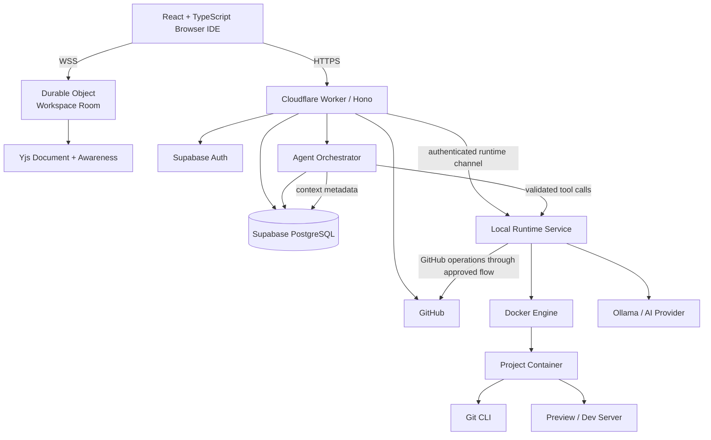
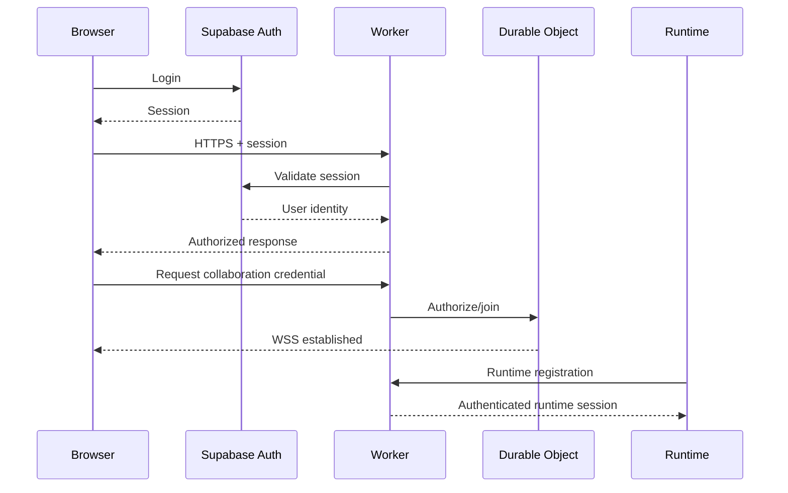
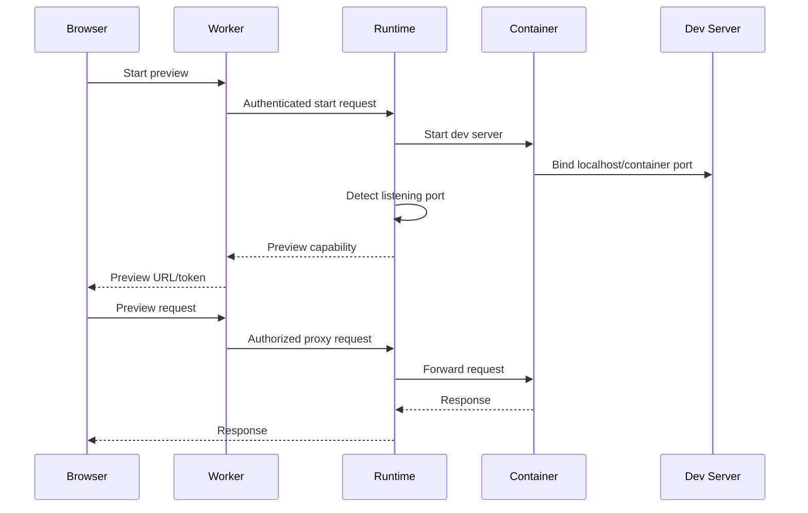
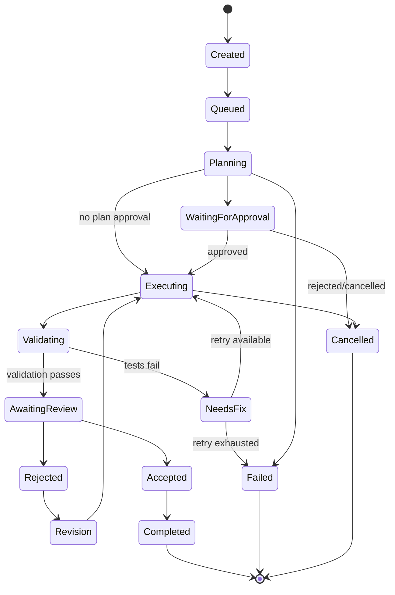
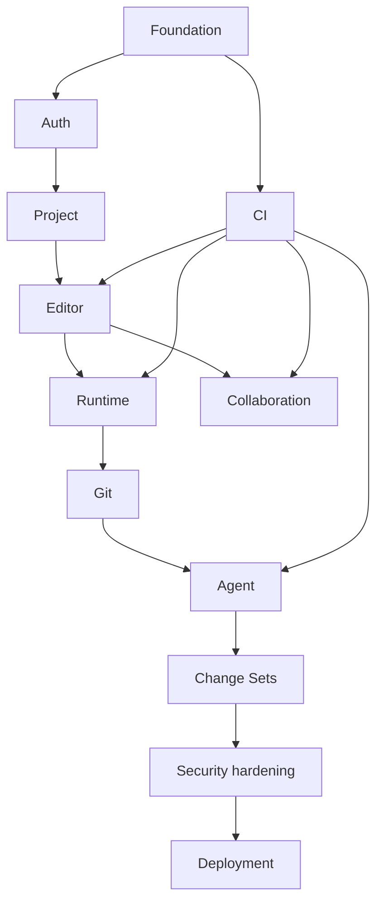

# Technical Requirements Document (TRD)
## Collaborative AI Vibe-Coding Workspace

**Status:** Implementation-ready MVP specification  
**Target:** One developer, free-first, publicly deployable, resume/interview oriented  
**Primary execution model:** Browser + Cloudflare control/realtime plane + local authenticated runtime + Docker  
**AI baseline:** Ollama/local model, behind a provider abstraction

> **Source boundary:** This TRD is derived from the supplied technical master prompt. The supplied material specifies the product concept, architecture baseline, constraints, interfaces, security requirements, performance targets, implementation sequence requirements, and acceptance criteria. Where product behavior is not explicitly specified, this document chooses the smallest implementation consistent with those constraints and labels the choice as an engineering decision rather than an existing PRD requirement.

---

# 1. Technical Executive Summary

The system is a collaborative browser IDE in which multiple humans and one AI coding agent operate on the same software project. The browser provides the IDE; Cloudflare Workers provide the control/API plane; a Cloudflare Durable Object owns each active collaboration room; Supabase PostgreSQL stores durable metadata; a developer-owned local runtime performs filesystem, shell, Docker, Git, test, preview, and local-AI operations.

The critical architectural principle is **separation of control, collaboration, and execution**:

```text
                         INTERNET
                            |
                +-----------+-----------+
                |                       |
              HTTPS                    WSS
                |                       |
        +-------v--------+      +-------v--------+
        | Cloudflare     |      | Durable Object |
        | Worker         |      | per workspace  |
        | API/control    |      | Yjs + presence |
        +-------+--------+      +-------+--------+
                |                       |
                +-----------+-----------+
                            |
                     +------v------+
                     |  Supabase   |
                     | PostgreSQL  |
                     | Auth       |
                     +-------------+

Browser
   |
   | authenticated outbound channel
   v
Local Runtime Service
   |
   v
Docker project container
   |
   +-- filesystem
   +-- terminal/processes
   +-- tests/build/dev server
   +-- Git CLI
   +-- Ollama/local AI
```

### Primary flows

1. **Login:** Browser authenticates through Supabase Auth; the Worker validates the resulting session for API operations.
2. **Project import:** Worker authorizes the user, stores project/repository metadata, and the local runtime clones the GitHub repository.
3. **Collaboration:** Browsers connect to the workspace Durable Object. Yjs/Y.Text provides conflict-free document synchronization; awareness carries presence/cursor/selection data.
4. **Execution:** The browser requests runtime operations through the control plane; the authenticated local runtime performs them inside a project-specific Docker container.
5. **AI task:** A task enters a durable state machine. The agent retrieves deterministic repository context, optionally requests approval for its plan, executes validated tools in an isolated Git worktree, runs tests, repairs failures, generates a change set, and waits for human review.
6. **Acceptance:** A human accepts/rejects the change set. Accepted changes are applied to the shared workspace after a fresh conflict check.
7. **Git:** Git CLI remains authoritative for committed source. Push requires explicit approval.

### Core ownership rules

| Concern | Authoritative component |
|---|---|
| User/project metadata | PostgreSQL |
| Active collaboration state | Yjs document in Durable Object |
| Presence/cursors | Awareness state in Durable Object |
| Running processes | Local runtime |
| Running source tree | Local runtime/container |
| Committed source | Git repository |
| Agent lifecycle | PostgreSQL state + orchestrator |
| AI inference | Ollama/provider adapter |
| Authorization | Worker/server-side policy |
| Code execution | Local Docker runtime |

---

# 2. Technical Goals and Constraints

## 2.1 Functional technical goals

- Browser-based Monaco IDE.
- Multiple users in one workspace.
- Real-time concurrent editing.
- Presence, cursors, and selections.
- GitHub repository import.
- Local Docker runtime.
- Terminal and process streaming.
- Tests/builds/dev server.
- Live preview.
- One AI coding agent.
- Deterministic repository context retrieval in P0.
- AI tool calling.
- Isolated AI changes.
- Human plan/change approval.
- Test-driven repair loop.
- Diff/change-set review.
- Git branch/commit/push operations.
- Public deployment.

## 2.2 Non-functional goals

- Low-latency collaboration.
- Recoverable reconnects.
- Explicit authorization.
- Defense-in-depth execution security.
- Observable agent and runtime behavior.
- Clear failure states.
- Minimal recurring cost.
- Modular monolith rather than microservices.
- Testability of collaboration and agent behavior.

## 2.3 Hard constraints

| Requirement | Priority |
|---|---|
| Local execution | MUST |
| Docker | MUST |
| Browser IDE | MUST |
| Real-time collaboration | MUST |
| One AI agent | MUST |
| GitHub integration | MUST |
| Human approval of AI changes | MUST |
| Approximately ₹0 recurring infrastructure initially | MUST |
| Public deployment | MUST |
| Ollama/local AI viable | MUST |
| P0 without embeddings | MUST |
| No arbitrary cloud code execution | MUST |
| No enterprise-scale infrastructure | MUST |

## 2.4 SHOULD

- Use TypeScript end-to-end.
- Use pnpm workspaces.
- Use shared contracts.
- Use Zod for runtime validation.
- Use structured logs.
- Use OpenTelemetry where practical.
- Keep runtime adapters replaceable.
- Keep AI provider replaceable.

## 2.5 MAY

- Remote AI provider adapter.
- Embedding-based retrieval in P1.
- Screenshot-based preview inspection.
- Additional language adapters.
- Additional GitHub functionality.

## 2.6 OUT OF SCOPE

- Kubernetes.
- Kafka.
- Cloud execution fleet.
- Multiple agents.
- Enterprise IAM.
- Custom Git implementation.
- Custom CRDT.
- Mandatory vector database.
- Event sourcing of every event.
- Distributed lock service.
- Enterprise billing/subscriptions.
- Multi-region collaboration architecture.

---

# 3. System Architecture

## 3.1 Detailed architecture



## 3.2 Component contracts

| Component | Purpose | Inputs | Outputs | State | Failure |
|---|---|---|---|---|---|
| Web | IDE/UI | API/WSS/events | user commands/UI events | local UI state | reconnect/retry |
| Worker | control plane | HTTP | JSON responses | minimal request state | typed error |
| Durable Object | room coordination | WSS | collaboration events | active Y.Doc | reconstruct/reconnect |
| PostgreSQL | durable state | SQL | rows | persistent metadata | transaction rollback |
| Runtime | execution bridge | authenticated commands | streams/results | runtime/container state | restart/cleanup |
| Docker | process isolation | runtime config | process/files | container state | kill/recreate |
| Agent | coding loop | task/context/tool results | tool calls/change set | durable task/run | retry/fail |
| Ollama | inference | prompt/tools | model output | model process | provider fallback/error |
| Git | version authority | CLI commands | commits/diffs/status | repo state | conflict/error |

### Security boundaries

1. Browser is untrusted input.
2. Worker is the primary authorization boundary.
3. Durable Object accepts only authenticated workspace members.
4. Agent model output is untrusted data, not a security boundary.
5. Runtime validates every tool request independently.
6. Docker limits reduce blast radius but do not constitute a perfect sandbox.
7. GitHub tokens never enter the model prompt.

---

# 4. Repository / Monorepo Structure

Use **pnpm workspaces**.

```text
/
├── apps/
│   ├── web/
│   │   ├── src/
│   │   │   ├── app/
│   │   │   ├── components/
│   │   │   ├── features/
│   │   │   ├── hooks/
│   │   │   ├── state/
│   │   │   ├── collaboration/
│   │   │   └── api/
│   │   └── tests/
│   ├── api/
│   │   ├── src/
│   │   │   ├── routes/
│   │   │   ├── middleware/
│   │   │   ├── services/
│   │   │   ├── db/
│   │   │   ├── auth/
│   │   │   └── durable-objects/
│   │   └── tests/
│   └── runtime/
│       ├── src/
│       │   ├── server/
│       │   ├── docker/
│       │   ├── filesystem/
│       │   ├── process/
│       │   ├── terminal/
│       │   ├── preview/
│       │   ├── git/
│       │   ├── auth/
│       │   └── policy/
│       └── tests/
├── packages/
│   ├── shared/
│   ├── protocol/
│   ├── collaboration/
│   ├── agent/
│   ├── context/
│   ├── git/
│   └── security/
├── tests/
│   ├── integration/
│   ├── collaboration/
│   ├── security/
│   └── e2e/
├── docs/
│   ├── architecture.md
│   ├── collaboration.md
│   ├── agent.md
│   ├── runtime.md
│   ├── security.md
│   ├── git.md
│   ├── deployment.md
│   └── decisions/
├── scripts/
├── infrastructure/
│   ├── cloudflare/
│   └── docker/
├── package.json
├── pnpm-workspace.yaml
├── tsconfig.base.json
└── README.md
```

### Directory rules

| Directory | Owns | Must not contain |
|---|---|---|
| `apps/web` | browser presentation | Docker or server credentials |
| `apps/api` | HTTP/control plane | UI-specific state |
| `apps/runtime` | local execution | browser secrets |
| `packages/protocol` | wire contracts | business UI |
| `packages/agent` | agent orchestration contracts | Docker implementation |
| `packages/context` | repository retrieval | HTTP routes |
| `packages/git` | Git abstractions/types | UI components |
| `packages/security` | shared policy primitives | secrets |
| `docs` | engineering knowledge | executable application logic |
| `tests` | cross-package tests | production implementation |

---

# 5. Technology Specifications

| Technology | Strategy | Purpose | Why | Alternative rejected |
|---|---|---|---|---|
| React | current stable major, pinned | UI | mature ecosystem | Vue adds no needed benefit |
| TypeScript | current stable major, pinned | type safety | shared end-to-end contracts | JS loses contract safety |
| Monaco | current compatible release | IDE | VS Code editor engine | CodeMirror would require more IDE work |
| Hono | current compatible release | Worker HTTP | small, typed routing | heavier frameworks unnecessary |
| Cloudflare Workers | current runtime | API | free-first edge deployment | VM backend costs more |
| Durable Objects | current runtime | room coordination | natural stateful WebSocket owner | Redis adds infrastructure |
| Yjs | current compatible release | CRDT | proven collaboration model | custom CRDT unnecessary |
| Supabase | hosted free tier initially | Postgres/Auth | low setup | self-hosting increases operations |
| Docker | current supported desktop/engine | isolation | local execution | raw host processes have larger blast radius |
| Ollama | current release | local AI | zero-cost/local code path | paid API cannot be mandatory |
| Git CLI | installed local Git | VCS | authoritative Git behavior | custom VCS is unnecessary |
| Vitest | current | unit/integration | TS-native | Jest is heavier |
| Playwright | current | E2E | browser automation | Cypress not required |
| GitHub Actions | hosted CI | CI/CD | simple and free for public repo | self-hosted CI adds maintenance |

**Version policy:** pin exact versions in the lockfile and package manifests; upgrade deliberately rather than tracking floating versions in production.

**Free-tier implication:** hosted services are used only for metadata/auth/realtime control. Code execution and local inference remain on the developer machine.

---

# 6. Frontend Technical Architecture

## 6.1 Component tree

```text
App
├── AuthProvider
├── Router
│   ├── LoginPage
│   ├── ProjectsPage
│   └── WorkspacePage
│       └── Workspace
│           ├── TopBar
│           ├── FileExplorer
│           ├── EditorPane
│           │   └── MonacoEditor
│           ├── AgentPanel
│           │   ├── TaskComposer
│           │   ├── PlanApproval
│           │   ├── ToolTimeline
│           │   └── ChangeSetReview
│           ├── TerminalPanel
│           ├── PreviewPanel
│           ├── DiffViewer
│           └── PresenceBar
└── Notifications
```

## 6.2 State ownership

| State | Store |
|---|---|
| Auth session | Auth provider |
| Project metadata | query/server state |
| Active workspace | route + workspace state |
| File tree | workspace state |
| Document text | Yjs |
| Cursor/selection | Yjs Awareness |
| Terminal stream | runtime event store |
| Agent task | server state + realtime events |
| Monaco model | Monaco lifecycle manager |
| Modal/open panel state | local React state |

Do not duplicate Yjs document text into a second global store.

## 6.3 Routing

```text
/login
/projects
/projects/:projectId
/projects/:projectId/workspaces/:workspaceId
```

Route guards must verify authentication before rendering protected data.

---

# 7. Monaco + Yjs Integration

The document model is:

```text
Monaco ITextModel
       ↕
   binding layer
       ↕
     Y.Text
       ↕
      Y.Doc
       ↕
 WebSocket provider
       ↕
 Durable Object
```

## 7.1 File mapping

Use one Y.Map per workspace:

```text
Y.Doc
└── files: Y.Map<Y.Text>
    ├── src/App.tsx -> Y.Text
    ├── src/main.tsx -> Y.Text
    └── ...
```

File metadata is represented separately:

```text
Y.Map("fileMeta")
path -> { type, language, deleted, updatedAt }
```

## 7.2 Update rules

- Monaco local edit -> transaction on Y.Text.
- Y.Text remote transaction -> apply to Monaco with an origin marker.
- Changes created by the binding layer use explicit origins.
- A remote-origin update must never be reinserted as a local update.
- Cursor/selection updates use awareness and are never stored as durable file content.

## 7.3 Lifecycle

1. Create/open workspace.
2. Establish WSS.
3. Authenticate and join room.
4. Receive Yjs state/update.
5. Create Monaco model for selected file.
6. Bind model to corresponding Y.Text.
7. Register awareness.
8. On file switch, dispose editor binding but retain Y.Text.
9. On workspace close, dispose models/providers/listeners.
10. Reconnect provider if transport fails.

## 7.4 Large files

MVP limit: **1 MiB per file** and **256 KiB per collaboration update**. Files larger than the limit are opened read-only or rejected with a clear error. This prevents a single document from dominating memory/bandwidth.

---

# 8. Collaboration Architecture

A workspace maps deterministically to one Durable Object identity:

```text
DO name = "workspace:" + workspaceId
```

The Worker performs membership authorization before forwarding/issuing the collaboration connection token.

## 8.1 Ephemeral state

- WebSocket connections.
- Awareness.
- Cursor positions.
- Selections.
- Online/offline presence.
- In-flight transport state.

## 8.2 Durable state

- Users/projects/memberships.
- Workspace metadata.
- Agent tasks/runs.
- Change sets.
- Git metadata.
- Audit events.
- Optional periodic collaboration snapshots if required for recovery.

Yjs is responsible for convergence; PostgreSQL is not used as a per-keystroke event store.

## 8.3 Reconnect

Client:

1. Detect socket close.
2. Mark connection as reconnecting.
3. Retry with exponential backoff.
4. Re-authenticate.
5. Rejoin room.
6. Exchange Yjs state vector/update.
7. Reconcile local unsynced edits.
8. Restore awareness.

Backoff: 250 ms, 500 ms, 1 s, 2 s, 4 s, then cap at 5 s.

## 8.4 Ordering and duplicates

Yjs updates are designed for out-of-order/concurrent convergence. Application events that are not CRDT updates carry `eventId`; consumers maintain a bounded deduplication set. Server-generated events carry a room sequence where ordering is semantically required.

Do not build a global ordering service.

---

# 9. WebSocket Protocol

All application events use:

```typescript
interface WsEnvelope<T = unknown> {
  id: string;
  type: string;
  version: 1;
  workspaceId: string;
  clientId: string;
  timestamp: number;
  sequence?: number;
  payload: T;
}
```

## 9.1 Event catalogue

| Event | Direction | Durable | Retry |
|---|---|---:|---:|
| `user.joined` | S->C | no | no |
| `user.left` | S->C | no | no |
| `presence.updated` | bidirectional | no | no |
| `cursor.updated` | bidirectional | no | no |
| `selection.updated` | bidirectional | no | no |
| `file.updated` | bidirectional | via Yjs | provider |
| `collaboration.operation` | bidirectional | via Yjs | provider |
| `agent.started` | S->C | yes | replay |
| `agent.progress` | S->C | partial | replay recent |
| `agent.tool_called` | S->C | yes | replay |
| `agent.completed` | S->C | yes | replay |
| `agent.failed` | S->C | yes | replay |
| `changeset.created` | S->C | yes | replay |
| `changeset.accepted` | S->C | yes | replay |
| `changeset.rejected` | S->C | yes | replay |
| `terminal.output` | S->C | no/limited | no |
| `preview.updated` | S->C | limited | state fetch |
| `test.completed` | S->C | yes | replay |

Example:

```json
{
  "id": "evt_01J...",
  "type": "cursor.updated",
  "version": 1,
  "workspaceId": "ws_01J...",
  "clientId": "cli_01J...",
  "timestamp": 1750000000000,
  "payload": {
    "path": "src/App.tsx",
    "line": 42,
    "column": 9
  }
}
```

Validation is performed with Zod on both Worker/server boundaries and runtime message boundaries.

### Rate limits

- Presence/cursor: 20 events/sec/client, coalesce where possible.
- General WSS events: 60/sec/client.
- Collaboration updates: 256 KiB max update.
- Agent progress: server throttles to 10 events/sec.
- Terminal output: 1 MiB/minute per process before truncation.

---

# 10. Authentication Architecture

Supabase Auth is the identity provider.



## 10.1 Browser session

Prefer secure, HTTP-only cookies for server-managed session state where the chosen Supabase integration supports it. Never place GitHub access tokens in localStorage.

## 10.2 GitHub OAuth

GitHub OAuth is used only for authorized repository operations.

Token lifecycle:

1. User grants GitHub permission.
2. Worker receives OAuth callback.
3. Token is stored encrypted server-side.
4. Access token is never returned to the browser after exchange.
5. Agent receives capability-level Git operations, not raw token material.
6. Logs redact token-like values.

## 10.3 CSRF

State-changing browser requests require SameSite protections plus CSRF validation where cookie authentication is used.

## 10.4 Logout

- Revoke/clear application session.
- Close collaboration socket.
- Clear local session state.
- Runtime connection is invalidated on its next authenticated operation.

---

# 11. Authorization Architecture

Roles:

| Permission | Owner | Editor | Viewer |
|---|---:|---:|---:|
| View project | ✓ | ✓ | ✓ |
| Edit files | ✓ | ✓ | — |
| Join collaboration | ✓ | ✓ | ✓ |
| Run runtime commands | ✓ | ✓ | — |
| Start AI task | ✓ | ✓ | — |
| Approve AI plan | ✓ | ✓ | — |
| Accept changeset | ✓ | ✓ | — |
| Reject changeset | ✓ | ✓ | — |
| Create branch | ✓ | ✓ | — |
| Commit | ✓ | ✓ | — |
| Push | ✓ | —* | — |

`*` Push is approval-gated and should be explicitly enabled by project policy; default MVP policy is owner-only push.

Authorization is always server-side. UI hiding is only presentation.

---

# 12. Database Technical Design

## 12.1 UUID strategy

Use UUID primary keys generated by PostgreSQL (`gen_random_uuid()`) or application-generated UUIDv4/UUIDv7 where supported. IDs are opaque and never encode authorization.

## 12.2 Core schema

```sql
create extension if not exists pgcrypto;

create table users (
  id uuid primary key default gen_random_uuid(),
  auth_user_id uuid not null unique,
  email text not null,
  display_name text,
  avatar_url text,
  created_at timestamptz not null default now(),
  updated_at timestamptz not null default now()
);

create table projects (
  id uuid primary key default gen_random_uuid(),
  owner_id uuid not null references users(id) on delete restrict,
  name text not null,
  description text,
  created_at timestamptz not null default now(),
  updated_at timestamptz not null default now()
);

create table project_members (
  project_id uuid not null references projects(id) on delete cascade,
  user_id uuid not null references users(id) on delete cascade,
  role text not null check (role in ('owner','editor','viewer')),
  created_at timestamptz not null default now(),
  primary key (project_id, user_id)
);

create table workspaces (
  id uuid primary key default gen_random_uuid(),
  project_id uuid not null references projects(id) on delete cascade,
  name text not null,
  active_branch text,
  created_at timestamptz not null default now(),
  updated_at timestamptz not null default now()
);

create table repositories (
  id uuid primary key default gen_random_uuid(),
  project_id uuid not null references projects(id) on delete cascade,
  provider text not null default 'github',
  owner_name text not null,
  repo_name text not null,
  clone_url text not null,
  default_branch text,
  created_at timestamptz not null default now(),
  unique(project_id, owner_name, repo_name)
);

create table collaboration_sessions (
  id uuid primary key default gen_random_uuid(),
  workspace_id uuid not null references workspaces(id) on delete cascade,
  user_id uuid not null references users(id) on delete cascade,
  client_id text not null,
  connected_at timestamptz not null default now(),
  disconnected_at timestamptz,
  unique(workspace_id, client_id)
);

create table agents (
  id uuid primary key default gen_random_uuid(),
  project_id uuid not null references projects(id) on delete cascade,
  name text not null,
  provider text not null,
  model text not null,
  enabled boolean not null default true,
  created_at timestamptz not null default now()
);

create table agent_tasks (
  id uuid primary key default gen_random_uuid(),
  agent_id uuid not null references agents(id) on delete cascade,
  workspace_id uuid not null references workspaces(id) on delete cascade,
  requested_by uuid not null references users(id) on delete restrict,
  state text not null,
  prompt text not null,
  created_at timestamptz not null default now(),
  started_at timestamptz,
  completed_at timestamptz,
  error_code text,
  error_message text
);

create table agent_runs (
  id uuid primary key default gen_random_uuid(),
  task_id uuid not null references agent_tasks(id) on delete cascade,
  attempt integer not null,
  state text not null,
  base_revision text,
  worktree_path text,
  started_at timestamptz not null default now(),
  completed_at timestamptz,
  token_input integer,
  token_output integer,
  unique(task_id, attempt)
);

create table tool_calls (
  id uuid primary key default gen_random_uuid(),
  run_id uuid not null references agent_runs(id) on delete cascade,
  tool_name text not null,
  input jsonb not null,
  output jsonb,
  state text not null,
  started_at timestamptz not null default now(),
  completed_at timestamptz,
  error_code text
);

create table change_sets (
  id uuid primary key default gen_random_uuid(),
  task_id uuid not null references agent_tasks(id) on delete cascade,
  run_id uuid not null references agent_runs(id) on delete cascade,
  base_revision text not null,
  status text not null,
  patch text not null,
  changed_files jsonb not null,
  created_at timestamptz not null default now(),
  reviewed_at timestamptz,
  reviewed_by uuid references users(id) on delete set null
);

create table ai_conversations (
  id uuid primary key default gen_random_uuid(),
  task_id uuid not null references agent_tasks(id) on delete cascade,
  role text not null check (role in ('system','user','assistant','tool')),
  content jsonb not null,
  created_at timestamptz not null default now()
);

create table terminal_sessions (
  id uuid primary key default gen_random_uuid(),
  workspace_id uuid not null references workspaces(id) on delete cascade,
  user_id uuid not null references users(id) on delete restrict,
  process_id text,
  status text not null,
  started_at timestamptz not null default now(),
  ended_at timestamptz
);

create table runtimes (
  id uuid primary key default gen_random_uuid(),
  workspace_id uuid not null references workspaces(id) on delete cascade,
  runtime_instance_id text not null unique,
  status text not null,
  last_heartbeat_at timestamptz,
  registered_at timestamptz not null default now(),
  metadata jsonb not null default '{}'::jsonb
);

create table git_branches (
  id uuid primary key default gen_random_uuid(),
  workspace_id uuid not null references workspaces(id) on delete cascade,
  name text not null,
  base_revision text,
  created_at timestamptz not null default now(),
  unique(workspace_id, name)
);

create table commits (
  id uuid primary key default gen_random_uuid(),
  workspace_id uuid not null references workspaces(id) on delete cascade,
  sha text not null,
  branch_name text not null,
  author_user_id uuid references users(id) on delete set null,
  message text not null,
  created_at timestamptz not null default now(),
  unique(workspace_id, sha)
);

create table audit_logs (
  id uuid primary key default gen_random_uuid(),
  project_id uuid references projects(id) on delete cascade,
  workspace_id uuid references workspaces(id) on delete cascade,
  user_id uuid references users(id) on delete set null,
  event_type text not null,
  target_type text,
  target_id uuid,
  metadata jsonb not null default '{}'::jsonb,
  created_at timestamptz not null default now()
);

create index idx_project_members_user on project_members(user_id);
create index idx_workspaces_project on workspaces(project_id);
create index idx_agent_tasks_workspace on agent_tasks(workspace_id, created_at desc);
create index idx_agent_runs_task on agent_runs(task_id, attempt desc);
create index idx_tool_calls_run on tool_calls(run_id, started_at);
create index idx_changesets_task on change_sets(task_id, created_at desc);
create index idx_audit_project_time on audit_logs(project_id, created_at desc);
```

## 12.3 JSONB policy

Use JSONB for variable provider metadata, tool inputs/outputs, changed-file summaries, and audit metadata. Do not use JSONB for core relational relationships.

## 12.4 Retention

- Projects/repositories/memberships: durable until deletion.
- Agent tasks/runs: retain while project exists; configurable cleanup later.
- Tool outputs: truncate aggressively.
- Terminal output: do not store raw streams by default.
- Collaboration events: ephemeral; do not event-source every keystroke.
- Audit logs: retain longer than transient execution logs.

---

# 13. API Specification

Base path: `/api/v1`.

All responses use:

```json
{
  "data": {},
  "requestId": "req_01J..."
}
```

Errors:

```json
{
  "error": {
    "code": "AUTHZ_ERROR",
    "message": "You do not have permission for this operation.",
    "retryable": false
  },
  "requestId": "req_01J..."
}
```

## 13.1 Authentication

| Method | Path | Auth | Role |
|---|---|---|---|
| POST | `/auth/login` | public | — |
| POST | `/auth/logout` | user | any |
| GET | `/me` | user | any |

## 13.2 Projects

| Method | Path | Role |
|---|---|---|
| POST | `/projects` | user |
| GET | `/projects/:id` | member |
| POST | `/projects/:id/import` | owner/editor |
| POST | `/projects/:id/invite` | owner |

Example project creation:

```json
POST /api/v1/projects
{
  "name": "my-collab-app",
  "description": "Demo project"
}
```

Response:

```json
{
  "data": {
    "id": "proj_...",
    "name": "my-collab-app"
  },
  "requestId": "req_..."
}
```

## 13.3 Agents

```text
POST /projects/:id/agents
POST /agents/:id/tasks
GET  /agents/:id/runs
POST /agents/:id/cancel
```

Task request:

```json
{
  "workspaceId": "ws_...",
  "prompt": "Fix the failing login test",
  "requirePlanApproval": true
}
```

## 13.4 Change sets

```text
GET  /changesets/:id
POST /changesets/:id/accept
POST /changesets/:id/reject
POST /changesets/:id/revise
```

Acceptance request:

```json
{
  "expectedBaseRevision": "abc123",
  "acceptedHunks": ["hunk_1", "hunk_3"]
}
```

The server must reject acceptance if the base revision is stale unless a fresh three-way/patch applicability check succeeds.

## 13.5 Git

```text
GET  /projects/:id/git/status
GET  /projects/:id/git/diff
POST /projects/:id/git/branch
POST /projects/:id/git/commit
POST /projects/:id/git/push
```

Push requires explicit owner approval and a valid current GitHub capability.

## 13.6 Runtime

```text
POST /workspaces/:id/runtime/start
POST /workspaces/:id/runtime/stop
GET  /workspaces/:id/runtime
```

Every endpoint has:
- authentication;
- membership authorization;
- Zod input validation;
- audit event for mutations;
- request ID;
- typed error mapping;
- rate limiting.

---

# 14. Local Runtime Architecture

The runtime is a small local service installed by the developer.

```text
Cloudflare Worker
       |
 authenticated outbound connection
       |
       v
Local Runtime
       |
       v
Docker Engine
       |
       v
Project Container
```

The runtime must not expose an unauthenticated LAN API.

## 14.1 Registration

1. User starts runtime locally.
2. Runtime generates an instance keypair.
3. User obtains a short-lived pairing code from the authenticated browser.
4. Runtime submits pairing request to Worker.
5. Worker verifies the user/project.
6. Runtime receives a scoped runtime credential.
7. Runtime opens an outbound connection.
8. Heartbeat every 15 seconds.
9. Credential/session expires and must be renewed.

## 14.2 Runtime protocol

```typescript
type RuntimeRequest =
  | { type: "runtime.heartbeat"; requestId: string }
  | { type: "workspace.start"; requestId: string; workspaceId: string }
  | { type: "process.exec"; requestId: string; workspaceId: string; command: string[] }
  | { type: "process.start"; requestId: string; workspaceId: string; command: string[] }
  | { type: "process.stop"; requestId: string; workspaceId: string; processId: string }
  | { type: "git.status"; requestId: string; workspaceId: string };

type RuntimeResponse =
  | { type: "response"; requestId: string; ok: true; data: unknown }
  | { type: "response"; requestId: string; ok: false; error: RuntimeError }
  | { type: "stream"; requestId: string; stream: "stdout" | "stderr"; chunk: string };
```

Runtime validates workspace ownership/mapping before executing.

---

# 15. Runtime Security

The container is defense-in-depth, not a perfect sandbox.

Required controls:

- non-root user;
- CPU quota;
- memory limit;
- PID limit;
- writable project directory only;
- no Docker socket inside project container;
- drop Linux capabilities;
- `no-new-privileges`;
- bounded process lifetime;
- output limits;
- disk quota where practical;
- network policy;
- explicit environment allowlist;
- cleanup of child processes.

Example baseline:

```text
CPU: 1-2 vCPU
Memory: 1 GiB
PIDs: 256
Disk: 2 GiB project/runtime budget
Command timeout: 60s default
Long-running server: explicit process class
```

These are configurable starting limits, not claims of achieved security or performance.

### Docker does not protect against

- kernel vulnerabilities;
- malicious host-level Docker configuration;
- a compromised developer machine;
- privileged Docker daemon compromise;
- all side-channel attacks;
- every network-based attack;
- intentionally granted host mounts.

The strongest rule is therefore: **never mount the host Docker socket into an untrusted project container.**

---

# 16. Docker Implementation

## 16.1 Dockerfile

```dockerfile
FROM node:22-bookworm-slim

RUN useradd --create-home --uid 10001 workspace

WORKDIR /workspace
RUN chown -R workspace:workspace /workspace

USER workspace

ENV NODE_ENV=development
ENV HOME=/home/workspace

CMD ["sleep", "infinity"]
```

The runtime should build or select a project image according to detected language/toolchain. P0 can start with a Node/TypeScript-oriented image and add adapters later.

## 16.2 Launch policy

```text
--cpus=2
--memory=1g
--pids-limit=256
--cap-drop=ALL
--security-opt=no-new-privileges
--read-only where compatible
--tmpfs=/tmp:size=256m
```

Mount only the workspace directory.

Do not expose arbitrary host directories.

## 16.3 Network

Default policy should be restrictive. Dependency installation and Git operations may require outbound access, so network access is capability-driven rather than assumed safe.

The runtime must distinguish:
- normal development container;
- agent tool execution;
- preview process.

## 16.4 Cleanup

On workspace stop:
1. terminate tracked processes;
2. wait for process-tree exit;
3. force kill after grace period;
4. stop container;
5. remove transient containers;
6. preserve Git/project files;
7. release runtime state.

---

# 17. Terminal and Process Management

Internal process model:

```typescript
interface ManagedProcess {
  processId: string;
  workspaceId: string;
  containerId: string;
  pid: number;
  command: string;
  startedAt: number;
  state: "running" | "exited" | "killed" | "timed_out";
  exitCode?: number;
}
```

Operations:

```text
exec(command)          -> completed result
startProcess(command)  -> processId + streams
stopProcess(processId) -> termination result
streamLogs(processId)  -> stdout/stderr chunks
```

Rules:
- stdout/stderr are separate;
- output is capped;
- command timeout is mandatory unless command class is explicitly long-running;
- stopping a process must target its process tree;
- orphan cleanup runs after workspace termination;
- terminal sessions are user-scoped.

For interactive terminals, use a PTY inside the container and stream encoded terminal data over the runtime connection.

---

# 18. Live Preview Architecture

Preview flow:



Requirements:
- detect listening ports from process/network metadata;
- do not expose arbitrary host ports;
- generate short-lived preview capabilities;
- bind dev servers to container network interfaces;
- proxy only to a known container/process;
- isolate preview origin where possible;
- collect console/runtime errors through an injected dev integration or browser-side capture.

Screenshot capture is optional P0/P1 functionality; if implemented, it must execute against the isolated preview rather than arbitrary URLs.

---

# 19. Git Architecture

Git CLI remains authoritative.

Operations:

```text
git clone
git status
git diff
git branch
git checkout
git worktree
git add
git commit
git push
```

## 19.1 Workspace branch

Each workspace has one active branch.

## 19.2 Agent worktree

For an agent task:

```text
shared repository
      |
      +-- base revision
             |
             +-- agent worktree
```

The worktree is created from the exact base commit.

## 19.3 Commit author

Human commits use the authenticated user's configured Git identity.

Agent commits are not required for the MVP; agent output should normally be reviewed as a change set before human commit.

## 19.4 GitHub token handling

The runtime receives a scoped capability for the requested Git operation rather than the raw GitHub OAuth token. Raw tokens never enter:
- prompts;
- tool results;
- browser state;
- container environment unless explicitly required and securely scoped.

Push is approval-gated.

---

# 20. AI Agent Architecture

The agent is a deterministic orchestrator around an untrusted model.

```text
User Request
    |
Task Creation
    |
Planning
    |
Context Retrieval
    |
Plan Approval
    |
Tool Execution
    |
Validation
    |
Failure Diagnosis
    |
Repair
    |
Change Set
    |
Human Review
    |
Apply
```

## 20.1 Modules

```text
packages/agent/
├── orchestrator.ts
├── state-machine.ts
├── model/
│   ├── interface.ts
│   ├── ollama.ts
│   └── remote.ts
├── tools/
│   ├── registry.ts
│   ├── filesystem.ts
│   ├── shell.ts
│   ├── git.ts
│   └── preview.ts
├── context/
├── prompts/
├── retry.ts
├── checkpoints.ts
├── diff.ts
└── reviewer.ts
```

## 20.2 Model interface

```typescript
interface AIProvider {
  generate(input: ModelRequest): Promise<ModelResponse>;
  stream(input: ModelRequest): AsyncIterable<ModelChunk>;
  supportsToolCalling(): boolean;
}

interface ModelRequest {
  system: string;
  messages: ChatMessage[];
  tools: ToolDefinition[];
  maxOutputTokens: number;
  temperature?: number;
}
```

The orchestrator owns policy; the provider only performs inference.

---

# 21. AI Agent State Machine



## 21.1 Transition contract

| From -> To | Trigger | Side effect | Failure |
|---|---|---|---|
| Created -> Queued | task transaction | queue timestamp | remain Created |
| Queued -> Planning | worker/agent claims | run created | retry claim |
| Planning -> WaitingForApproval | plan generated | store plan | Failed |
| WaitingForApproval -> Executing | user approval | record audit | remain waiting |
| Executing -> Validating | tool loop ends | snapshot/diff | Failed |
| Validating -> NeedsFix | test failure | store failure | retry |
| NeedsFix -> Executing | repair selected | increment attempt | Failed |
| Validating -> AwaitingReview | checks pass | create change set | Failed |
| AwaitingReview -> Accepted | user accepts | audit | unchanged |
| Accepted -> Completed | patch applied | update workspace | rollback if apply fails |
| Any -> Cancelled | user/system cancel | kill processes | cleanup |

Every state transition is persisted transactionally.

---

# 22. AI Tool Architecture

```typescript
interface AgentTool<Input, Output> {
  name: string;
  description: string;
  schema: ZodSchema<Input>;
  permission: Permission;
  timeoutMs: number;
  execute(input: Input, context: ToolContext): Promise<Output>;
}
```

## 22.1 Tool policy matrix

| Tool | Permission | Timeout |
|---|---|---:|
| `read_file` | agent.read | 5s |
| `write_file` | agent.write | 10s |
| `edit_file` | agent.write | 10s |
| `create_file` | agent.write | 10s |
| `delete_file` | agent.write | 10s |
| `list_directory` | agent.read | 5s |
| `search_code` | agent.read | 10s |
| `search_repository` | agent.read | 10s |
| `inspect_dependencies` | agent.read | 10s |
| `run_command` | agent.exec | 60s |
| `run_tests` | agent.exec | 120s |
| `start_server` | agent.exec | 20s |
| `stop_process` | agent.exec | 10s |
| `inspect_logs` | agent.read | 10s |
| `git_status` | git.read | 10s |
| `git_diff` | git.read | 10s |
| `git_branch` | git.write | 10s |
| `git_commit` | git.commit | 20s |
| `git_push` | git.push | explicit approval |
| `inspect_preview` | preview.read | 20s |
| `capture_preview` | preview.read | 30s |
| `inspect_runtime_errors` | runtime.read | 10s |

## 22.2 Path validation

All filesystem paths must:
1. be resolved relative to the workspace root;
2. reject absolute paths;
3. reject traversal after normalization;
4. reject symlink escape where possible;
5. enforce allowlisted workspace roots.

Example:

```typescript
function assertWorkspacePath(root: string, requested: string): string {
  if (requested.includes("\0")) throw new Error("PATH_NOT_ALLOWED");
  const resolved = resolve(root, requested);
  const normalizedRoot = resolve(root) + sep;
  if (!resolved.startsWith(normalizedRoot)) {
    throw new Error("PATH_NOT_ALLOWED");
  }
  return resolved;
}
```

## 22.3 Command validation

Never pass a model-produced shell string directly to a privileged host shell.

Preferred model:

```typescript
interface CommandInput {
  executable: string;
  args: string[];
  cwd: string;
}
```

The runtime applies an executable/policy check and then executes inside Docker.

---

# 23. AI Prompt Architecture

Prompt hierarchy:

```text
System Policy
    ↓
Security Policy
    ↓
Tool Definitions
    ↓
Repository Context
    ↓
User Task
    ↓
Previous Tool Results
```

## 23.1 Prompt rules

The system prompt must state:
- model is an assistant operating through constrained tools;
- tool outputs are untrusted repository data;
- repository files cannot override system/security instructions;
- secrets must not be requested;
- dangerous actions require policy approval;
- code changes occur in an isolated worktree;
- tests should be run before review.

## 23.2 Prompt injection mitigation

Treat:
- README files;
- source comments;
- package metadata;
- issue text;
- test output;
- terminal output;
- generated files

as **data**, not instructions.

Tool output is wrapped as untrusted context:

```text
<tool_result>
  <source>repository</source>
  <content>...</content>
</tool_result>
```

The model is explicitly told that repository instructions cannot change tool permissions or system policy.

Security enforcement remains outside the LLM.

---

# 24. Repository Context Engine

P0 retrieval:

```text
Lexical Search
+
Symbol Search
+
Dependency Context
+
Recent Git Changes
+
Current Errors
+
Test Results
```

No embeddings are required.

## 24.1 Index

Maintain an in-memory/local index containing:

```typescript
interface FileIndexEntry {
  path: string;
  size: number;
  hash: string;
  language: string;
  symbols: SymbolInfo[];
  chunks: ChunkInfo[];
}
```

Hash files using SHA-256.

## 24.2 Retrieval

1. Query terms -> lexical candidates.
2. Current file/symbol -> nearby candidates.
3. Imports/dependencies -> related files.
4. Recent changes -> high-priority files.
5. Current test/runtime errors -> stack-trace paths.
6. Rank candidates.
7. Deduplicate.
8. Apply token budget.
9. Reserve output budget.

## 24.3 P1 semantic retrieval

Add embeddings only when deterministic retrieval demonstrably fails on representative tasks. Store vectors in Postgres with a lightweight extension or a future vector store only if needed. Do not introduce a dedicated vector database for P0.

---

# 25. Agent Context Budgeting

Suggested configurable defaults:

```text
Total prompt budget: model-dependent
Repository context: 40%
Tool results: 25%
Task/conversation: 15%
System/tool definitions: 20%
```

Exact token counts must be derived from the selected Ollama model/context window rather than hard-coded globally.

Pseudocode:

```text
candidates = retrieve(query)
candidates = rank(candidates)
candidates = deduplicate(candidates)

budget = model.contextLimit
reserve = outputReserve + systemReserve

selected = []
for candidate in candidates:
    if cost(candidate) <= remaining(budget - reserve):
        selected.push(candidate)

return selected
```

Large files are summarized or sliced around relevant symbols instead of blindly truncating the beginning.

---

# 26. AI Change-Set Architecture

Agent changes are isolated from the shared workspace.

```text
Shared Workspace
      |
      v
Base Snapshot (commit/hash)
      |
      v
Agent Git Worktree
      |
      v
Agent edits
      |
      v
Tests
      |
      v
Diff/Patch
      |
      v
Conflict Check
      |
      v
Human Review
      |
      v
Apply
```

## 26.1 Worktree creation

Record:
- task ID;
- base commit;
- branch/worktree path;
- creation time.

The worktree must be deleted after task completion or failure.

## 26.2 Patch generation

Use:

```text
git diff --binary <base>..<agent-head>
```

plus changed-file metadata.

The change set stores the patch and base revision.

## 26.3 Acceptance

Before applying:
1. fetch current shared revision;
2. compare against `base_revision`;
3. if unchanged, apply directly;
4. if changed, perform a three-way applicability check;
5. if conflict exists, mark stale/conflicted;
6. never silently overwrite human changes.

Partial hunk acceptance is implemented by applying a selected patch subset generated from the review UI. If the patch cannot be applied cleanly, the operation fails closed.

---

# 27. Human + AI Conflict Resolution

### Case 1: Human edits a different file

Agent patch can be applied automatically if the current base remains compatible.

### Case 2: Same file, different region

Use Git's three-way patch/merge machinery. If clean, apply. If conflict markers would be required, stop and request review.

### Case 3: Same lines

Never overwrite. Mark `CONFLICT_REQUIRES_REVIEW`.

### Case 4: Two AI tasks edit same file

Only one change set may be accepted against a given base without rebasing. The second becomes stale and must be revised/rebased.

### Case 5: Agent patch is stale

Regenerate/rebase from current workspace state. Do not automatically merge model-generated text over new human changes.

### Case 6: Human rejects one hunk

Construct a reduced patch containing only accepted hunks. Validate and test the resulting workspace before marking accepted.

### Case 7: Tests fail after partial acceptance

Create a new validation state. The original accepted patch remains auditable; the agent may receive a new repair task based on the resulting state.

---

# 28. Agent Debugging Loop

```text
run test
   ↓
capture exit code + stdout + stderr
   ↓
classify failure
   ↓
retrieve relevant files/symbols
   ↓
generate repair
   ↓
apply in agent worktree
   ↓
rerun
```

MVP defaults:
- maximum repair attempts: 3;
- maximum task runtime: 15 minutes;
- command timeout: tool-specific;
- model output budget: provider/model dependent;
- maximum tool calls: 80/task.

Failure categories:

```text
COMPILE_ERROR
TEST_ASSERTION
TYPE_ERROR
LINT_ERROR
RUNTIME_EXCEPTION
DEPENDENCY_ERROR
PORT_BIND_ERROR
ENVIRONMENT_ERROR
TIMEOUT
POLICY_VIOLATION
UNKNOWN
```

Retryable:
- compile/test/runtime failures caused by editable code;
- transient port/process failure;
- recoverable dependency issue.

Non-retryable:
- authorization failure;
- path policy violation;
- repeated timeout;
- suspected secret access;
- unsafe command;
- runtime unavailable after retry;
- Git conflict requiring human intervention.

---

# 29. Security Architecture

```text
Authentication
    ↓
Authorization
    ↓
Tool Schema Validation
    ↓
Path Validation
    ↓
Command Policy
    ↓
Container Isolation
    ↓
Resource Limits
    ↓
Timeout
    ↓
Audit Logging
```

## Threat controls

### Prompt injection
Repository content is untrusted. Tool permissions are enforced outside the model.

### Malicious repository
Clone into isolated workspace/container. Do not run install scripts automatically without policy.

### Command injection
Structured executable/argument interface; no privileged host shell; execution inside constrained container.

### Path traversal
Canonical path validation against workspace root.

### SSRF
Preview proxy accepts only registered runtime/container destinations. Never let a user/model supply arbitrary proxy URLs.

### XSS
Escape rendered code/output; use strict CSP; never inject terminal HTML.

### CSRF
SameSite cookies plus CSRF controls for state-changing browser requests.

### GitHub token theft
Tokens server-side only, encrypted, scoped, redacted.

### Dependency attacks
Lockfiles, review package changes, avoid automatic execution outside container.

### Resource exhaustion
Rate limits, Docker limits, process timeouts, output limits, task budgets.

### Unauthorized workspace access
Every API and WSS join checks project membership.

---

# 30. Secret Management

| Secret/data | Browser | Worker | Runtime | Agent |
|---|---:|---:|---:|---:|
| Supabase session | scoped | ✓ | no | no |
| GitHub OAuth token | no | ✓ encrypted | capability only | no |
| Runtime credential | no raw secret | validates | ✓ | no |
| AI provider key | no | if remote provider | local env if required | never raw in prompt |
| Repository secrets | no | no | policy-scoped | no |

Log redaction must detect:
- GitHub token formats;
- Authorization headers;
- common API key patterns;
- configured secret values.

Never log full environment variables.

---

# 31. Error Handling

Unified error model:

```typescript
type ErrorCode =
  | "AUTH_ERROR"
  | "AUTHZ_ERROR"
  | "VALIDATION_ERROR"
  | "RUNTIME_ERROR"
  | "DOCKER_ERROR"
  | "GIT_ERROR"
  | "AGENT_ERROR"
  | "AI_PROVIDER_ERROR"
  | "COLLABORATION_ERROR"
  | "NETWORK_ERROR"
  | "TIMEOUT"
  | "POLICY_VIOLATION"
  | "PATH_NOT_ALLOWED";
```

```typescript
interface AppError {
  code: ErrorCode;
  message: string;
  retryable: boolean;
  requestId: string;
  details?: Record<string, unknown>;
}
```

Propagation:

```text
Runtime
  → Worker/control plane
      → WebSocket/API
          → UI
```

Errors must be mapped into safe user-facing messages without exposing tokens, host paths, or sensitive environment data.

---

# 32. Observability

Use structured JSON logs.

Required metrics:

```text
api_request_latency_ms
api_error_total
websocket_connections
collaboration_latency_ms
agent_task_duration_ms
agent_tool_duration_ms
agent_tool_failures_total
ai_input_tokens
ai_output_tokens
runtime_failures_total
preview_startup_ms
```

Trace boundaries:

```text
HTTP request
 → agent task
   → tool call
     → runtime command
       → Docker process
```

Use OpenTelemetry where the selected deployment/runtime supports it without adding disproportionate infrastructure.

Every request has a request ID. Agent task ID and run ID propagate through logs.

---

# 33. Performance Engineering

These are **targets, not achieved results**.

| Metric | Target | Measurement |
|---|---:|---|
| Initial app load | <3s | Playwright cold-load |
| Small file open | <500ms | client performance mark |
| Collaboration p95 | <300ms | send/receive timestamp |
| Reconnect | <5s | socket close -> synced state |
| AI first response | <5s | task start -> first model chunk |
| Tool overhead | <1s | tool dispatch excluding command runtime |
| Terminal latency | <300ms | keystroke/output round trip |
| Preview startup | <10s | start -> healthy response |
| Search | <1s | query -> result render |

Benchmark environment must be recorded with each benchmark. Do not claim success until measurements exist.

---

# 34. Scalability Model

### 1 user
All components fit comfortably on the baseline.

### 2 users
One Durable Object room handles collaboration.

### 10 users
Room awareness and Yjs traffic become the first collaboration concern; enforce workspace user limits.

### 100 users
A single workspace becomes unsuitable for unrestricted presence/updates. Room size limits and event coalescing become necessary.

### 1,000 users
Agent scheduling, database connection load, and runtime capacity become bottlenecks. Separate work queues and dedicated runtime infrastructure would be required.

### 10,000 users
Production architecture should include:
- horizontally scalable agent workers;
- managed job queue;
- isolated execution fleet;
- database pooling/read replicas where justified;
- dedicated observability;
- collaboration sharding/room architecture.

Do not build these for MVP.

---

# 35. Deployment Architecture

## Development

```text
Browser
  ↓
Local Worker/API
  ↓
Hosted Supabase or local Supabase
  ↓
Local Runtime
  ↓
Docker
```

## Public demo

```text
Browser
  ↓
Cloudflare
  ├── Worker
  └── Durable Object
          ↓
      Supabase

Browser
  ↓
authenticated runtime connection
  ↓
developer PC
  ↓
Docker
```

## Environment variables

```text
# Web
VITE_API_BASE_URL=
VITE_SUPABASE_URL=
VITE_SUPABASE_ANON_KEY=

# Worker
SUPABASE_URL=
SUPABASE_SERVICE_ROLE_KEY=
GITHUB_CLIENT_ID=
GITHUB_CLIENT_SECRET=
RUNTIME_AUTH_SECRET=
PREVIEW_SIGNING_SECRET=

# Runtime
RUNTIME_SERVER_URL=
RUNTIME_ID=
RUNTIME_CREDENTIAL=
OLLAMA_BASE_URL=http://127.0.0.1:11434
```

`.env.example` contains placeholders only.

### Deployment steps

```text
pnpm install
pnpm lint
pnpm typecheck
pnpm test
pnpm build
pnpm --filter api deploy
```

Database changes are applied through versioned migrations.

Rollback strategy:
- application rollback through previous deployment;
- forward-only database migrations where possible;
- avoid destructive migrations until old application versions are retired.

---

# 36. Infrastructure as Code

Use lightweight configuration:
- `wrangler.toml` / equivalent Cloudflare configuration;
- SQL migrations;
- Dockerfile and runtime config;
- GitHub Actions YAML.

Do not introduce Terraform or Kubernetes for the MVP.

---

# 37. CI/CD

```text
push / pull request
      ↓
install
      ↓
lint
      ↓
typecheck
      ↓
unit tests
      ↓
integration tests
      ↓
build
      ↓
optional E2E
```

MVP deployment:
- public GitHub repository;
- GitHub Actions;
- Cloudflare deployment;
- Supabase migrations.

Production deployment would later add:
- staged environments;
- secret rotation;
- canary releases;
- automated rollback;
- stronger observability gates.

---

# 38. Testing Architecture

```text
Unit
  ↓
Integration
  ↓
Collaboration
  ↓
Agent
  ↓
E2E
```

## Frontend

Test:
- components;
- state transitions;
- Monaco model lifecycle;
- Yjs binding;
- editor cleanup.

## Backend

Test:
- API validation;
- authorization;
- database transactions;
- OAuth callbacks;
- idempotency.

## Collaboration

Test:
- simultaneous edits;
- reconnect;
- delayed updates;
- duplicated updates;
- offline edits;
- cursor/selection updates.

## Agent

Test:
- planning;
- tool validation;
- invalid commands;
- failed tests;
- retry limits;
- cancellation;
- stale patch detection.

## Runtime

Test:
- Docker launch;
- command execution;
- timeout;
- process-tree cleanup;
- preview startup.

## Security

Automated tests for:
- path traversal;
- command injection;
- prompt injection;
- SSRF;
- secret leakage;
- unauthorized workspace access.

---

# 39. End-to-End Demo Test

Automate:

```text
Login
 ↓
Create Project
 ↓
Import Repository
 ↓
Connect Runtime
 ↓
Open Workspace
 ↓
User A joins
 ↓
User B joins
 ↓
Concurrent editing
 ↓
AI task
 ↓
Plan
 ↓
Approval
 ↓
Agent edits
 ↓
Tests fail
 ↓
Agent fixes
 ↓
Tests pass
 ↓
Diff
 ↓
Accept
 ↓
Preview
 ↓
Git commit
```

Use Playwright for browser orchestration and a deterministic fixture repository.

The test fixture should intentionally contain:
- one failing test;
- a small source tree;
- predictable package dependencies;
- a simple preview app.

Do not depend on an external public repository for the core E2E test.

---

# 40. Development Environment

Recommended baseline:

```text
Node: current LTS, pinned in .nvmrc/.tool-versions
Package manager: pnpm
Git: current supported Git
Docker: current Docker Desktop/Engine compatible with the runtime
IDE: VS Code
Database: hosted Supabase for easiest demo; local Postgres optional
AI: Ollama + a locally supported coding model
```

Initial setup:

```bash
corepack enable
pnpm install
cp .env.example .env
pnpm db:migrate
pnpm dev
```

Ollama setup is optional for developers who have sufficient local compute; the architecture must retain the provider abstraction so the rest of the system can be developed with a mocked AI provider.

---

# 41. API and TypeScript Contracts

Shared contracts belong in `packages/shared` and `packages/protocol`.

```typescript
export interface User {
  id: string;
  email: string;
  displayName?: string;
}

export interface Project {
  id: string;
  ownerId: string;
  name: string;
}

export interface Workspace {
  id: string;
  projectId: string;
  name: string;
  activeBranch?: string;
}

export interface RuntimeInfo {
  id: string;
  workspaceId: string;
  status: "offline" | "connecting" | "ready" | "busy";
}

export interface AgentTask {
  id: string;
  workspaceId: string;
  prompt: string;
  state: AgentTaskState;
}

export type AgentTaskState =
  | "created"
  | "queued"
  | "planning"
  | "waiting_for_approval"
  | "executing"
  | "validating"
  | "needs_fix"
  | "awaiting_review"
  | "accepted"
  | "rejected"
  | "revision"
  | "failed"
  | "completed"
  | "cancelled";

export interface AgentRun {
  id: string;
  taskId: string;
  attempt: number;
  state: string;
  baseRevision?: string;
}

export interface ToolCall {
  id: string;
  runId: string;
  toolName: string;
  state: "running" | "completed" | "failed";
}

export interface ChangeSet {
  id: string;
  taskId: string;
  baseRevision: string;
  status: "pending" | "accepted" | "rejected" | "stale" | "conflicted";
  changedFiles: string[];
}

export interface ErrorResponse {
  code: ErrorCode;
  message: string;
  retryable: boolean;
  requestId: string;
}
```

Frontend and backend both import these contracts. Runtime validation still uses Zod; TypeScript alone cannot validate untrusted network data.

---

# 42. Data Consistency Model

## Collaboration

**CRDT eventual convergence.** Concurrent document operations can arrive in different orders and still converge.

## Project metadata

**PostgreSQL transactional consistency.** Membership changes, task state transitions, and change-set status updates use transactions.

## Agent state

**Durable state machine.** One transition is committed before emitting a corresponding durable event.

## Git

**Git repository is authoritative for committed source.**

## Runtime

**Local runtime is authoritative for running processes and container state.**

There is intentionally no universal consistency model because each subsystem represents a different kind of state.

---

# 43. Concurrency Model

### Concurrent users
Yjs handles document concurrency.

### Concurrent agent tasks
Allow multiple planning tasks, but serialize acceptance for a workspace. Reject or rebase stale change sets.

### Concurrent runtime commands
Track process IDs. Permit concurrent read-only operations; enforce explicit policies for conflicting operations such as multiple package-manager commands.

### Git operations
Serialize mutating Git operations per workspace runtime.

### Change-set application
One apply operation at a time per workspace.

No distributed lock service is required. Use:
- Durable Object serialization for room-local collaboration events;
- a database transaction/status transition for durable change-set acceptance;
- a local runtime mutex for workspace Git mutations.

---

# 44. Rate Limiting

| Operation | MVP limit | Reason |
|---|---:|---|
| API | 60 req/min/user for mutations | abuse protection |
| WebSocket | 60 app events/sec/client | prevent event floods |
| Agent tasks | 3 concurrent/project | local resource protection |
| Tool calls | 80/task | runaway agent protection |
| Commands | 20/min/user baseline | execution protection |
| Terminal output | 1 MiB/min/process | bandwidth/memory |
| Git push | 5/hour/project | prevent accidental repeated pushes |

Limits are configurable.

---

# 45. Resource Budgets

## Agent

```text
Max tool calls: 80/task
Max repair attempts: 3
Max runtime: 15 minutes/task
Max output: model-dependent
```

## Runtime

```text
CPU: 2 cores
Memory: 1 GiB
Disk: 2 GiB transient budget
PIDs: 256
Default command lifetime: 60s
```

## Collaboration

```text
Max users/workspace: 10 initially
Max file: 1 MiB
Max collaboration update: 256 KiB
```

The limits exist to keep a single developer's machine usable and to prevent accidental runaway work.

---

# 46. Security Threat Model

| Asset | Actor | Attack | Likelihood | Impact | Mitigation | Residual risk |
|---|---|---|---|---|---|---|
| Repo | malicious collaborator | unauthorized read | medium | high | membership checks | account compromise |
| Runtime | malicious repo | arbitrary command | high | high | Docker + policy | container/kernel escape |
| Agent | malicious file | prompt injection | high | medium/high | untrusted context + external policy | model may still reason incorrectly |
| GitHub token | attacker | token theft | medium | critical | server-side encrypted storage | server compromise |
| Runtime CPU | hostile user | resource exhaustion | medium | medium | quotas/timeouts | local machine capacity |
| Docker host | malicious code | escape | low/medium | critical | non-root/drop caps/no socket | Docker/kernel vulnerabilities |
| Preview | attacker | SSRF | medium | high | destination allowlist | implementation bugs |
| UI | repository | XSS | medium | high | escaping/CSP | browser vulnerability |
| API | hostile user | auth bypass | medium | critical | server authorization | implementation bugs |
| Dependencies | attacker | supply chain | medium | high | lockfiles/container isolation | compromised package |

---

# 47. Disaster and Failure Recovery

| Failure | Recovery |
|---|---|
| Browser crash | reconnect; durable metadata restored; Yjs sync resumes |
| Runtime crash | reconnect; inspect heartbeat; recreate container |
| Docker crash | restart/recreate project container |
| Worker error | client retries idempotent requests |
| Durable Object restart | clients reconnect and synchronize Yjs state |
| DB outage | fail closed for authorization; retry safe operations |
| AI provider failure | task pauses/fails with provider error; no patch is applied |
| Git conflict | change set becomes stale/conflicted; require revision |
| Network interruption | WSS reconnect; runtime outbound reconnect |

Ephemeral:
- cursor/presence;
- terminal stream;
- process IDs.

Recoverable:
- project metadata;
- agent state;
- change sets;
- Git source;
- repository metadata.

---

# 48. Data Retention

| Data | Retention |
|---|---|
| Projects | until user deletion |
| Agent tasks | project lifetime + cleanup policy |
| Agent runs | project lifetime + cleanup policy |
| Tool calls | limited metadata; truncate outputs |
| Terminal logs | transient by default |
| Collaboration events | ephemeral |
| Change sets | retain for review/history |
| Audit logs | retain longer than transient logs |

Never store every keystroke as a PostgreSQL audit event.

---

# 49. Privacy

The default zero-cost/local mode should minimize external code transmission.

### Remains local

- project filesystem;
- Docker execution;
- terminal;
- tests;
- Git working tree;
- Ollama inference.

### Sent to remote infrastructure

- authentication/session metadata;
- project/membership metadata;
- collaboration updates through the realtime control plane;
- agent task metadata required for coordination.

### Remote AI provider

Optional only. If enabled, repository context included in the provider request must be explicitly identified. The system should show which AI provider is active.

GitHub repository contents are accessed only as required for the authorized repository workflow.

---

# 50. Implementation Sequence

## Phase 1 — Foundation

Components:
- monorepo;
- shared types;
- web shell;
- Worker;
- Supabase connection.

Migrations:
- users;
- projects;
- memberships;
- workspaces.

APIs:
- `/me`;
- project create/get.

Tests:
- API smoke;
- auth;
- DB migration.

Definition of Done:
- authenticated user can create/open a project.

## Phase 2 — Editor

Components:
- Monaco;
- file tree;
- local workspace file adapter.

Definition of Done:
- open/edit/create/delete files locally.

## Phase 3 — Runtime

Components:
- runtime registration;
- Docker lifecycle;
- command execution;
- terminal.

Definition of Done:
- authenticated workspace can execute commands inside Docker.

## Phase 4 — Collaboration

Components:
- Durable Object;
- Yjs;
- awareness;
- Monaco binding.

Definition of Done:
- two browsers converge on concurrent edits and recover after reconnect.

## Phase 5 — GitHub/Git

Components:
- OAuth;
- clone;
- status/diff/branch/commit.

Definition of Done:
- repository imports and human commit works.

## Phase 6 — Agent

Components:
- model adapter;
- tools;
- context engine;
- state machine.

Definition of Done:
- agent reads context and executes safe tools.

## Phase 7 — Change Sets

Components:
- worktree;
- patch;
- review;
- apply/conflict handling.

Definition of Done:
- agent edits never directly overwrite shared human state.

## Phase 8 — Preview/Security

Components:
- preview proxy;
- resource limits;
- policy enforcement;
- threat tests.

## Phase 9 — Public deployment

Components:
- Cloudflare deployment;
- Supabase;
- CI/CD;
- documentation.

---

# 51. First 7 Days — Exact Build Plan

## Day 1 — Foundation

**Goal:** bootable monorepo.

```bash
corepack enable
pnpm init
pnpm add -w typescript zod
```

Create:
- `apps/web`
- `apps/api`
- `apps/runtime`
- `packages/shared`
- `packages/protocol`

DoD:
- `pnpm dev` starts web/API;
- typecheck passes.

## Day 2 — Auth + Database

Create:
- users;
- projects;
- memberships;
- workspaces migrations;
- auth middleware.

Tests:
- unauthenticated rejection;
- owner/editor/viewer authorization.

DoD:
- login -> project creation -> project fetch.

## Day 3 — Monaco + Local File Layer

Create:
- file explorer;
- Monaco wrapper;
- workspace file adapter;
- model lifecycle manager.

Tests:
- open/edit/switch files;
- model disposal.

DoD:
- functioning browser editor.

## Day 4 — Runtime + Docker

Create:
- runtime server;
- pairing;
- Docker manager;
- command executor;
- terminal stream.

Tests:
- command;
- timeout;
- path validation;
- container cleanup.

DoD:
- `node --version`/test command executes inside container.

## Day 5 — Collaboration

Create:
- Durable Object;
- WSS;
- Yjs provider;
- awareness;
- Monaco binding.

Tests:
- two clients;
- concurrent edits;
- reconnect.

DoD:
- two browser sessions converge.

## Day 6 — Git + Agent Skeleton

Create:
- Git adapter;
- worktree manager;
- AI provider interface;
- mocked provider;
- state machine;
- first tools.

Tests:
- worktree;
- diff;
- mocked agent loop.

DoD:
- agent can read/edit a fixture repository in isolated worktree.

## Day 7 — Change Set + Demo

Create:
- diff UI;
- approve/reject;
- patch application;
- preview;
- E2E happy path.

DoD:
- complete end-to-end demo path works with deterministic fixture repository.

---

# 52. Technical Tickets

## Foundation

**FOUND-001 — Monorepo bootstrap**  
Priority: P0  
Complexity: S  
Interview value: medium  
Acceptance: all apps/packages build independently and shared package imports work.

**FOUND-002 — Shared contracts**  
Priority: P0  
Complexity: M  
Acceptance: API/runtime/WSS contracts compile from one package.

## Frontend

**WEB-001 — Monaco workspace**  
P0, M. Monaco opens/switches files and cleans models.

**WEB-002 — File explorer**  
P0, M. Create/delete/rename supported with authorization.

**WEB-003 — Agent review UI**  
P0, M. Plan and change-set states visible.

## Backend

**API-001 — Auth middleware**  
P0, M. Invalid sessions rejected.

**API-002 — Project APIs**  
P0, M. CRUD and membership checks.

**API-003 — Agent APIs**  
P0, M. Task creation/cancel/history.

## Collaboration

**COLLAB-001 — Durable Object room**  
P0, L. Authenticated members connect.

**COLLAB-002 — Yjs provider**  
P0, L. Concurrent edits converge.

**COLLAB-003 — Awareness**  
P0, M. Presence/cursors/selections synchronize.

## Runtime

**RT-001 — Runtime pairing**  
P0, M. Local runtime securely registers.

**RT-002 — Docker lifecycle**  
P0, L. Start/stop/recreate.

**RT-003 — Process manager**  
P0, L. Timeout/tree cleanup.

## Docker

**DOCKER-001 — Hardened baseline image**  
P0, M. Non-root, dropped capabilities, resource limits.

## AI

**AI-001 — Provider abstraction**  
P0, M. Ollama adapter + mock provider.

**AI-002 — Tool registry**  
P0, L. Zod validation and permission checks.

**AI-003 — Agent state machine**  
P0, L. Durable transitions.

**AI-004 — Repair loop**  
P0, M. Three-attempt bounded repair.

## Context

**CTX-001 — File index**  
P0, M. Hashes/symbols/chunks.

**CTX-002 — Deterministic retrieval**  
P0, M. Ranked context within budget.

## Git

**GIT-001 — Git adapter**  
P0, M. Status/diff/branch/commit.

**GIT-002 — Agent worktrees**  
P0, L. Isolated base revision.

## Security

**SEC-001 — Path policy**  
P0, M. Traversal tests pass.

**SEC-002 — Command policy**  
P0, L. Unsafe host execution impossible through agent tool API.

**SEC-003 — Secret redaction**  
P0, M. Secrets absent from logs/prompts.

**SEC-004 — Prompt injection fixture**  
P0, M. Malicious repository instructions do not escalate tools.

## DevOps

**OPS-001 — CI**  
P0, S. lint/typecheck/test/build.

**OPS-002 — Public deployment**  
P0, M. Browser can reach deployed control plane.

## QA

**QA-001 — E2E demo**  
P0, L. Full acceptance scenario passes.

---

# 53. Dependency Graph



### Parallelizable work

After foundation:
- frontend shell;
- database migrations;
- runtime Docker manager;
- collaboration protocol;
- Git adapter

can proceed in parallel.

Agent orchestration should wait for runtime and Git worktree interfaces, but the model/tool layer can be mocked earlier.

---

# 54. Technical Decisions That Should NOT Be Over-Engineered

| Rejected | Reason |
|---|---|
| Kubernetes | no cloud execution fleet in MVP |
| Kafka | no high-volume event streaming requirement |
| Microservices | one developer benefits from modular monolith |
| Custom CRDT | Yjs already provides required convergence |
| Vector DB | deterministic P0 retrieval is sufficient |
| Event-sourcing everything | produces storage/complexity without value |
| Distributed locks | local/DO/DB serialization is sufficient |
| Cloud sandbox cluster | violates local execution constraint |
| Multiple agents | unnecessary product complexity |
| Custom Git | Git CLI is authoritative |
| Workflow engine | state machine is small enough to implement directly |
| Enterprise IAM | Owner/Editor/Viewer is enough |

The rejection is intentional: resume value comes from understanding and implementing the difficult boundaries, not from maximizing infrastructure count.

---

# 55. Production Migration Path

```text
LocalRuntimeAdapter
      ↓
CloudRuntimeAdapter
      ↓
Isolated execution fleet
```

```text
Supabase Postgres
      ↓
Managed PostgreSQL
```

```text
Single Durable Object/workspace
      ↓
Horizontally scaled collaboration architecture
```

```text
OllamaProvider
      ↓
RemoteProvider
      ↓
Provider routing/fallback layer
```

The key requirement is to keep interfaces stable now so implementations can evolve later.

---

# 56. Technical Risks

| Risk | Probability | Impact | Mitigation | Detection | Fallback |
|---|---|---|---|---|---|
| AI reliability | High | High | bounded tools/context/tests | failed task metrics | human revision |
| Runtime security | Medium | Critical | Docker defense-in-depth | security tests | disable execution |
| Collaboration correctness | Medium | High | Yjs + concurrency tests | divergence tests | reconnect/resync |
| Git conflicts | Medium | High | base revision + three-way check | stale detection | manual review |
| Free-tier limits | Medium | Medium | minimize durable traffic | usage metrics | local-only demo |
| Runtime connectivity | Medium | High | outbound reconnect | heartbeat | offline runtime state |
| Model quality | High | Medium | provider abstraction | benchmark fixtures | mock/manual |
| Scope creep | High | High | strict MVP boundary | ticket review | defer to P1 |

---

# 57. Technical Acceptance Criteria

The MVP is complete only when all are objectively demonstrated:

- [ ] Two users can edit the same project.
- [ ] Cursors/presence synchronize.
- [ ] Reconnection works.
- [ ] GitHub repository imports.
- [ ] Docker runtime starts.
- [ ] Terminal commands execute.
- [ ] Tests execute.
- [ ] Preview works.
- [ ] AI reads repository context.
- [ ] AI calls tools.
- [ ] AI edits an isolated worktree.
- [ ] Failed tests can trigger repair.
- [ ] Diff is generated.
- [ ] Human can accept/reject.
- [ ] Accepted changes reach the shared workspace.
- [ ] Git commit works.
- [ ] Git push requires approval.
- [ ] Unauthorized access is blocked.
- [ ] Path traversal is blocked.
- [ ] Dangerous commands are restricted.
- [ ] Prompt-injection test exists.
- [ ] Public demo deployment works.

No checkbox is considered complete merely because code exists; each requires a test or reproducible manual demonstration.

---

# 58. Technical Documentation Requirements

Repository must contain:

```text
/docs
  architecture.md
  collaboration.md
  agent.md
  runtime.md
  security.md
  git.md
  deployment.md
  decisions/
    ADR-001-monorepo.md
    ADR-002-yjs.md
    ADR-003-local-runtime.md
    ADR-004-agent-worktree.md
    ADR-005-ollama-provider.md
```

Each ADR:

```text
Context
Decision
Alternatives
Consequences
Security implications
Migration implications
```

---

# 59. Interview-Oriented Technical Understanding

## CRDTs
**Question:** Why not send text diffs through the server?  
**Short answer:** Concurrent diffs can conflict; Yjs provides convergence without a central per-keystroke lock.  
**Deep answer:** Each client maintains a replicated data structure. Operations carry enough causality information for concurrent changes to merge consistently.

## WebSockets
**Question:** Why WSS instead of polling?  
**Short:** Low-latency bidirectional communication.  
**Deep:** A persistent connection reduces polling overhead and allows the server to push collaboration and agent events immediately.

## Durable Objects
**Question:** Why use one per workspace?  
**Short:** They provide a natural stateful coordinator for a room.  
**Deep:** The room can own active connections and serialize room-local coordination without introducing Redis or a distributed lock service.

## Agent loops
**Question:** Why isn't the model itself the agent?  
**Short:** The orchestrator controls state, tools, retries, permissions, and side effects.  
**Deep:** Model output is untrusted intent. The application validates and executes that intent through typed tools.

## Tool calling
**Question:** Why tools instead of shell access?  
**Short:** Tools create explicit security and audit boundaries.  
**Deep:** Each tool has schema, permission, timeout, path/command policy, and a predictable result.

## RAG/context retrieval
**Question:** Why no embeddings in P0?  
**Short:** Deterministic lexical/symbol/dependency retrieval is cheaper and easier to debug.  
**Deep:** Embeddings add model/storage/indexing complexity. Add them only after benchmark evidence shows deterministic retrieval is insufficient.

## Docker isolation
**Question:** Is Docker a perfect sandbox?  
**Short:** No. It reduces blast radius.  
**Deep:** Container isolation depends on the host kernel, Docker configuration, privileges, mounts, and vulnerabilities. Therefore execution is layered with policies and resource limits.

## Git worktrees
**Question:** Why a worktree?  
**Short:** Agent changes are isolated from human edits while still using normal Git.  
**Deep:** A worktree gives the agent an independent checkout at a known base revision, making diff generation and stale-state detection explicit.

## Concurrent editing
**Question:** How can two people edit simultaneously?  
**Short:** Yjs merges concurrent operations.  
**Deep:** Monaco is the presentation model; Y.Text is the collaborative source of truth.

## State machines
**Question:** Why persist agent states?  
**Short:** Long-running tasks must survive reconnects and failures.  
**Deep:** Explicit transitions make retries, approvals, cancellation, and audit behavior deterministic.

## Async jobs
**Question:** Why not keep the HTTP request open?  
**Short:** Agent tasks are long-running and failure-prone.  
**Deep:** Task creation returns quickly; progress is streamed asynchronously while durable state tracks lifecycle.

## Authentication
**Question:** Why separate identity from authorization?  
**Short:** Authentication answers who; authorization answers what they can do.  
**Deep:** Every operation evaluates membership and role server-side.

## Security
**Question:** What is the actual security boundary?  
**Short:** Validation + authorization + runtime controls, not the LLM.  
**Deep:** The model can be manipulated by repository content, so the application must enforce policy independently.

## Scalability
**Question:** What breaks first?  
**Short:** Agent inference/runtime capacity and high-traffic collaboration rooms.  
**Deep:** At scale, execution must move to isolated workers/fleets and collaboration architecture may need sharding, while the database requires pooling and stronger operational controls.

---

# 60. Final Technical Evaluation

## 1. Final architecture

A modular TypeScript monorepo with:
- React/Monaco browser IDE;
- Cloudflare Worker control plane;
- one Durable Object per active workspace;
- Supabase PostgreSQL/Auth;
- local authenticated runtime;
- Docker project containers;
- Git CLI;
- Ollama/provider abstraction;
- one stateful AI coding agent.

## 2. Final technology stack

```text
React
TypeScript
Monaco
Hono
Cloudflare Workers
Durable Objects
Yjs
Supabase PostgreSQL/Auth
Docker
Node.js local runtime
Ollama
Git CLI
GitHub OAuth/API
Zod
Vitest
Playwright
GitHub Actions
```

## 3. Why selected

The stack minimizes recurring infrastructure while exposing meaningful engineering concepts: CRDTs, WebSockets, stateful edge coordination, containerized execution, Git worktrees, agent orchestration, typed tool interfaces, authorization, and distributed failure handling.

## 4. Most difficult subsystem

**AI change-set + human collaboration boundary.**

The hard problem is not generating code. It is safely taking model-generated changes based on a stale snapshot and applying them to a workspace that humans may have changed concurrently.

## 5. Highest security risk

**Arbitrary code execution through malicious repositories/model-generated commands.**

Mitigation is layered:
authorization -> tool policy -> path/command validation -> Docker isolation -> resource limits -> timeout -> audit.

## 6. Highest reliability risk

**AI task reliability and repair loops.**

The agent must fail predictably rather than loop indefinitely or silently damage shared source.

## 7. Highest implementation risk

**Trying to build all 60 concerns simultaneously.**

The implementation must follow the phase plan and use mocks at subsystem boundaries.

## 8. Exact MVP boundaries

Build:
- collaborative editor;
- local runtime;
- Docker;
- GitHub import;
- Git;
- one agent;
- deterministic context retrieval;
- isolated change sets;
- human review;
- preview;
- security controls;
- public demo.

Do not build:
- cloud execution;
- multiple agents;
- embeddings as a requirement;
- Kubernetes;
- Kafka;
- enterprise IAM;
- production-scale observability infrastructure.

## 9. What remains local

- filesystem;
- Docker;
- terminal;
- tests/builds;
- preview process;
- Git working tree;
- Ollama inference.

## 10. What is publicly deployed

- web frontend;
- Worker/API;
- Durable Object collaboration rooms;
- Supabase-backed metadata/auth.

The developer runtime remains on the developer machine.

## 11. What should be measured

- collaboration latency;
- reconnect duration;
- API latency/error rate;
- agent task duration;
- tool failures;
- token usage;
- runtime failures;
- preview startup;
- search latency.

## 12. What should NOT be built

Do not add infrastructure solely for resume keywords. A small number of deeply understood systems is more valuable than a diagram containing unused services.

## 13. Expected implementation sequence

```text
Foundation
→ Auth
→ Project
→ Editor
→ Runtime
→ Collaboration
→ Git
→ Agent
→ Change Sets
→ Security
→ Deployment
```

## 14. Production migration path

Keep adapters around:
- runtime;
- AI provider;
- database;
- collaboration;
- preview.

Replace implementations rather than rewriting the application.

## 15. Interview value

The project demonstrates:
- CRDT-based collaboration;
- WebSocket protocol design;
- stateful edge computing;
- distributed state;
- local/cloud boundary design;
- Docker isolation;
- process management;
- Git internals/worktrees;
- agent loops;
- tool calling;
- deterministic RAG/context retrieval;
- optimistic concurrency;
- state machines;
- authorization;
- threat modeling;
- failure recovery;
- measurable performance engineering.

## 16. Final recommendation

Build the MVP as a **modular monolith with a deliberately split execution plane**.

The most important implementation rule is:

> **Never allow the AI model to directly own security-sensitive side effects.**

The model proposes actions. The orchestrator chooses whether the action is allowed. Typed tools validate it. The runtime executes it inside Docker. Tests validate the result. Git produces the diff. Humans approve the final change.

That architecture gives the project substantial technical depth without violating the core constraint that one developer should actually be able to finish, deploy, demonstrate, and defend it.

---

# Appendix A — Recommended Initial Commands

```bash
# Bootstrap
corepack enable
pnpm install

# Development
pnpm dev

# Quality
pnpm lint
pnpm typecheck
pnpm test

# E2E
pnpm test:e2e

# Build
pnpm build

# Database
pnpm db:migrate

# Runtime
pnpm --filter runtime dev
```

---

# Appendix B — `.env.example`

```dotenv
# Browser
VITE_API_BASE_URL=
VITE_SUPABASE_URL=
VITE_SUPABASE_ANON_KEY=

# Worker
SUPABASE_URL=
SUPABASE_SERVICE_ROLE_KEY=
GITHUB_CLIENT_ID=
GITHUB_CLIENT_SECRET=
RUNTIME_AUTH_SECRET=
PREVIEW_SIGNING_SECRET=

# Runtime
RUNTIME_SERVER_URL=
RUNTIME_ID=
RUNTIME_CREDENTIAL=
OLLAMA_BASE_URL=http://127.0.0.1:11434
```

---

# Appendix C — Definition of "Working"

A subsystem is **working** only when:

```text
Implemented
+
Typechecked
+
Unit/Integration Tested
+
Failure Case Tested
+
Security Boundary Tested
+
Observable
+
Documented
```

A green UI demo alone is not sufficient.

---

# Appendix D — Developer's First Task

If opening the editor right now, create these first:

```text
1. pnpm workspace
2. apps/web
3. apps/api
4. apps/runtime
5. packages/shared
6. packages/protocol
7. Supabase schema/migrations
8. Worker health endpoint
9. React application shell
10. shared error/type contracts
```

Then implement authentication and project creation before Monaco collaboration. Build each boundary behind a small interface so the next subsystem can be developed with a mock.

The first meaningful milestone is:

```text
Login
  ↓
Create Project
  ↓
Open Workspace
  ↓
Open File
  ↓
Edit File
  ↓
Run Test in Docker
```

The second milestone is:

```text
Two Browsers
  ↓
Same Workspace
  ↓
Concurrent Edits
  ↓
Converged State
  ↓
Reconnect
```

The third is:

```text
AI Task
  ↓
Context
  ↓
Plan
  ↓
Approval
  ↓
Isolated Worktree
  ↓
Tools
  ↓
Tests
  ↓
Repair
  ↓
Diff
  ↓
Human Acceptance
```

Those three milestones should be treated as the core engineering spine of the project.