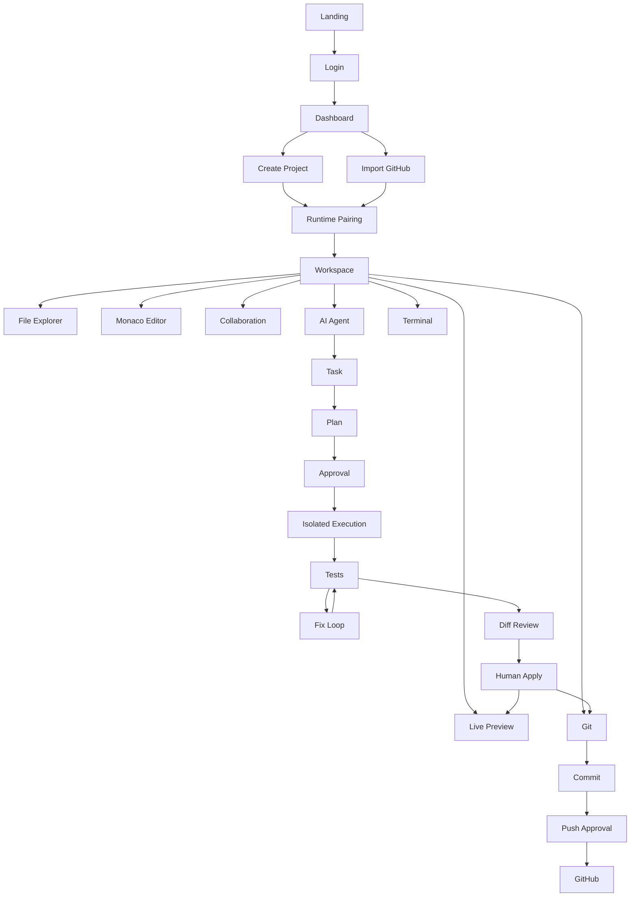

# UI/UX DESIGN SPECIFICATION
## Collaborative AI Vibe-Coding Workspace

**Document type:** Implementation-ready UI/UX specification  
**Audience:** Product designer, UX designer, frontend engineer, design-system engineer, developer-experience engineer  
**Design stance:** Serious developer tool — browser IDE + collaborative workspace + AI engineering agent  
**Primary objective:** Make the core product loop obvious, fast, trustworthy, and implementable without major frontend design decisions being invented during development.

---

# 0. Source of Truth and Design Boundary

The approved PRD defines the product as a browser-based collaborative development workspace where two humans and one AI coding agent can work on the same software project. The MVP includes Monaco, Yjs collaboration, presence/cursors/selections, GitHub import, local Docker execution, terminal/tests/live preview, one repository-aware AI agent, isolated AI changes, human review, and Git integration. The intended success loop is create/import → browser IDE → invite user → collaborative editing → AI task → repository inspection → plan → implementation → tests/debugging → diff → human review → preview → Git. [PRD]

The PRD explicitly positions the product as **not simply a chatbot inside an editor** and **not a complete VS Code replacement**. It also explicitly excludes enterprise-scale infrastructure, mobile IDE parity, Kubernetes, a large extension marketplace, multiple agents, billing, and similar scope-expanding features. [PRD]

The design therefore optimizes for:

```text
Real code
+
Real collaboration
+
Real execution
+
Real AI engineering work
+
Human control
```

It does not optimize for:
- marketing-heavy SaaS dashboards;
- conversational AI as the primary interaction;
- decorative animations;
- enterprise administration;
- mobile IDE parity;
- feature count.

---

# 1. Design Objectives

## 1.1 The first 10 seconds

A user entering the product should understand:

1. This is an IDE.
2. Other people can work here with me.
3. AI can inspect, modify, test, and propose changes.
4. Changes remain under human control.

The workspace should visually communicate this without requiring a tutorial.

## 1.2 Primary UX goals

| Goal | Design implication |
|---|---|
| Developer productivity | Dense, keyboard-first layout |
| Collaboration | Persistent presence and remote cursor cues |
| AI trust | Explicit agent state, plan, tools, tests, and review |
| Safety | Isolated AI change indicator + approval boundaries |
| Runtime clarity | Always-visible runtime status |
| Code readability | Editor gets the largest surface |
| Fast navigation | Command/search affordances |
| Debuggability | Errors remain attached to their source |
| Accessibility | Keyboard and focus-first interaction |
| MVP simplicity | One strong workspace instead of many dashboards |

## 1.3 Product UX loop

```text
Open
 ↓
Understand
 ↓
Edit
 ↓
Collaborate
 ↓
Ask AI
 ↓
Understand plan
 ↓
Approve
 ↓
Observe safe execution
 ↓
Validate
 ↓
Review diff
 ↓
Apply
 ↓
Preview
 ↓
Commit
 ↓
Push
```

---

# 2. Visual Identity

## 2.1 Direction

Use a **dark-first developer-tool aesthetic** with a fully supported light theme.

The visual language should feel closer to:
- a modern code editor;
- a terminal;
- a collaborative engineering console;

than:
- a consumer dashboard;
- a marketing website;
- a chat application.

## 2.2 Brand character

**Keywords:**

```text
Technical
Precise
Calm
Dense
Trustworthy
Fast
Collaborative
Instrumented
```

## 2.3 Avoid

Do not use:
- giant gradient hero cards;
- excessive glassmorphism;
- oversized rounded cards;
- floating decorative blobs;
- excessive shadows;
- animated background particles;
- chatbot-style message bubbles as the primary AI UI;
- excessive empty space inside the IDE;
- color for decoration without semantic meaning.

---

# 3. Design Language

## 3.1 Theme strategy

**Recommendation: Dual theme, dark-first.**

Dark mode is the default for the developer workspace.

Light mode is supported because:
- users may work in bright environments;
- accessibility is improved for some users;
- a portfolio demo benefits from theme choice.

The editor theme should be coherent with the surrounding application rather than looking like a separate embedded product.

## 3.2 Surface hierarchy

Use five primary surface levels:

```text
Surface 0 — Application background
Surface 1 — Main workspace panels
Surface 2 — Elevated controls
Surface 3 — Dialogs / popovers
Surface 4 — Temporary overlays
```

Avoid deep elevation stacks.

## 3.3 Borders

Use borders more often than shadows.

Default:
- 1px panel border;
- subtle neutral border;
- stronger border on focus;
- semantic border on warning/error/success state.

## 3.4 Radius

Developer tools benefit from restrained geometry.

```text
radius-xs: 2px
radius-sm: 4px
radius-md: 6px
radius-lg: 8px
radius-xl: 10px
```

Default controls: 5–6px.

Dialogs: 8px.

Do not use 16–24px rounded cards throughout the workspace.

---

# 4. Typography

## 4.1 Font system

Recommended:

```text
UI:
Inter, system-ui, sans-serif

Code:
JetBrains Mono, ui-monospace, SFMono-Regular, Consolas, monospace
```

Use the code font only for:
- editor;
- terminal;
- code snippets;
- file paths where useful;
- commit hashes;
- technical identifiers.

## 4.2 Type scale

```text
Display:     32px / 1.15 / 650
H1:          24px / 1.2 / 650
H2:          18px / 1.3 / 600
H3:          14px / 1.4 / 600

Body:        13px / 1.45 / 400
Small:       12px / 1.4 / 400
Caption:     11px / 1.35 / 500

Code:        13px / 1.55
Terminal:    12px / 1.55
```

The workspace should prefer 12–13px UI text for density.

---

# 5. Spacing System

Use a 4px base scale.

```text
space-1:  4px
space-2:  8px
space-3:  12px
space-4:  16px
space-5:  20px
space-6:  24px
space-8:  32px
space-10: 40px
space-12: 48px
space-16: 64px
```

## 5.1 Workspace defaults

```text
Panel padding:       8–12px
Toolbar height:      36–40px
Top bar height:      48px
Tab height:          34px
Tree row height:     24px
Status row height:   28px
Terminal header:     32px
```

---

# 6. Color System

The exact brand hue can be adjusted during implementation, but semantic roles must remain stable.

## 6.1 Dark theme tokens

```text
--bg-app:            #0D1117
--bg-panel:          #11161D
--bg-panel-raised:   #171D26
--bg-input:          #0A0F14
--bg-hover:          #1C2430
--bg-selected:       #222C38

--border-subtle:     #252D38
--border-default:    #303946
--border-strong:     #414B59

--text-primary:      #E6EDF3
--text-secondary:    #A7B1BE
--text-muted:        #778291
--text-disabled:     #555F6D

--accent:            #5B8DEF
--accent-hover:      #709CF2
--accent-subtle:     #182640

--success:            #3FB950
--success-subtle:    #12261A

--warning:            #D29922
--warning-subtle:    #2B220F

--error:              #F85149
--error-subtle:      #2B1514

--info:               #58A6FF
--info-subtle:       #12233A
```

These are recommended design tokens, not a PRD requirement.

## 6.2 Light theme tokens

```text
--bg-app:            #F6F8FA
--bg-panel:          #FFFFFF
--bg-panel-raised:   #FFFFFF
--bg-input:          #F6F8FA
--bg-hover:          #EEF2F6
--bg-selected:       #E6EEF8

--border-subtle:     #E5E9EF
--border-default:    #D0D7DE
--border-strong:     #AEB8C4

--text-primary:      #1F2328
--text-secondary:    #59636E
--text-muted:        #6E7781
--text-disabled:     #8C959F

--accent:            #336DCC
--accent-hover:      #285DB0
--accent-subtle:     #DDEBFF

--success:            #1A7F37
--warning:            #9A6700
--error:              #CF222E
--info:               #0969DA
```

## 6.3 Semantic rule

Never use:
- red merely for visual emphasis;
- green merely as decoration;
- yellow merely to make a card noticeable.

Semantic colors mean:

```text
Green  = verified/success
Yellow = needs attention
Red    = failed/blocked
Blue   = active/informational
Gray   = neutral/inactive
```

---

# 7. Iconography

Use one consistent icon family such as Lucide.

Recommended:
- 16px icons for tree/toolbars;
- 14px icons for dense lists;
- 18px for primary actions;
- 20px for major empty-state illustrations.

Icons should supplement labels, not replace unfamiliar actions.

Examples:

```text
Run          Play
Stop         Square
Share        Users
Branch       GitBranch
Changes      GitCompare
AI           Bot
Terminal     Terminal
Preview      Monitor
Settings     Settings
Search       Search
```

---

# 8. Motion

Motion should communicate state.

## 8.1 Durations

```text
Instant:      0–80ms
Micro:        100–150ms
Normal:       150–220ms
Panel:        220–300ms
```

## 8.2 Allowed

- panel open/close;
- reconnecting indicator;
- agent activity indicator;
- preview startup;
- toast entrance/exit;
- focus transitions.

## 8.3 Avoid

- bouncing buttons;
- animated gradients;
- continuous decorative motion;
- large layout animations;
- animations that slow keyboard workflows.

## 8.4 Reduced motion

When `prefers-reduced-motion: reduce` is active:
- remove non-essential transitions;
- replace pulsing with static indicators;
- keep status changes immediate.

---

# 9. Information Architecture

```text
Landing
├── Login
│
├── Dashboard
│   ├── Projects
│   ├── Create Project
│   ├── Import GitHub
│   └── Settings
│
└── Workspace
    ├── Files
    ├── Editor
    ├── AI Agent
    ├── Terminal
    ├── Preview
    ├── Git
    ├── Collaboration
    └── Change Review
```

## 9.1 Workspace principle

Workspace surfaces are not separate pages wherever possible.

Use:
- panels;
- drawers;
- tabs;
- bottom panes;
- dialogs.

The user should not leave the coding context to:
- view Git status;
- inspect AI progress;
- inspect terminal output;
- see collaborators.

---

# 10. Landing Page

## 10.1 Purpose

Explain the product in one screen and get the user into the product.

The PRD's demo requirements call for a concise product statement, workspace preview, Open Demo CTA, architecture highlights, GitHub link, and known limitations. [PRD]

## 10.2 Layout

```text
┌──────────────────────────────────────────────────────────────┐
│ Logo                    GitHub        Docs?       Login      │
├──────────────────────────────────────────────────────────────┤
│                                                              │
│ Humans + AI                                                   │
│ building software together.                                  │
│                                                              │
│ Collaborative browser IDE where developers and an AI agent   │
│ edit, run, test, review, and ship the same project.          │
│                                                              │
│ [Open Demo]    [View on GitHub]                              │
│                                                              │
│              ┌─────────────────────────────┐                 │
│              │ Workspace screenshot/GIF    │                 │
│              │ Monaco + AI + Terminal      │                 │
│              └─────────────────────────────┘                 │
│                                                              │
├──────────────────────────────────────────────────────────────┤
│ Collaboration | AI Agent | Docker Runtime | Git              │
├──────────────────────────────────────────────────────────────┤
│ Known limitations / MVP scope                                │
└──────────────────────────────────────────────────────────────┘
```

## 10.3 Hero hierarchy

1. Product statement.
2. One-sentence explanation.
3. Primary CTA.
4. Secondary GitHub CTA.
5. Workspace visual.
6. Four technical capability points.
7. Limitations.

## 10.4 Hero copy

Recommended:

**Headline**

> Humans + AI building software together.

**Supporting copy**

> A collaborative browser development workspace where developers and an AI coding agent can edit, run, test, review, and ship the same project.

Primary:
`Open Demo`

Secondary:
`View on GitHub`

## 10.5 Technical highlights

Use compact horizontal items:

```text
CRDT Collaboration
Yjs + realtime presence

AI Engineering Agent
Plan → tools → tests → fixes

Local Execution
Docker + terminal + preview

Human Review
Isolated changes + diff approval
```

Do not turn these into giant feature cards.

## 10.6 Limitations

A small section:

```text
MVP limitations

• Local runtime required for execution
• One AI agent
• Browser IDE, not full VS Code parity
• Designed for small collaborative projects
• No enterprise infrastructure
```

This improves trust.

---

# 11. Login Screen

## 11.1 Layout

Keep login minimal.

```text
┌──────────────────────────────────────┐
│                                      │
│        Collaborative Workspace       │
│                                      │
│        [ Continue with GitHub ]      │
│                                      │
│        GitHub is used for auth       │
│        and repository integration.   │
│                                      │
└──────────────────────────────────────┘
```

## 11.2 States

### Idle

`Continue with GitHub`

### Loading

`Connecting to GitHub...`

Button disabled.

### Error

```text
GitHub authentication failed.

Your account was not signed in.

[Try Again]
```

### Success

Redirect to Dashboard.

## 11.3 Accessibility

- button is first interactive element;
- visible focus ring;
- Enter activates;
- authentication status announced to screen readers.

---

# 12. Dashboard

## 12.1 Purpose

The Dashboard is a launchpad, not the core product.

The PRD calls for projects, create project, import GitHub, runtime status, and recent activity immediately after login. [PRD]

## 12.2 Layout

```text
┌──────────────────────────────────────────────────────────────┐
│ Workspace                            Runtime ● Ready   User  │
├──────────────────────────────────────────────────────────────┤
│ Projects                                                     │
│                                                              │
│ [ + Create Project ] [ Import GitHub ]                       │
│                                                              │
│ ┌──────────────────┐ ┌──────────────────┐                    │
│ │ React Dashboard  │ │ Portfolio        │                    │
│ │ main             │ │ feature/ui       │                    │
│ │ Updated 5m ago  │ │ Updated yesterday│                    │
│ │ 2 collaborators  │ │ 1 collaborator   │                    │
│ └──────────────────┘ └──────────────────┘                    │
│                                                              │
│ Recent activity                                              │
└──────────────────────────────────────────────────────────────┘
```

## 12.3 Project card

Show:
- project name;
- repository/branch;
- last updated;
- collaborator count;
- runtime readiness only if relevant;
- last activity.

Avoid:
- progress bars;
- vanity metrics;
- fake analytics.

## 12.4 Empty state

```text
No projects yet

Create a blank project or import a GitHub repository.

[Create Project] [Import GitHub]
```

## 12.5 Loading

```text
Projects
────────────
Skeleton rows/cards

Loading your projects...
```

## 12.6 Error

```text
Couldn't load projects.

Your projects were not changed.

[Retry]
```

## 12.7 Keyboard behavior

- `N` → create project;
- `/` → focus project search if search exists;
- Up/Down → project navigation;
- Enter → open selected project;
- `Esc` → close modal.

Do not hijack browser/OS shortcuts unnecessarily.

---

# 13. Create Project

## 13.1 Dialog

```text
Create project

Project name
[React Dashboard________________]

Description
[Optional_______________________]

[Create Project] [Cancel]
```

## 13.2 Validation

- required name;
- trim whitespace;
- reasonable length;
- no duplicate project names if product policy requires uniqueness.

## 13.3 Success

Do not return to Dashboard.

Immediately move to:

```text
Runtime setup → Workspace
```

The user should feel that creation starts development.

---

# 14. GitHub Import

## 14.1 Stepper

```text
1 Repository
2 Branch
3 Import
```

## 14.2 Repository picker

```text
Import GitHub repository

Search repositories
[_____________________]

Repositories
○ owner/react-dashboard
○ owner/portfolio
○ team/project

[Continue]
```

## 14.3 Branch picker

```text
Repository
owner/react-dashboard

Branch
[main ▼]

[Import Repository]
```

## 14.4 Progress

Use a step checklist:

```text
✓ Repository selected
✓ Access verified
● Cloning repository
○ Creating workspace
○ Preparing runtime
```

## 14.5 Empty repository

```text
This repository is empty.

You can still open a workspace and create files.

[Open Empty Workspace]
```

## 14.6 Import failure

```text
Repository import failed

We couldn't clone this repository.
No existing project files were modified.

[Retry] [Choose Another Repository]
```

---

# 15. Runtime Pairing

## 15.1 Purpose

Connect the cloud workspace to the user's local runtime.

The PRD requires local execution and Docker while keeping the cloud side focused on control, authentication, metadata, and collaboration. [PRD]

## 15.2 Screen

```text
Connect local runtime

Your local runtime runs:
• terminal commands
• tests/builds
• preview
• Git operations
• local AI

Pairing code

       X7K-29P

Waiting for runtime...

[Cancel]
```

## 15.3 Runtime ready

```text
Runtime
● Connected

Docker
● Available

Project container
● Ready
```

Primary:
`Open Workspace`

## 15.4 Offline

```text
Runtime offline

You can still edit and collaborate.
Terminal, preview, tests, and Git execution
are unavailable until the runtime reconnects.

[Reconnect]
```

## 15.5 Docker unavailable

```text
Runtime connected
Docker unavailable

Start Docker and retry the health check.

[Retry]
```

---

# 16. Workspace Layout

## 16.1 Baseline

```text
┌──────────────────────────────────────────────────────────────┐
│ Project | Branch | Changes | Share | Run | AI | Users | RT  │
├────────────┬──────────────────────────┬───────────────────────┤
│ FILES      │ EDITOR                   │ AI AGENT              │
│            │                          │                       │
│ Explorer   │ Tabs                     │ Task                  │
│ Search     │ Breadcrumbs              │ Plan                  │
│            │ Monaco                   │ Activity              │
│            │                          │ Tests                 │
│            │                          │ Review                │
├────────────┴──────────────────────────┴───────────────────────┤
│ TERMINAL                         │ LIVE PREVIEW                │
└──────────────────────────────────┴────────────────────────────┘
```

## 16.2 Recommended desktop dimensions

For a 1440px-wide viewport:

```text
Left explorer:      240px
Editor:             1fr
AI panel:           360px

Bottom area:        30–40% of workspace height
Terminal:           55%
Preview:            45%
```

Example at 1440px:

```text
Explorer 240
AI       360
Editor   ~840
```

At 1280px:

```text
Explorer 220
AI       320
Editor   ~740
```

## 16.3 Minimum widths

```text
Explorer minimum:  180px
Editor minimum:   420px
AI minimum:       280px
Terminal minimum: 360px
Preview minimum:  360px
```

If the available width cannot satisfy these values, collapse the AI panel before shrinking the editor below a usable width.

## 16.4 Panel resizing

All major panels are resizable with 4–6px resize hit areas.

Behavior:
- cursor changes on hover;
- keyboard-accessible resize if feasible;
- dimensions persisted per user;
- reset available via workspace menu.

## 16.5 Collapse rules

### Explorer

Collapse to icon rail or hide.

### AI

Collapse to a 40px rail containing:
- AI icon;
- active task indicator;
- approval badge.

### Bottom panel

Collapse completely to a bottom tab bar:

```text
Terminal  Preview  Output  Git
```

---

# 17. Responsive Strategy

The product is desktop-first.

## 17.1 1440px+

Full layout:

```text
Explorer | Editor | AI
-----------------------
Terminal | Preview
```

All major panels visible.

## 17.2 1280px

Same structure with:
- narrower explorer;
- narrower AI;
- fewer secondary labels;
- compact toolbar.

## 17.3 1024px

Use:

```text
Explorer collapsed by default
Editor dominant
AI panel toggleable
Bottom terminal/preview tabs
```

Top bar prioritizes:

```text
Project
Branch
Runtime
AI
Share
```

## 17.4 Tablet

Do not attempt full IDE parity.

Use a panel-switching model:

```text
Editor
AI
Terminal
Preview
```

One primary surface at a time.

File tree becomes an overlay drawer.

## 17.5 Mobile

Mobile is not an IDE replacement.

Show:
- project navigation;
- editor preview/limited editing if practical;
- AI task review;
- terminal output;
- preview.

Do not promise full:
- multi-panel editing;
- advanced Monaco workflows;
- dense collaboration;
- full Git management.

Primary mobile navigation:

```text
Editor | AI | Terminal | Preview
```

---

# 18. Top Bar

## 18.1 Structure

```text
[☰] [Project ▼] [main ▼] [● 3 changes]
                           |
                     [Share] [Run] [AI]
                           |
              [Users] [Runtime ● Ready] [Settings]
```

## 18.2 Priority

Left:
1. project;
2. branch;
3. Git dirty state.

Center/right:
4. Share;
5. Run;
6. AI;
7. collaborators;
8. runtime;
9. settings.

## 18.3 Project menu

```text
React Dashboard

Open Dashboard
Project Settings
Copy Project ID
Leave Workspace
```

Avoid excessive options.

## 18.4 Branch control

Show:

`main`

Dropdown:

```text
Branches
────────────
main
feature/dark-mode
fix/login

[Create Branch]
```

## 18.5 Git status

Clean:

`✓ Clean`

Dirty:

`● 3 changes`

Click opens Git panel.

## 18.6 Share

Opens compact collaboration popover:

```text
Share workspace

Invite people
[GitHub username/email...]

Members
Alice   Owner
Bob     Editor

[Copy Invite]
```

## 18.7 Run

State-aware:

```text
Run
Starting...
Stop
Restart
```

## 18.8 Runtime status

```text
● Ready
● Reconnecting
○ Offline
⚠ Docker unavailable
```

Tooltip includes technical detail.

---

# 19. File Explorer

## 19.1 Structure

```text
FILES

[Search files]

▾ src
  ▾ components
    Dashboard.tsx
    Header.tsx
  App.tsx
  theme.ts
▾ tests
  Dashboard.test.tsx
package.json
README.md
```

## 19.2 File rows

```text
[icon] filename             [modified dot]
```

Modified:
- subtle colored dot;
- not a bright badge.

AI-modified pending review should not appear as ordinary shared dirty state because the agent operates in an isolated worktree.

## 19.3 Selected state

Selected row:
- subtle background;
- left accent line;
- strong text.

## 19.4 Folder behavior

- single click toggles expand;
- Enter opens when file selected;
- ArrowRight expands;
- ArrowLeft collapses;
- ArrowUp/Down navigates.

## 19.5 Context menu

File:

```text
Open
Rename
Delete
Copy Path
```

Folder:

```text
New File
New Folder
Rename
Delete
Copy Path
```

Do not add IDE features that are not needed for MVP.

## 19.6 Search

Search should:
- filter by path/name;
- support quick keyboard invocation;
- show result count;
- preserve tree context.

Large repositories:
- virtualize long lists;
- lazy-load directory children;
- avoid rendering thousands of nodes simultaneously.

---

# 20. Monaco Editor

## 20.1 Editor hierarchy

```text
Tab Bar
Breadcrumbs
Monaco
Diagnostics/status
```

## 20.2 Tabs

Example:

```text
[Dashboard.tsx ●] [theme.ts] [Dashboard.test.tsx]
```

Dirty indicator:
`●`

Close:
- middle click;
- close icon on hover;
- `Ctrl/Cmd+W` with standard browser/Monaco conflict handled intentionally.

## 20.3 Breadcrumbs

```text
src / components / Dashboard.tsx
```

Clicking a segment navigates within the current path.

## 20.4 Editor settings

MVP:
- font size;
- word wrap;
- minimap toggle;
- theme;
- line numbers;
- whitespace preference.

Persist per user.

## 20.5 Diagnostics

Use Monaco diagnostics.

Inline:
- subtle squiggle;
- gutter marker.

Hover:
```text
Type error
Property 'theme' does not exist...
```

## 20.6 AI modification distinction

The shared editor should not turn every AI edit into a permanent color overlay.

Use three layers:

### During agent execution

AI work is isolated.

Show a small top-right editor badge:

`AI working in isolated changes`

### During review

Use the dedicated Diff Review UI.

### After apply

AI-originated changes become normal source changes with normal dirty state.

This prevents permanent visual noise.

## 20.7 Remote cursors

Remote cursor:
- thin vertical caret;
- collaborator color;
- name label only when active/hovered.

Remote selection:
- translucent collaborator color;
- never obscure syntax.

---

# 21. Collaboration UX

The PRD explicitly requires multiple users, presence, live cursors, selections, synchronized editing, reconnection, and basic offline/replay behavior. [PRD]

## 21.1 Presence bar

Top bar:

```text
[ A ] [ B ] [+2]
```

Hover:
```text
Alice
Online
Editing Dashboard.tsx
```

## 21.2 User status

```text
● Online
◐ Away
○ Offline
```

Use accessible text in addition to color.

## 21.3 Cursor labels

Only show persistent labels for:
- the active remote cursor;
- recently moved cursor.

Fade after a short idle period.

Do not show names permanently for every cursor.

## 21.4 Active file

Presence tooltip:

`Bob · Dashboard.tsx`

## 21.5 Simultaneous editing

Do not show conflict dialogs for normal Yjs collaboration.

Instead:
- merge automatically;
- show remote cursor;
- keep selections subtle.

## 21.6 Reconnect

Top banner:

```text
↻ Reconnecting collaboration...
```

After recovery:

```text
✓ Collaboration reconnected
```

Success toast should disappear quickly.

## 21.7 Offline

Editor status:

```text
Offline
Changes will sync when connection returns.
```

Do not imply runtime offline if only collaboration is offline.

---

# 22. AI Agent UX

This is the most important secondary surface after the editor.

The PRD requires one coding agent with natural-language tasks, repository inspection, context retrieval, plan generation, tool calling, file changes, command/test execution, debugging, change sets, and human approval. [PRD]

## 22.1 Do not design AI as chat

Avoid:

```text
User bubble
AI bubble
User bubble
AI bubble
```

Instead use:

```text
TASK
PLAN
ACTIVITY
TESTS
CHANGE SET
```

The agent is an engineering process, not merely a conversation.

## 22.2 AI panel structure

```text
┌───────────────────────────────┐
│ AI AGENT                  ●   │
├───────────────────────────────┤
│ TASK                          │
│ Add dark mode...              │
│                               │
│ PLAN                          │
│ ✓ Inspect theme architecture  │
│ ✓ Add persistent state        │
│ ○ Update dashboard            │
│ ○ Add tests                   │
│                               │
│ ACTIVITY                      │
│ ✓ read_file App.tsx           │
│ ✓ search_code "theme"         │
│ ● edit_file theme.ts          │
│                               │
│ TESTS                         │
│ ○ Waiting                    │
│                               │
│ [Stop]                        │
└───────────────────────────────┘
```

## 22.3 Agent header

```text
AI Agent
● Working
```

States:

```text
Idle
Planning
Waiting for approval
Working
Testing
Fixing
Review ready
Failed
Cancelled
```

## 22.4 Task composer

```text
What should the agent change?

[Add dark mode to the dashboard,
 preserve the current layout...     ]

[Ask AI]
```

Optional context actions:
- `Current file`;
- `Selected code`;
- `Current error`.

Keep the MVP composer simple.

---

# 23. AI State UI

## 23.1 Idle

```text
AI Agent

Describe a coding task.

[Ask AI]
```

## 23.2 Planning

```text
● Planning

Inspecting repository
Finding relevant files
Building implementation plan
```

## 23.3 Waiting for approval

This is a high-visibility state.

```text
AI Agent
WAITING FOR APPROVAL

Plan

1. Inspect theme architecture
2. Add persistent theme state
3. Update dashboard components
4. Add tests

Estimated files
4

[Approve Plan] [Reject]
```

## 23.4 Executing

```text
AI Agent
● Working

✓ Read src/App.tsx
✓ Searched theme references
● Editing src/theme.ts
○ Running tests
```

## 23.5 Testing

```text
AI Agent
● Testing

npm test

12 tests running...
```

## 23.6 Fixing

```text
AI Agent
⚠ Fixing

2 tests failed.

Inspecting Dashboard.test.tsx
→ Updating theme initialization
→ Retesting
```

## 23.7 Review ready

```text
AI Agent
✓ Review ready

3 files changed
54 additions
8 deletions
14 tests passed

[Review Changes]
```

## 23.8 Failed

```text
AI Agent
✕ Task failed

The agent could not safely complete this task.

No changes were applied to the shared workspace.

[View Details] [Retry]
```

---

# 24. AI Plan UI

## 24.1 Plan card

```text
PLAN

Goal
Add dark mode to the dashboard.

Steps
01  Inspect theme architecture
02  Add persistent theme state
03  Update dashboard components
04  Add tests

Files
4 estimated

Validation
• Run unit tests
• Run build

[Approve Plan] [Reject]
```

## 24.2 Why this plan?

Do not expose hidden reasoning.

Instead show concise rationale:

```text
Why these files?
The dashboard and existing theme utilities
are the closest existing implementation points.
```

This provides trust without exposing chain-of-thought.

## 24.3 Plan rejection

Dialog:

```text
Reject plan?

The agent will stop before editing files.

[Reject Plan] [Cancel]
```

## 24.4 Revision

Provide:

```text
What should change in the plan?

[Keep the existing spacing unchanged...]

[Revise Plan]
```

---

# 25. AI Tool Activity

## 25.1 Timeline

```text
12:41:02  read_file      src/App.tsx
12:41:04  search_code    "theme"
12:41:07  edit_file      src/theme.ts
12:41:12  run_tests
12:41:18  test_failed
12:41:22  edit_file      src/theme.ts
12:41:29  run_tests
12:41:34  tests_passed
```

## 25.2 Visible information

Show:
- timestamp;
- tool name;
- target;
- success/failure;
- duration where useful.

## 25.3 Hidden by default

Hide:
- raw model tokens;
- full prompt;
- internal chain-of-thought;
- massive stdout;
- repetitive file contents.

Expandable:
- command;
- concise stdout;
- error details;
- affected files.

## 25.4 Activity grouping

Group repeated operations:

```text
Repository inspection
  7 reads
  3 searches

Implementation
  4 file changes

Validation
  2 test runs
```

Allow expansion.

---

# 26. AI Approval UX

## 26.1 Approval levels

The design should distinguish:

```text
PLAN APPROVAL
ACTION APPROVAL
CHANGE APPROVAL
GIT APPROVAL
```

## 26.2 Plan approval

Inline card; no modal unless the plan is long.

## 26.3 Dangerous command

Modal:

```text
Approval required

The agent wants to run:

rm -rf ./build-cache

Why:
Clear generated build output before retrying.

Risk:
Deletes files inside the project workspace.

[Allow Once] [Deny]
```

The runtime policy remains authoritative. A UI approval cannot authorize an action that is globally blocked.

## 26.4 Package installation

```text
Package installation requested

npm install date-fns

This modifies package.json and package-lock.json.

[Allow] [Deny]
```

## 26.5 Commit

```text
Create commit?

Message
Add dashboard dark mode

Changes
3 files
+54 -8
Tests
14 passed

[Commit] [Cancel]
```

## 26.6 Push

```text
Push to GitHub?

Branch
feature/dark-mode

Remote
origin

This will update the remote repository.

[Push] [Cancel]
```

Push must always be explicit.

---

# 27. Diff Review UX

## 27.1 Purpose

The diff review is the trust boundary between:

```text
AI-generated isolated changes
```

and:

```text
shared workspace
```

## 27.2 Layout

```text
┌──────────────────────────────────────────────────────────────┐
│ Change Set: Add dark mode                [Reject] [Apply]    │
│ ✓ Tests passed   3 files   +54 -8                            │
├───────────────────┬──────────────────────────────────────────┤
│ CHANGED FILES     │ Dashboard.tsx                            │
│                   │                                          │
│ ● Dashboard.tsx   │  41  - const theme = "light"            │
│ ● theme.ts        │  41  + const theme = useTheme()          │
│ ● Dashboard.test  │                                          │
│                   │  55  + <ThemeToggle />                   │
├───────────────────┴──────────────────────────────────────────┤
│ Agent summary                                                │
│ Added persistent theme state and dashboard toggle.           │
└──────────────────────────────────────────────────────────────┘
```

## 27.3 Header

Show:
- task title;
- files changed;
- additions/deletions;
- tests;
- stale/conflict status;
- primary Apply action.

## 27.4 File list

Each file:
- status icon;
- path;
- additions/deletions;
- review state.

Example:

```text
M  src/Dashboard.tsx      +22 -4
M  src/theme.ts            +18 -2
A  tests/Dashboard.test.ts +14 -2
```

## 27.5 Diff viewer

Use:
- syntax highlighting;
- line numbers;
- clear addition/deletion treatment;
- hunk separators;
- word-level highlighting when useful.

Avoid overly bright colors.

## 27.6 Hunk controls

Each hunk:

```text
[✓ Accept] [Reject]
```

Selected state is explicit.

## 27.7 Agent summary

Show a concise generated summary:

```text
What changed

• Added theme state
• Added toggle control
• Updated theme styles
• Added coverage for dark mode
```

## 27.8 Why it changed

```text
Why

The existing theme utility was reused instead of
introducing a second theme mechanism.
```

## 27.9 Safety summary

```text
Validation
✓ 14 tests passed
✓ Build passed
✓ No package changes
```

This is more useful than generic "AI verified."

---

# 28. Diff States

## 28.1 Ready

```text
✓ Ready for review
```

## 28.2 Stale

```text
⚠ Workspace changed since this change set was created.

Review the current workspace before applying.

[Refresh Review]
```

## 28.3 Conflict

```text
Conflict detected

Human edits overlap with AI changes.

Nothing has been overwritten.

[Review Conflict]
```

## 28.4 Partial acceptance

Show:

```text
2 / 4 hunks selected

[Apply Selected]
```

## 28.5 Rejected

```text
Change set rejected.
Shared workspace unchanged.
```

---

# 29. Terminal UX

## 29.1 Layout

```text
TERMINAL
────────────────────────────────────────
[Terminal 1] [Terminal 2] [+]
────────────────────────────────────────
$ npm test

 PASS Dashboard.test.tsx
 PASS App.test.tsx

Tests: 14 passed
Time: 2.1s
Exit code: 0
────────────────────────────────────────
[command input]
```

## 29.2 Terminal header

Show:
- session tabs;
- runtime state;
- process state;
- stop;
- clear.

## 29.3 Running state

```text
● Running
npm test
[Stop]
```

## 29.4 Completed

```text
✓ Exited 0
```

## 29.5 Failed

```text
✕ Exited 1
```

## 29.6 Timeout

```text
⚠ Timed out after 60s
```

## 29.7 Excessive output

```text
Output truncated.

The process is still running.

[Stop Process]
```

## 29.8 Runtime offline

Disable command input and show:

```text
Runtime offline
Connect the runtime to execute commands.
```

---

# 30. Live Preview UX

## 30.1 Preview header

```text
LIVE PREVIEW

● Running
Port 3000

[Refresh] [Restart] [Open External]
```

## 30.2 Preview frame

The preview should occupy the majority of the preview panel.

## 30.3 Startup

```text
Starting preview

✓ Container ready
✓ Dev server started
● Checking port 3000
```

## 30.4 Error

```text
Preview crashed

TypeError: Cannot read properties of undefined

[Restart] [Send Error to AI]
```

## 30.5 Console

Optional collapsible drawer:

```text
Console
────────────────────────
GET /api/dashboard 200
Warning: ...
Error: ...
```

Keep the preview itself uncluttered.

## 30.6 AI relationship

A `Send Error to AI` action packages:
- error message;
- relevant console output;
- current route;
- current project context;
- optionally screenshot if later implemented.

For P0, structured runtime errors are sufficient.

---

# 31. Git UX

The PRD requires status, branch, diff, commit, and push. [PRD]

## 31.1 Git panel

```text
GIT

Branch
main ▼

Changes
M src/Dashboard.tsx
M src/theme.ts
A tests/Dashboard.test.ts

[Review Changes]

Commit
[Add dashboard dark mode________]

[Commit]

Remote
origin

[Push]
```

## 31.2 Clean state

```text
✓ Working tree clean

Branch: main
Up to date with origin/main
```

## 31.3 Dirty state

```text
3 changes
```

Clicking opens changed file list.

## 31.4 Branch creation

Use a compact dialog.

```text
Create branch

Name
[feature/dark-mode]

[Create]
```

## 31.5 Commit validation

Disable commit when:
- no changes;
- empty message.

## 31.6 Push

Always explicit.

## 31.7 Push conflict

```text
Push rejected

origin/feature/dark-mode has new commits.

Your local changes are safe.

[View Remote Changes]
[Reconcile]
[Cancel]
```

---

# 32. Collaboration Share UI

## 32.1 Share popover

```text
Share workspace

Invite collaborator
[username / email____________] [+]

People with access

● Alice     Owner
● Bob       Editor

[Copy Invite]
```

## 32.2 Join notification

Use a subtle toast:

`Bob joined the workspace`

Do not interrupt the editor.

## 32.3 Leave notification

Only notify when meaningful:

`Bob left the workspace`

---

# 33. Notifications

## 33.1 Placement

Primary:
- bottom-right toast stack.

Contextual:
- inline within relevant panel.

Persistent:
- top workspace banner for conditions that affect work.

## 33.2 Priority

```text
P0 — blocking error
P1 — action required
P2 — important state change
P3 — informational
```

## 33.3 Durations

```text
Success:  3s
Info:     4s
Warning:  persistent if actionable
Error:    persistent if unresolved
```

## 33.4 Examples

### Success

`✓ Changes applied`

### AI

`AI is waiting for your approval`

### Runtime

`⚠ Runtime disconnected`

### Collaboration

`Bob joined the workspace`

### Git

`✓ Pushed feature/dark-mode`

Do not toast:
- every file read;
- every Yjs update;
- every agent tool call;
- every remote cursor move.

---

# 34. Status Indicators

Use a shared `StatusIndicator` component.

## Variants

```text
success
active
warning
error
offline
neutral
```

## Display

Always pair color with:
- icon;
- text;
- tooltip.

Example:

```text
● Runtime Ready
```

not merely:

```text
●
```

---

# 35. Empty States

## 35.1 Dashboard

```text
No projects yet

Start with a blank project or import an existing GitHub repository.

[Create Project] [Import GitHub]
```

## 35.2 AI

```text
No active AI task

Describe a coding task to get started.

[Ask AI]
```

## 35.3 Git

```text
Working tree clean

There are no uncommitted changes.
```

## 35.4 Preview

```text
Preview isn't running

Start the project to see it here.

[Run]
```

## 35.5 Terminal

```text
No terminal session

Connect the runtime to run commands.

[Connect Runtime]
```

## 35.6 Collaboration

```text
You're the only collaborator

Invite someone to work on this project with you.

[Share]
```

## 35.7 Diff

```text
No changes to review

The current change set contains no applicable changes.
```

---

# 36. Loading States

## App

```text
Loading workspace...
```

## Project list

```text
Loading projects...
```

## Import

```text
Cloning repository...
```

## Workspace

```text
Synchronizing workspace...
```

## Collaboration

```text
Connecting collaboration...
```

## Runtime

```text
Checking Docker...
```

## AI

```text
Inspecting repository...
```

## Diff

```text
Generating change set...
```

## Git

```text
Creating commit...
```

Never use a blank screen with an indefinite spinner.

---

# 37. Error UX

Every error should answer:

```text
What happened?
Why?
Was work saved?
What next?
```

## 37.1 Network

```text
Connection lost

Your local editor is still open.
Changes will sync when the connection returns.

[Retry]
```

## 37.2 Authentication

```text
Session expired

Sign in again to continue.

[Sign In]
```

## 37.3 Runtime

```text
Runtime offline

Editing and collaboration remain available.
Execution is paused.

[Reconnect]
```

## 37.4 Docker

```text
Docker unavailable

Start Docker on your machine and retry.

[Retry]
```

## 37.5 Git

```text
Git operation failed

No commit was created.

[View Details]
```

## 37.6 AI

```text
AI task failed

No AI changes were applied to the shared workspace.

[Retry] [View Details]
```

## 37.7 Collaboration

```text
Collaboration disconnected

Trying to reconnect...

[Retry Now]
```

---

# 38. Settings

Settings should remain small in the MVP.

## 38.1 Sections

```text
Settings
├── Appearance
├── Editor
├── Runtime
├── AI Provider
└── Account
```

## 38.2 Appearance

- dark/light/system.

## 38.3 Editor

- font size;
- word wrap;
- minimap;
- line numbers.

## 38.4 Runtime

- connection status;
- reconnect;
- runtime version;
- Docker health.

## 38.5 AI Provider

Show current provider:

```text
AI Provider

Ollama / Local

Status: ● Available

[Check Connection]
```

If provider abstraction supports another configured provider, show it without building a provider marketplace.

## 38.6 Account

- profile;
- GitHub connection;
- logout.

---

# 39. Design System

## 39.1 Button

### Variants

```text
Primary
Secondary
Ghost
Danger
Icon
```

### Sizes

```text
sm: 28px
md: 32px
lg: 36px
```

Default workspace button: `md`.

### States

```text
default
hover
active
focus
disabled
loading
```

Loading replaces label with spinner + short status.

Example:

`Push` → `Pushing...`

---

# 40. IconButton

Use for:
- close;
- settings;
- refresh;
- collapse;
- expand.

Requirements:
- 32×32px minimum hit target in normal UI;
- tooltip after short hover;
- accessible label.

---

# 41. Tooltip

Use for:
- unfamiliar icon buttons;
- truncated paths;
- status details.

Do not use tooltips for essential information that must be discoverable without hover.

---

# 42. Badge

Variants:

```text
neutral
success
warning
error
info
```

Use sparingly.

Example:

`Review ready`

Avoid badges on every project attribute.

---

# 43. Avatar

Sizes:

```text
sm: 20px
md: 24px
lg: 32px
```

Presence:
- status dot;
- accessible name.

Remote cursor color should map to avatar accent where possible.

---

# 44. Panel

Panel structure:

```text
Panel
├── Header
├── Toolbar (optional)
├── Content
└── Footer (optional)
```

Panel headers should be 32–36px high.

---

# 45. Tabs

Use for:
- editor files;
- terminal sessions;
- bottom panels.

States:
- active;
- inactive;
- dirty;
- disabled.

Avoid horizontal tab overflow where possible; use scroll with visible affordance.

---

# 46. Tree

Requirements:
- keyboard navigation;
- lazy directory expansion;
- virtualization for large repositories;
- selected state;
- modified state;
- context menu;
- accessible tree roles.

---

# 47. Dialog

Use for:
- Git push confirmation;
- dangerous command approval;
- package installation;
- branch creation;
- destructive deletion.

Do not use modal dialogs for routine AI progress.

---

# 48. Dropdown

Use for:
- branch selector;
- project selector;
- runtime actions;
- settings.

Keyboard:
- ArrowUp/Down;
- Enter;
- Escape;
- typeahead.

---

# 49. Toast

Requirements:
- max 3 visible at once;
- stack vertically;
- newest on top;
- pause dismissal while hovered/focused;
- persistent errors remain until action/resolution.

---

# 50. Progress

Use:
- determinate progress when known;
- activity indicator when unknown.

Agent work should generally use semantic steps rather than a fake percentage.

Do not show:

`AI: 63%`

unless the system can actually calculate meaningful progress.

---

# 51. CodeBlock

Used outside Monaco for:
- commands;
- errors;
- approval dialogs;
- small snippets.

Include:
- copy button;
- language label where useful;
- wrap option for logs.

---

# 52. DiffViewer

Capabilities:
- unified/split mode;
- syntax highlighting;
- line numbers;
- hunk navigation;
- selected hunk state;
- file navigation;
- conflict state.

MVP default: unified diff for compactness.

---

# 53. Terminal Component

Capabilities:
- tabs;
- streaming output;
- command input;
- stop;
- clear;
- process status;
- reconnect state.

Do not render terminal output as normal proportional UI text.

---

# 54. AgentTimeline

Component structure:

```text
AgentTimeline
├── Phase
│   ├── status
│   ├── timestamp
│   └── summary
├── ToolItem
│   ├── icon
│   ├── name
│   ├── target
│   └── result
└── ErrorItem
```

Support collapsing groups.

---

# 55. ApprovalCard

Used inline in AI panel.

Structure:

```text
ApprovalCard
├── Approval type
├── Action summary
├── Risk/context
├── Affected resources
├── Primary action
└── Secondary action
```

Never use ambiguous buttons like:
`Continue`

Prefer:
`Approve Plan`, `Allow Once`, `Reject`, `Push`.

---

# 56. Keyboard System

## Global

```text
Ctrl/Cmd + P     Quick Open
Ctrl/Cmd + Shift + P  Command Palette
Ctrl/Cmd + K     AI task focus (recommended)
Ctrl/Cmd + B     Toggle Explorer
Ctrl/Cmd + J     Toggle Bottom Panel
Ctrl/Cmd + Shift + A  Focus AI panel
```

These are recommendations and should be reconciled with Monaco/browser shortcuts before implementation.

## Workspace

```text
Ctrl/Cmd + S     Save/sync if applicable
Ctrl/Cmd + W     Close tab
Ctrl/Cmd + Tab   Next editor tab
Ctrl/Cmd + Shift + Tab  Previous tab
```

## AI

```text
Ctrl/Cmd + Enter     Submit task
Esc                  Stop/close transient UI
```

## Git

```text
Ctrl/Cmd + Shift + G  Focus Git panel
```

Do not override high-value Monaco shortcuts unnecessarily.

---

# 57. Accessibility

## 57.1 Keyboard

Every non-editor interaction must be keyboard reachable.

Required:
- visible focus;
- logical tab order;
- Escape closes dialogs/popovers;
- Enter activates focused action;
- arrow keys for menus/tree/tabs.

## 57.2 Focus management

### Dialog opens

Focus first meaningful input/action.

### Dialog closes

Return focus to trigger.

### Agent approval appears

Do not steal focus automatically unless the user explicitly initiated an action that requires approval.

Instead:
- announce;
- visually emphasize;
- optionally offer keyboard shortcut.

## 57.3 ARIA

Use semantic elements first.

Examples:
- `button`;
- `nav`;
- `dialog`;
- `tree`;
- `treeitem`;
- `tablist`;
- `tabpanel`;
- `status`;
- `alert`.

## 57.4 Screen reader announcements

Announce meaningful transitions:

```text
Runtime connected.
AI plan ready for approval.
Tests failed: 2 failures.
Changes ready for review.
```

Do not announce:
- every cursor movement;
- every code edit;
- every AI tool call.

## 57.5 Contrast

Target WCAG AA for normal UI text.

Do not rely on color alone for:
- Git dirty state;
- online/offline;
- test pass/fail;
- AI approval state.

## 57.6 Monaco accessibility

Respect Monaco's accessible mode and screen-reader behavior.

Do not layer custom keyboard behavior on top of Monaco without checking shortcut conflicts.

---

# 58. Trust UX

The PRD's strongest differentiator is the interaction between AI, isolated changes, human review, runtime, and collaboration. [PRD]

## 58.1 Always show

```text
AI state
Current action
Affected files
Test state
Approval state
Next action
```

## 58.2 Never show

Do not expose:
- hidden chain-of-thought;
- internal prompts;
- private model reasoning;
- raw provider internals.

## 58.3 Safe execution indicator

When AI is executing:

```text
AI changes
ISOLATED

Shared workspace
UNCHANGED
```

This should be visually prominent but compact.

## 58.4 Apply boundary

Before Apply:

```text
AI changes are isolated.
Nothing has been applied to the shared workspace.
```

After Apply:

```text
✓ AI changes applied
```

---

# 59. AI + Collaboration Visual Model

The UI should establish this mental model:

```text
              HUMAN A
                 │
                 ▼
        ┌─────────────────┐
        │ Shared Workspace│
        │   Monaco/Yjs    │
        └────────┬────────┘
                 ▲
                 │
              HUMAN B


              AI AGENT
                 │
                 ▼
        ┌─────────────────┐
        │ Isolated Work   │
        │   Git Worktree  │
        └────────┬────────┘
                 │
              Review
                 │
                 ▼
        Shared Workspace
```

This is a product concept, not merely an architecture detail.

---

# 60. AI State Color Semantics

Use one accent family for AI rather than rainbow status.

```text
AI active       accent
AI waiting      warning
AI success      success
AI failure      error
AI idle         neutral
```

Tool result semantics:

```text
✓ completed
● active
○ pending
⚠ warning
✕ failed
```

---

# 61. Runtime State Color Semantics

```text
● Ready
↻ Reconnecting
○ Offline
⚠ Docker unavailable
✕ Runtime error
```

Always include text.

---

# 62. Git State Semantics

```text
✓ Clean
● Dirty
↑ Push available
⚠ Push conflict
✕ Git error
```

---

# 63. Screen-by-Screen Implementation Specification

# 63.1 Landing

**Purpose:** Product introduction.

**Layout:** Centered hero + workspace preview + technical highlights + limitations.

**Components:** Header, Hero, CTA, ProductPreview, FeatureStrip, Limitations.

**Primary action:** Open Demo / Login.

**Secondary:** GitHub.

**States:** Normal, demo loading, auth failure.

**Interactions:** CTA, GitHub navigation.

**Keyboard:** Tab through header → CTA → links.

**Responsive:** Single column below 768px.

**Accessibility:** Heading hierarchy, descriptive image/preview label, visible focus.

---

# 63.2 Login

**Purpose:** Authenticate.

**Layout:** Centered authentication card.

**Components:** OAuthButton, status text.

**Primary:** Continue with GitHub.

**Secondary:** Retry.

**States:** Idle/loading/error/success.

**Keyboard:** Enter on button.

**Responsive:** Full width with max-width 360px.

**Accessibility:** Button label and status announcement.

---

# 63.3 Dashboard

**Purpose:** Project launchpad.

**Layout:** Header + project list + create/import actions + recent activity.

**Components:** ProjectList, ProjectItem, Button, RuntimeStatus, EmptyState.

**Primary:** Open project / Create.

**Secondary:** Import, Settings.

**States:** Loading/empty/ready/error.

**Keyboard:** Project navigation and Enter-to-open.

**Responsive:** One-column project list.

---

# 63.4 Create Project

**Purpose:** Blank project creation.

**Layout:** Modal or dedicated setup view.

**Components:** Form, Button, ValidationMessage.

**Primary:** Create.

**Secondary:** Cancel.

**States:** Empty/validating/creating/error/success.

**Accessibility:** Form labels, inline validation.

---

# 63.5 GitHub Import

**Purpose:** Repository import.

**Layout:** Stepper + picker.

**Components:** RepositoryList, SearchInput, BranchSelect, Progress.

**Primary:** Import.

**States:** Loading repositories, branch selection, cloning, success, failure, empty repo.

**Accessibility:** Step headings and status announcements.

---

# 63.6 Runtime Pairing

**Purpose:** Connect local runtime.

**Layout:** Pairing code + status.

**Components:** PairingCode, RuntimeStatus, Progress, Retry.

**Primary:** Connect/Open Workspace.

**States:** Waiting, connected, offline, Docker unavailable, auth expired.

**Accessibility:** Pairing code exposed as text, status announced.

---

# 63.7 Workspace

**Purpose:** Primary development environment.

**Layout:** Top bar + explorer/editor/AI + bottom terminal/preview.

**Components:** TopBar, FileTree, EditorTabs, Monaco, AgentPanel, Terminal, Preview, GitPanel, Presence.

**Primary:** Edit/Run/Ask AI.

**Secondary:** Share/Git/Preview.

**States:** Loading, ready, runtime offline, collaboration reconnecting.

**Keyboard:** IDE shortcuts.

**Responsive:** Panel collapse at 1024px and below.

---

# 63.8 Agent Panel

**Purpose:** Manage AI engineering task.

**Layout:** Task composer + phase timeline + plan/activity/tests/review.

**Components:** TaskComposer, AgentTimeline, PlanCard, ApprovalCard, TestSummary, ReviewCTA.

**Primary:** Ask AI / Approve / Review Changes.

**Secondary:** Reject, Stop, Retry, Revise.

**States:** Idle, planning, approval, executing, testing, fixing, review-ready, failed.

**Accessibility:** Live status region for phase changes.

---

# 63.9 Diff Review

**Purpose:** Human validation of AI changes.

**Layout:** Changed files left, diff center/right, summary header.

**Components:** FileList, DiffViewer, HunkControls, TestStatus, ApplyButton.

**Primary:** Apply.

**Secondary:** Reject, revise, hunk selection.

**States:** Ready, stale, conflict, partially selected, applied, rejected.

**Accessibility:** File/hunk controls keyboard accessible.

---

# 63.10 Git

**Purpose:** Source-control operations.

**Layout:** Branch + changes + commit + remote.

**Components:** BranchSelect, ChangeList, CommitInput, PushButton, ConflictBanner.

**Primary:** Commit.

**Secondary:** Branch, push, review diff.

**States:** Clean, dirty, committing, committed, push pending, conflict.

---

# 63.11 Settings

**Purpose:** User/workspace preferences.

**Layout:** Simple left navigation + setting panels.

**Components:** ThemeSelect, EditorSettings, RuntimeStatus, AIProviderStatus, Account.

**Primary:** Save automatically where possible.

**States:** Loaded, saving, error.

---

# 63.12 Error states

**Purpose:** Recover without losing context.

**Layout:** Inline first; modal only for blocking actions.

**Components:** ErrorMessage, Explanation, SaveState, NextAction.

**Primary:** Recovery action.

**Secondary:** Details.

---

# 64. Workspace Interaction Rules

## Rule 1

Opening a file must not navigate away from the workspace.

## Rule 2

Opening Git should not replace the editor unless the user explicitly chooses a full-screen review.

## Rule 3

AI activity should never block normal human editing unless a safety boundary requires it.

## Rule 4

Runtime offline should disable execution actions but not the editor.

## Rule 5

AI plan approval should be visible without forcing a modal.

## Rule 6

Final AI changes should require a deliberate review/apply action.

## Rule 7

Git push must always have an explicit confirmation.

## Rule 8

Collaboration events should not interrupt typing.

---

# 65. Large Repository UX

The product is not intended to become a full VS Code replacement, but file navigation must remain usable.

Use:
- lazy directory expansion;
- virtualized tree rendering;
- incremental search;
- recent-file quick open;
- cached file metadata.

Do not load the full repository into the DOM.

For AI:
- show retrieved context as counts and file names;
- do not expose a giant context dump.

---

# 66. AI Context UX

When context is being gathered:

```text
Context

7 files
3 relevant symbols
2 recent diagnostics

Relevant files
• src/Dashboard.tsx
• src/theme.ts
• tests/Dashboard.test.tsx
```

This gives the developer confidence that the agent is looking in the right place without exposing internal reasoning.

---

# 67. Test UX

Tests should be represented consistently across:
- terminal;
- AI panel;
- diff review;
- workspace status.

Example:

```text
Tests
✓ 14 passed
✕ 0 failed
```

Failure:

```text
Tests
✓ 12 passed
✕ 2 failed

Dashboard.test.tsx
Theme.test.tsx
```

Clicking a failure:
- opens relevant output;
- optionally opens source/test file;
- offers `Send to AI`.

---

# 68. Preview-to-AI UX

When runtime reports a preview error:

```text
Preview error

ReferenceError: theme is not defined

[Send Error to AI]
```

The AI task composer opens with structured context:

```text
Context attached
✓ Runtime error
✓ Current route
✓ Console output
```

The user remains in control of submitting the task.

---

# 69. Git-to-AI UX

When Git status is dirty:

```text
3 uncommitted changes
```

AI should know that the shared workspace is not clean, but the UI should not imply that human changes belong to the AI.

When creating a new AI change set:

```text
AI base
a81f2c4

Shared workspace currently
a81f2c4 + 3 human changes
```

If this level of detail is too dense for normal mode, expose it under `Details`.

---

# 70. Conflict UX

## 70.1 No conflict

```text
✓ Change set can be applied
```

## 70.2 Stale but automatically compatible

```text
Workspace changed.

The AI change set does not overlap with the new edits.

[Review Updated Diff]
```

## 70.3 True conflict

```text
Conflict detected

AI and human changes overlap in:

src/theme.ts
lines 41–55

Nothing has been overwritten.

[Resolve Conflict]
[Ask AI to Rebase]
```

---

# 71. First-Time UX

The PRD prioritizes a fast, meaningful demo. [PRD]

## 71.1 First session checklist

```text
Get started

✓ Account connected
✓ Project ready
○ Connect runtime
○ Run project
○ Invite collaborator
○ Ask AI
```

## 71.2 Contextual hints

Only show hints:
- first time entering workspace;
- first time opening AI;
- first time opening collaboration/share.

Dismiss permanently.

## 71.3 No onboarding carousel

Do not create a 5–7 slide product tour.

---

# 72. Five-Minute Demo UI Sequence

## 0:00

Landing:

`Humans + AI building software together.`

Click `Open Demo`.

## 0:20

Dashboard:

```text
React Dashboard
Runtime ● Ready
```

Open.

## 0:40

Workspace:

Show:
- Monaco;
- file tree;
- collaborators;
- runtime;
- Git.

## 1:00

Bob joins.

Presence:

`[Alice] [Bob]`

Remote cursor appears.

## 1:20

Alice and Bob edit simultaneously.

## 1:45

Alice opens AI:

```text
Add dark mode to the dashboard.
Keep the existing layout and make sure tests pass.
```

## 2:00

Agent:

```text
Planning
↓
Inspecting
↓
Plan ready
```

## 2:20

Plan approval card appears.

Alice clicks:

`Approve Plan`

## 2:40

Activity:

```text
✓ Read Dashboard.tsx
✓ Search "theme"
● Edit theme.ts
```

## 3:10

Tests fail.

```text
⚠ 2 tests failed
```

## 3:20

AI fixes.

```text
✓ 14 tests passed
```

## 3:40

Review ready.

Open Diff.

## 4:00

Alice reviews hunks.

```text
3 files
+54 -8
✓ tests passed
```

Apply.

## 4:30

Preview updates.

Dark mode works.

## 4:45

Git commit.

## 5:00

Push approval.

Final:

```text
✓ Pushed to GitHub
```

The visual story is:

```text
Humans
 ↓
Shared editor
 ↓
AI
 ↓
Isolated work
 ↓
Tests
 ↓
Review
 ↓
Shared result
 ↓
GitHub
```

---

# 73. UX Risks

## Risk 1 — Looks like a chatbot

**Cause:** AI panel dominated by messages.

**Fix:** State-machine/timeline UI.

## Risk 2 — Looks like a generic SaaS dashboard

**Cause:** oversized cards and sparse project dashboard.

**Fix:** Dashboard is minimal; workspace dominates product identity.

## Risk 3 — AI trust is unclear

**Cause:** user cannot tell whether AI has changed shared source.

**Fix:** persistent isolated-change indicator + explicit Apply.

## Risk 4 — Collaboration is invisible

**Cause:** avatars exist but remote editing is subtle.

**Fix:** remote cursors, selections, active-file presence.

## Risk 5 — Runtime complexity leaks into UI

**Cause:** too many Docker/WebSocket/process statuses.

**Fix:** one primary Runtime status with expandable technical details.

## Risk 6 — Approval fatigue

**Cause:** approval for every tiny action.

**Fix:** plan approval + policy-based risky action approval + final change review.

## Risk 7 — Editor becomes cramped

**Cause:** AI and terminal panels consume too much width/height.

**Fix:** editor remains the largest surface and panels collapse.

## Risk 8 — Errors are technically correct but unusable

**Fix:** use What / Why / Saved / Next.

---

# 74. Recommended MVP Design

## Must-have visual surfaces

```text
Landing
Login
Dashboard
Runtime Pairing
Workspace
AI Agent
Diff Review
Git
Settings
```

## Must-have workspace capabilities

```text
File Tree
Monaco
Tabs
Search
Presence
Remote Cursors
AI Task
AI Plan
Tool Activity
Tests
Diff
Terminal
Preview
Git
```

## Must-have states

```text
Runtime Ready
Runtime Offline
Collaboration Connected
Collaboration Reconnecting
AI Planning
AI Waiting
AI Working
AI Testing
AI Fixing
AI Review Ready
AI Failed
Diff Clean
Diff Stale
Conflict
Git Dirty
Git Clean
Push Approval
```

## Defer

Do not design deep flows for:
- multiple AI agents;
- extension marketplace;
- enterprise administration;
- cloud execution fleet;
- mobile IDE parity;
- billing;
- full CI/CD;
- Kubernetes;
- complex project analytics.

These are outside the MVP boundary described by the PRD. [PRD]

---

# 75. Component Inventory

```text
ApplicationShell
LandingHeader
Hero
ProductPreview
FeatureStrip
Limitations

AuthButton
AuthStatus

Dashboard
ProjectList
ProjectItem
ProjectEmptyState
CreateProjectDialog
GitHubImport

RepositoryPicker
BranchPicker
ImportProgress

RuntimePairing
RuntimeStatus
DockerStatus

WorkspaceShell
TopBar
ProjectSelector
BranchSelector
GitStatus
SharePopover
PresenceBar

FileExplorer
FileTree
FileRow
FileContextMenu
FileSearch

EditorShell
EditorTabs
Breadcrumbs
MonacoEditor
Diagnostics
RemoteCursor
RemoteSelection

AgentPanel
TaskComposer
AgentHeader
AgentPhase
PlanCard
ApprovalCard
AgentTimeline
ToolActivity
TestSummary
AgentError
ReviewCTA

DiffReview
ChangedFileList
DiffViewer
DiffHunk
HunkActions
ConflictBanner
ReviewSummary

Terminal
TerminalTabs
TerminalOutput
ProcessStatus
CommandInput

Preview
PreviewToolbar
PreviewFrame
PreviewError
ConsoleDrawer

GitPanel
BranchList
GitChanges
CommitForm
PushDialog
GitConflict

Settings
AppearanceSettings
EditorSettings
RuntimeSettings
AISettings
AccountSettings

Dialog
Dropdown
Tooltip
Toast
StatusIndicator
Progress
Badge
Avatar
Tabs
Tree
Button
IconButton
```

---

# 76. Component State Matrix

| Component | Default | Hover | Active | Loading | Disabled | Error | Success |
|---|---|---|---|---|---|---|---|
| Button | normal | raised | pressed | spinner | muted | danger | optional |
| IconButton | neutral | surface | pressed | spinner | muted | danger | optional |
| ProjectItem | neutral | surface | selected | skeleton | muted | — | — |
| RuntimeStatus | Ready/offline | tooltip | — | reconnecting | — | error | connected |
| AgentPanel | idle | — | working | active | — | failed | review ready |
| ApprovalCard | waiting | — | focused | — | — | blocked | approved |
| DiffHunk | normal | highlight | selected | — | rejected | conflict | accepted |
| Terminal | idle | — | running | streaming | offline | exit 1 | exit 0 |
| Preview | stopped | — | running | starting | offline | crashed | healthy |
| GitStatus | clean | tooltip | — | operation | — | conflict | pushed |

---

# 77. Design Token Summary

```text
# Typography
font-ui: Inter, system-ui
font-code: JetBrains Mono, ui-monospace

# Base
space: 4px
radius-control: 6px
radius-dialog: 8px

# Workspace
topbar: 48px
toolbar: 36px
tree-row: 24px
tab: 34px
status: 28px

# Panels
explorer: 240px
ai: 360px
ai-min: 280px
editor-min: 420px

# Motion
micro: 100–150ms
normal: 150–220ms
panel: 220–300ms

# Themes
dark-first
light-supported
```

---

# 78. Frontend Architecture Implications

The UI specification should map cleanly to frontend modules:

```text
app/
├── routes/
│   ├── landing
│   ├── auth
│   ├── dashboard
│   ├── workspace
│   └── settings
│
├── components/
│   ├── ui/
│   ├── editor/
│   ├── collaboration/
│   ├── agent/
│   ├── terminal/
│   ├── preview/
│   ├── git/
│   └── runtime/
│
├── features/
│   ├── projects
│   ├── auth
│   ├── workspace
│   ├── collaboration
│   ├── agent
│   ├── changesets
│   ├── runtime
│   └── git
│
└── design-system/
    ├── tokens
    ├── themes
    └── primitives
```

This is an implementation recommendation, not a requirement to split the application into micro-frontends or other independently deployed systems.

---

# 79. UX-to-System State Mapping

| UI state | System meaning |
|---|---|
| Runtime ● Ready | Local runtime authenticated and available |
| Runtime ○ Offline | Runtime unavailable |
| Collaboration ● Connected | Browser has active collaboration connection |
| Agent Planning | Agent task in planning state |
| Waiting for Approval | User action required |
| AI Working | Agent executing tools in isolated worktree |
| Testing | Runtime executing validation |
| Fixing | Agent repair loop active |
| Review Ready | Change set generated |
| Stale | Shared revision changed since agent base |
| Conflict | Safe patch application cannot proceed automatically |
| Applied | Accepted changes merged into shared workspace |
| Git Dirty | Working tree has uncommitted changes |
| Push Approval | User must explicitly authorize remote update |

---

# 80. Final Design Principles

## 1. Editor first

The editor gets the most space.

## 2. AI is an engineering agent

Show task phases, tools, tests, failures, and review — not a generic chat transcript.

## 3. Collaboration is ambient

Presence and cursors are always available but should not interrupt work.

## 4. Runtime state is honest

Users should know immediately whether execution is available.

## 5. Human review is the trust boundary

AI changes become shared only after explicit review/application.

## 6. Git remains recognizable

Use familiar branch, status, diff, commit, and push patterns.

## 7. Errors are actionable

Always answer:

```text
What happened?
Was my work saved?
What should I do next?
```

## 8. Density over decoration

Developer tools benefit from information density, not visual emptiness.

## 9. Keyboard over mouse where appropriate

Every common development workflow should have a keyboard path.

## 10. Technical complexity should be surfaced selectively

Expose enough to build trust and debug problems, but hide implementation noise.

---

# 81. Final Visual Direction

The product should look like:

```text
┌──────────────────────────────────────────────────────────────┐
│ React Dashboard   main ●3   Share   Run   AI   A B   ●Ready │
├───────────┬──────────────────────────────────┬───────────────┤
│ FILES     │ Dashboard.tsx                   │ AI AGENT      │
│           │                                  │               │
│ ▾ src     │  1  import ...                  │ TASK          │
│   App.tsx │  2  ...                         │ Dark mode...  │
│   theme   │ 18  function Dashboard()        │               │
│ ▾ tests   │                                  │ PLAN          │
│           │     ● Bob                        │ ✓ Inspect     │
│           │                                  │ ✓ Implement   │
│           │                                  │ ○ Test        │
│           │                                  │               │
│           │                                  │ ACTIVITY      │
│           │                                  │ ✓ read_file   │
│           │                                  │ ● edit_file   │
├───────────┴──────────────────────────────────┴───────────────┤
│ TERMINAL                          │ LIVE PREVIEW              │
│ $ npm test                        │                           │
│ ✓ 14 passed                      │    React Dashboard       │
└──────────────────────────────────┴───────────────────────────┘
```

The emotional impression should be:

> **"This is a real engineering environment, and the AI is another participant in it."**

Not:

> "This is a chatbot with an editor attached."

---

# 82. Final UX Architecture



---

# 83. Final Interaction Model

```text
HUMANS
  │
  ├───────────────┐
  ↓               ↓
COLLABORATION   EDITOR
  │               │
  └───────┬───────┘
          ↓
     SHARED STATE
          ↑
          │
       AI AGENT
          │
    ┌─────┴─────┐
    ↓           ↓
  PLAN        TOOLS
                │
             RUNTIME
                │
             DOCKER
                │
       ┌────────┼────────┐
       ↓        ↓        ↓
     TESTS    PREVIEW    GIT
       │
       ↓
   CHANGE SET
       │
       ↓
 HUMAN REVIEW
       │
       ↓
     APPLY
       │
       ↓
 SHARED WORKSPACE
```

---

# 84. Final Checklist for Frontend Implementation

Before considering the UI MVP complete:

### Product identity
- [ ] Looks like a developer tool, not SaaS admin.
- [ ] Workspace is the visual center of gravity.
- [ ] AI is visibly an engineering agent.
- [ ] Collaboration is visible.

### Workspace
- [ ] Monaco occupies dominant space.
- [ ] Explorer is resizable/collapsible.
- [ ] AI panel is resizable/collapsible.
- [ ] Terminal and preview share the bottom area.
- [ ] Top bar exposes branch/runtime/collaboration state.

### Collaboration
- [ ] Presence avatars.
- [ ] Online/offline state.
- [ ] Remote cursor.
- [ ] Remote selection.
- [ ] Reconnect state.
- [ ] No cursor/notification chaos.

### AI
- [ ] Task composer.
- [ ] Planning state.
- [ ] Plan approval.
- [ ] Tool timeline.
- [ ] Tests.
- [ ] Repair loop.
- [ ] Isolated-work indicator.
- [ ] Review-ready state.
- [ ] Stop/retry/error states.

### Review
- [ ] File list.
- [ ] Syntax-highlighted diff.
- [ ] Hunk controls.
- [ ] Test result.
- [ ] Agent summary.
- [ ] Conflict warning.
- [ ] Apply/reject/revise.

### Runtime
- [ ] Connected.
- [ ] Reconnecting.
- [ ] Offline.
- [ ] Docker unavailable.
- [ ] Terminal streaming.
- [ ] Preview startup/error/restart.

### Git
- [ ] Branch.
- [ ] Status.
- [ ] Changes.
- [ ] Commit.
- [ ] Push approval.
- [ ] Push conflict.

### Accessibility
- [ ] Keyboard navigation.
- [ ] Focus states.
- [ ] Dialog focus management.
- [ ] ARIA semantics.
- [ ] Status announcements.
- [ ] Color-independent status.
- [ ] Reduced motion.
- [ ] Monaco shortcut compatibility.

### Responsive
- [ ] 1440px full workspace.
- [ ] 1280px compact workspace.
- [ ] 1024px collapsed secondary panels.
- [ ] Tablet single-surface mode.
- [ ] Mobile does not claim full IDE parity.

---

# 85. Final Recommended MVP Design

The MVP should ship with one exceptionally strong visual and interaction loop:

```text
LANDING
   ↓
LOGIN
   ↓
DASHBOARD
   ↓
CREATE / IMPORT
   ↓
CONNECT RUNTIME
   ↓
WORKSPACE
   │
   ├── Monaco + Files
   ├── Presence
   ├── Terminal
   ├── Preview
   ├── Git
   │
   └── AI AGENT
          ↓
        TASK
          ↓
        PLAN
          ↓
       APPROVAL
          ↓
     ISOLATED WORK
          ↓
        TESTS
        ↙   ↘
     PASS    FAIL
      ↓       ↓
     DIFF ← REPAIR
      ↓
 HUMAN REVIEW
   ↙       ↘
REJECT     ACCEPT
             ↓
       CONFLICT CHECK
             ↓
           APPLY
             ↓
          PREVIEW
             ↓
           COMMIT
             ↓
       PUSH APPROVAL
             ↓
          GITHUB
```

The defining design decision is:

> **The workspace is shared, the AI's implementation is isolated, validation is visible, and humans control what gets applied.**

That single idea should be visible in the product's layout, status system, AI panel, diff review, runtime indicators, and Git workflow.

---

# Appendix A — Design Handoff Summary

## Most important screens

1. Workspace.
2. AI Agent panel.
3. Diff Review.
4. Dashboard.
5. Runtime Pairing.
6. Git panel.
7. Landing.

## Most important components

1. Monaco Editor.
2. AgentTimeline.
3. PlanCard.
4. ApprovalCard.
5. DiffViewer.
6. FileTree.
7. PresenceBar.
8. RuntimeStatus.
9. Terminal.
10. Preview.

## Most important interactions

1. Edit code.
2. See collaborator edit.
3. Ask AI.
4. Approve plan.
5. Observe AI execution.
6. Inspect test result.
7. Review diff.
8. Apply changes.
9. Preview.
10. Commit/push.

## Most important trust signals

```text
AI Planning
AI Waiting for Approval
AI Changes Isolated
Tests Passed/Failed
Change Set Ready
Conflict Check
Changes Applied
Push Approval
```

---

# Appendix B — Design QA Questions

Before release, ask:

### Can a new developer answer these immediately?

- What project am I in?
- What branch am I on?
- Is my runtime connected?
- Who else is here?
- What is the AI doing?
- Has AI changed my shared code yet?
- What files did AI change?
- Did tests pass?
- Can I reject one hunk?
- Is the change set stale?
- Is the preview running?
- Are there uncommitted changes?
- Will this push to GitHub?

If any answer requires navigating through multiple unrelated screens, simplify the workspace.

---

# Appendix C — Source Alignment

This design specification stays aligned with the supplied PRD's core product thesis and MVP boundary:

- browser-based collaborative development workspace;
- Monaco editor;
- Yjs collaboration;
- presence/cursors/selections;
- GitHub import;
- local runtime + Docker;
- terminal/tests/live preview;
- one repository-aware AI coding agent;
- plan and tool execution;
- autonomous debugging;
- isolated AI changes;
- human approval/rejection;
- Git branch/status/diff/commit/push;
- free-first, one-developer, resume-oriented scope.

The PRD explicitly identifies the core demo as two humans plus one AI coding agent collaboratively building and running a real application in one browser-based workspace. [PRD]

The PRD also explicitly excludes full VS Code parity, enterprise IAM, Kubernetes, production cloud sandboxing, billing, extension marketplace, multiple agents, mobile IDE, and other large product surfaces. [PRD]

Therefore the recommended design intentionally keeps the workspace dense, focused, and implementation-friendly rather than expanding into a generic platform.
